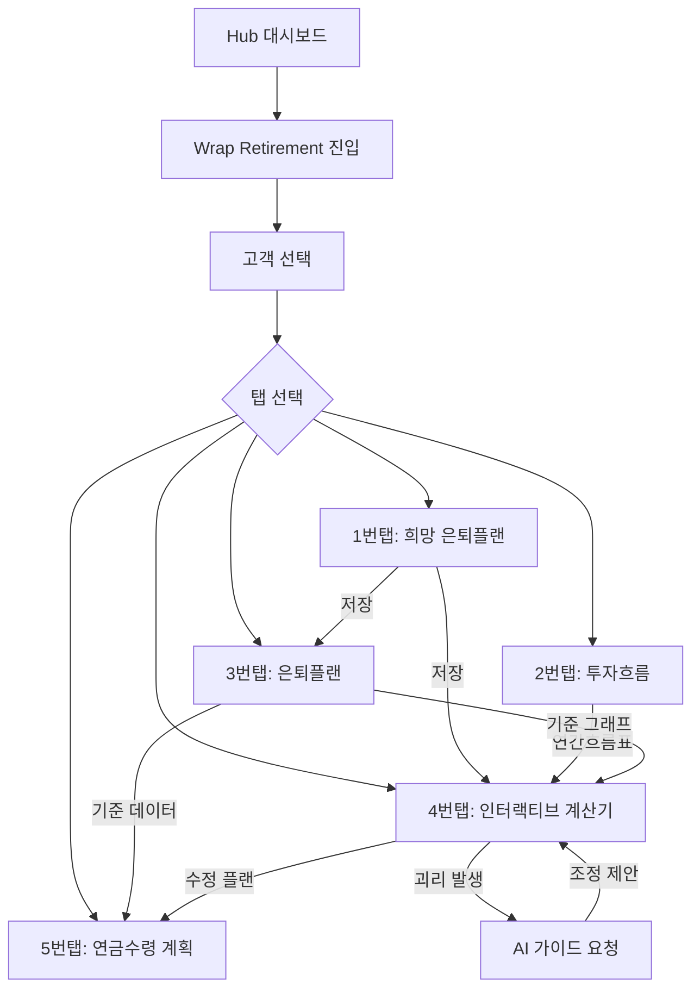

# Wrap Retirement (랩 은퇴설계) 사용자 플로우

## 1. 메인 플로우



## 2. 화면별 플로우

### 공통: 고객 선택
- **진입**: Wrap Retirement 페이지 접속
- **행동**:
  1. 상단 고객 선택 드롭다운 클릭
  2. 고객명 검색 또는 목록에서 선택
  3. 선택 시 `고객명(고유번호)` + `은퇴목표금액` + `희망은퇴나이` 표시
- **상태 유지**: 탭 이동 시에도 선택한 고객 유지, 다른 고객 선택 시 현재 탭에서도 즉시 변경

### 1번탭: 희망 은퇴플랜
- **진입**: 탭 클릭 또는 최초 진입 시 기본 탭
- **행동**:
  1. 매월 희망 수령 은퇴금액 입력
  2. 은퇴 기간 입력
  3. 목표 은퇴자금 자동 계산
  4. 필요 일시납/적립금액 계산표 확인
  5. 복리 성장 그래프 확인
  6. [저장] 버튼 클릭
- **이탈**: 저장 후 3번탭으로 이동 권장 (또는 자유 탭 이동)
- **데이터**: 저장 시 3번탭, 4번탭에 자동 반영

### 2번탭: 투자흐름
- **진입**: 탭 클릭
- **행동 (연간 투자흐름표)**:
  1. 연도 선택 (드롭다운)
  2. 연도별 요약 테이블 확인 (자동 계산)
- **행동 (투자기록)**:
  1. [+ 추가] 버튼 클릭 → 투자기록 추가 모달
  2. 유형 선택 (신규투자 / 추가적립 / 인출)
  3. 상품 선택 (랩어카운트 관리에서 등록된 상품 드롭다운)
  4. 금액, 시작일, 상태(ing/exit) 입력
  5. exit 시: 종료일, 평가금액 입력 → 수익률 자동계산
  6. 연결 정보: 선행상품/후행상품 지정
  7. 메모 입력
  8. [저장]
- **뷰 전환**: [타임라인 뷰] 토글로 시각화 확인
- **필터**: 전체/운용중/종결/적립 필터링
- **연결상품 클릭**: 해당 상품 행으로 스크롤 + 하이라이트

### 3번탭: 은퇴플랜
- **진입**: 탭 클릭
- **행동**:
  1. 기본정보 입력 (현재나이, 일시납입금액, 연적립금액, 납입기간, 물가상승률&상속재원, 연수익률, 목표은퇴자금, 목표연금액, 희망은퇴나이, 가능은퇴나이)
  2. [계산] 클릭 → 연도별 예상 평가금액 테이블 자동 생성
  3. 성장 그래프 확인
  4. [저장] 클릭
- **데이터**: 1번탭 저장 데이터가 기본정보에 사전 세팅됨

### 4번탭: 인터랙티브 계산기
- **진입**: 탭 클릭
- **행동**:
  1. 3번탭 기준 그래프 + 실제 데이터 겹친 그래프 확인
  2. 직전 연도까지 실선(실제), 이후 점선(예측) 구분
  3. 이격률 수치 확인
  4. 목표 하회 시 [AI 가이드 요청] 버튼 클릭
  5. AI가 제안하는 조정 방안 확인 (적립액, 목표수익률, 투자기간)
  6. 수정된 예측 그래프 확인
  7. [저장] 클릭
- **데이터**: 2번탭 연간 투자흐름표의 실제 데이터가 자동 반영

### 5번탭: 연금수령 계획
- **진입**: 탭 클릭
- **행동**:
  1. 모으는 기간 요약 확인
  2. 연금지급방법 선택 (종신형 / 확정형 / 상속형)
  3. 선택에 따라 쓰는 기간 그래프 동적 변경
  4. 모으기 + 쓰기 통합 연속 그래프 확인
  5. 예상 연금액 vs 실제 연금액 비교 (데이터 있을 경우)
  6. [저장] 클릭

---

## 3. 데이터 흐름도

```
┌──────────┐     저장      ┌──────────┐     기준      ┌──────────────────┐
│ 1번탭     │───────────────▶│ 3번탭     │──────────────▶│ 4번탭             │
│ 희망플랜  │               │ 은퇴플랜  │    그래프     │ 인터랙티브계산기  │
└──────────┘               └──────────┘               └──────────────────┘
                                │                            ▲      │
                                │                   실제데이터│      │수정플랜
                                │                            │      ▼
                                │              ┌──────────┐  │  ┌──────────┐
                                │              │ 2번탭     │──┘  │ 5번탭     │
                                └──────────────▶│ 투자흐름  │     │ 연금수령  │
                                   기준데이터   └──────────┘     └──────────┘
```

---

## 4. 예외 플로우

| 상황 | 처리 |
|------|------|
| 고객 미선택 상태에서 탭 진입 | "고객을 먼저 선택해주세요" 안내 |
| 1번탭 미저장 상태에서 3번탭 진입 | 빈 상태로 진입 가능 (수동 입력) |
| 2번탭 데이터 없이 4번탭 진입 | 3번탭 계획 그래프만 표시, 실제 데이터 없음 안내 |
| AI 가이드 API 오류 | "잠시 후 다시 시도해주세요" + 수동 계산 안내 |
| 네트워크 오류 | 공통 에러 토스트 + 재시도 버튼 |
