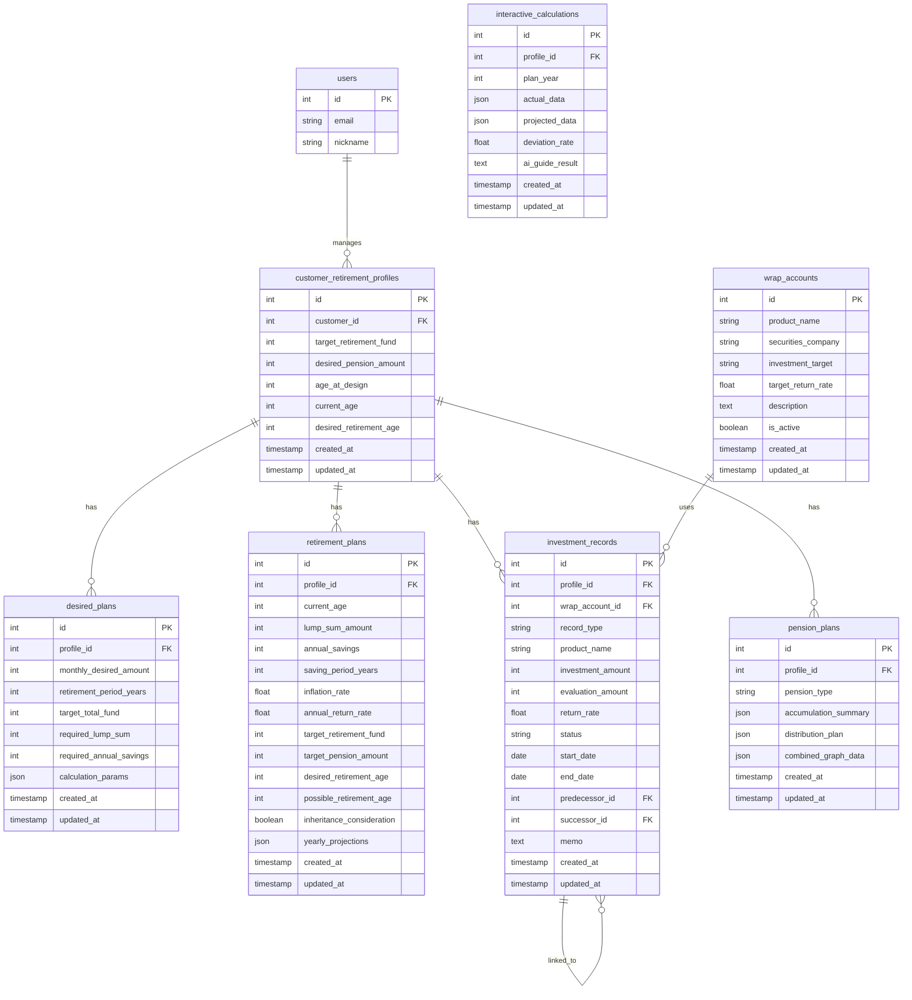

# Wrap Retirement (랩 은퇴설계) 데이터베이스 설계

## 1. ERD

---

## 2. 테이블 정의

### customer_retirement_profiles (고객 은퇴설계 프로필)
> Hub 고객 DB 공유 + 은퇴설계 전용 필드

| 컬럼 | 타입 | 제약 | 설명 |
|------|------|------|------|
| id | SERIAL | PK | 기본키 |
| customer_id | INT | FK, UNIQUE | Hub 고객 테이블 참조 |
| target_retirement_fund | BIGINT | NOT NULL | 목표 은퇴자금 (만원) |
| desired_pension_amount | BIGINT | | 희망 연금액 (만원/월) |
| age_at_design | INT | NOT NULL | 설계 당시 나이 |
| current_age | INT | NOT NULL | 현재 나이 |
| desired_retirement_age | INT | NOT NULL | 희망 은퇴나이 |
| created_at | TIMESTAMP | DEFAULT NOW | 생성일 |
| updated_at | TIMESTAMP | DEFAULT NOW | 수정일 |

### desired_plans (희망 은퇴플랜 - 1번탭)

| 컬럼 | 타입 | 제약 | 설명 |
|------|------|------|------|
| id | SERIAL | PK | 기본키 |
| profile_id | INT | FK | 고객 프로필 참조 |
| monthly_desired_amount | BIGINT | NOT NULL | 매월 희망 수령액 (만원) |
| retirement_period_years | INT | NOT NULL | 은퇴 기간 (년) |
| target_total_fund | BIGINT | | 계산된 목표 은퇴자금 |
| required_lump_sum | BIGINT | | 필요 일시납 금액 |
| required_annual_savings | BIGINT | | 필요 연적립 금액 |
| calculation_params | JSONB | | 계산에 사용된 파라미터 (수익률 등) |
| created_at | TIMESTAMP | DEFAULT NOW | 생성일 |
| updated_at | TIMESTAMP | DEFAULT NOW | 수정일 |

### retirement_plans (은퇴플랜 - 3번탭)

| 컬럼 | 타입 | 제약 | 설명 |
|------|------|------|------|
| id | SERIAL | PK | 기본키 |
| profile_id | INT | FK | 고객 프로필 참조 |
| current_age | INT | NOT NULL | 현재 나이 |
| lump_sum_amount | BIGINT | | 일시납입금액 (만원) |
| annual_savings | BIGINT | | 연적립금액 (만원) |
| saving_period_years | INT | | 납입기간 (년) |
| inflation_rate | DECIMAL(5,2) | | 물가상승률 (%) |
| annual_return_rate | DECIMAL(5,2) | NOT NULL | 연수익률 (%) |
| target_retirement_fund | BIGINT | | 목표 은퇴자금 (만원) |
| target_pension_amount | BIGINT | | 목표 연금액 (만원/월) |
| desired_retirement_age | INT | | 희망 은퇴나이 |
| possible_retirement_age | INT | | 가능 은퇴나이 |
| inheritance_consideration | BOOLEAN | DEFAULT FALSE | 상속재원 고려 여부 |
| yearly_projections | JSONB | | 연도별 예상 평가금액 배열 |
| created_at | TIMESTAMP | DEFAULT NOW | 생성일 |
| updated_at | TIMESTAMP | DEFAULT NOW | 수정일 |

### investment_records (투자기록 - 2번탭)

| 컬럼 | 타입 | 제약 | 설명 |
|------|------|------|------|
| id | SERIAL | PK | 기본키 |
| profile_id | INT | FK, NOT NULL | 고객 프로필 참조 |
| wrap_account_id | INT | FK | 랩어카운트 상품 참조 |
| record_type | VARCHAR(20) | NOT NULL | 유형: investment, additional_savings, withdrawal |
| product_name | VARCHAR(100) | | 상품명 (수동 입력 가능) |
| investment_amount | BIGINT | NOT NULL | 투자/적립/인출 금액 (만원) |
| evaluation_amount | BIGINT | | 평가금액 (만원, exit 시) |
| return_rate | DECIMAL(5,2) | | 수익률 (%, 자동계산) |
| status | VARCHAR(10) | NOT NULL | 상태: ing, exit, deposit |
| start_date | DATE | NOT NULL | 시작일 |
| end_date | DATE | | 종료일 (exit 시) |
| predecessor_id | INT | FK(self) | 선행 투자기록 ID |
| successor_id | INT | FK(self) | 후행 투자기록 ID |
| memo | TEXT | | 메모 |
| created_at | TIMESTAMP | DEFAULT NOW | 생성일 |
| updated_at | TIMESTAMP | DEFAULT NOW | 수정일 |

### wrap_accounts (랩어카운트 관리)

| 컬럼 | 타입 | 제약 | 설명 |
|------|------|------|------|
| id | SERIAL | PK | 기본키 |
| product_name | VARCHAR(100) | NOT NULL | 상품명 |
| securities_company | VARCHAR(50) | NOT NULL | 증권사 |
| investment_target | VARCHAR(200) | | 투자대상 |
| target_return_rate | DECIMAL(5,2) | | 목표수익률 (%) |
| description | TEXT | | 상품 설명 |
| is_active | BOOLEAN | DEFAULT TRUE | 활성 여부 |
| created_at | TIMESTAMP | DEFAULT NOW | 생성일 |
| updated_at | TIMESTAMP | DEFAULT NOW | 수정일 |

### interactive_calculations (인터랙티브 계산 - 4번탭)

| 컬럼 | 타입 | 제약 | 설명 |
|------|------|------|------|
| id | SERIAL | PK | 기본키 |
| profile_id | INT | FK | 고객 프로필 참조 |
| plan_year | INT | NOT NULL | 기준 연도 |
| actual_data | JSONB | | 실제 투자 데이터 (2번탭에서) |
| projected_data | JSONB | | 수정 예측 데이터 |
| deviation_rate | DECIMAL(5,2) | | 이격률 (%) |
| ai_guide_result | TEXT | | AI 가이드 결과 |
| created_at | TIMESTAMP | DEFAULT NOW | 생성일 |
| updated_at | TIMESTAMP | DEFAULT NOW | 수정일 |

### pension_plans (연금수령 계획 - 5번탭)

| 컬럼 | 타입 | 제약 | 설명 |
|------|------|------|------|
| id | SERIAL | PK | 기본키 |
| profile_id | INT | FK | 고객 프로필 참조 |
| pension_type | VARCHAR(20) | NOT NULL | 종신형/확정형/상속형 |
| accumulation_summary | JSONB | | 모으는 기간 요약 |
| distribution_plan | JSONB | | 연금 지급 계획 |
| combined_graph_data | JSONB | | 통합 그래프 데이터 |
| created_at | TIMESTAMP | DEFAULT NOW | 생성일 |
| updated_at | TIMESTAMP | DEFAULT NOW | 수정일 |

---

## 3. 인덱스

| 테이블 | 인덱스 | 용도 |
|--------|--------|------|
| customer_retirement_profiles | customer_id (UNIQUE) | 고객별 프로필 조회 |
| investment_records | (profile_id, start_date) | 고객별 투자기록 시간순 조회 |
| investment_records | (profile_id, status) | 고객별 운용중/종결 필터 |
| investment_records | predecessor_id | 연결 상품 추적 |
| retirement_plans | profile_id | 고객별 플랜 조회 |
| wrap_accounts | (securities_company, is_active) | 증권사별 활성 상품 조회 |
| interactive_calculations | (profile_id, plan_year) | 고객별 연도별 계산 조회 |

---

## 4. 제약 조건

| 제약 | 설명 |
|------|------|
| FK: customer_retirement_profiles.customer_id → customers.id | Hub 고객 테이블 참조 |
| FK: investment_records.profile_id → customer_retirement_profiles.id | ON DELETE CASCADE |
| FK: investment_records.wrap_account_id → wrap_accounts.id | ON DELETE SET NULL |
| FK: investment_records.predecessor_id → investment_records.id | 자기 참조 (연결고리) |
| CHECK: investment_records.status IN ('ing', 'exit', 'deposit') | 상태값 제한 |
| CHECK: investment_records.record_type IN ('investment', 'additional_savings', 'withdrawal') | 유형 제한 |
| CHECK: pension_plans.pension_type IN ('lifetime', 'fixed', 'inheritance') | 연금유형 제한 |
