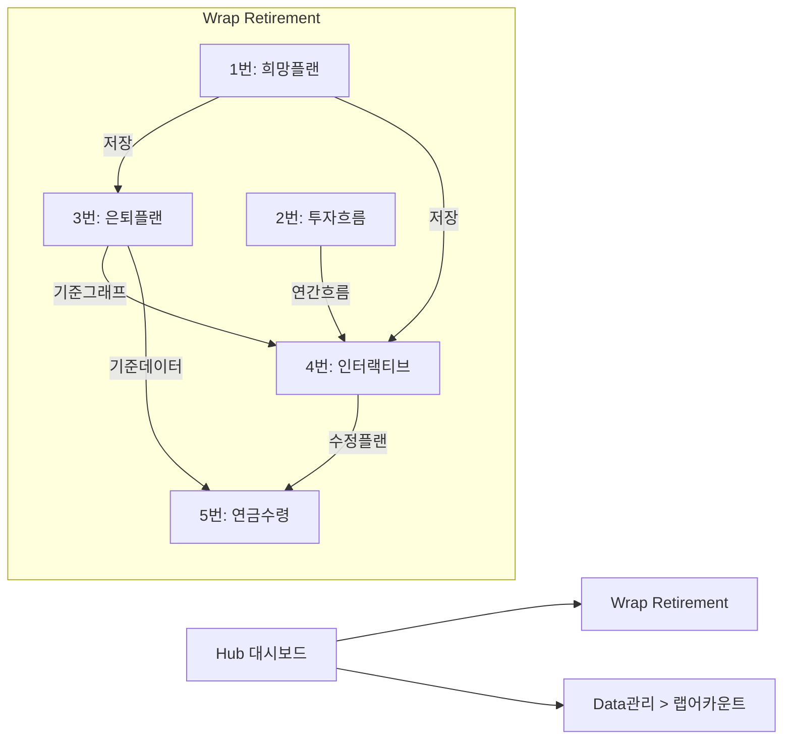

# Wrap Retirement (랩 은퇴설계) 화면 목록

> /screen-spec 입력용 화면 정의

---

## 공통 요소

### COMMON-01: 고객 선택 바
- **ID**: common-customer-selector
- **위치**: 탭 아래, 콘텐츠 상단 고정
- **컴포넌트**:
  - 고객 검색/선택 드롭다운
  - 선택된 고객 표시: `고객명(고유번호)` | `목표은퇴자금` | `희망은퇴나이`
- **동작**: 고객 변경 시 현재 탭 + 모든 탭 데이터 갱신

### COMMON-02: 탭 네비게이션
- **ID**: common-tab-navigation
- **탭 목록**: 희망은퇴플랜 | 투자흐름 | 은퇴플랜 | 인터랙티브 계산기 | 연금수령 계획
- **동작**: 탭 전환 시 고객 선택 상태 유지

---

## 화면 1: 희망 은퇴플랜 (1번탭)

- **ID**: screen-retirement-desired
- **경로**: /retirement?tab=desired-plan
- **기능**: 매월 희망 수령액 기반 목표 은퇴자금 역산

### 컴포넌트
| 컴포넌트 | 설명 |
|---------|------|
| DesiredAmountInput | 매월 희망 수령 은퇴금액 입력 |
| RetirementPeriodInput | 은퇴 기간 (년) 입력 |
| TargetCalculationTable | 목표 은퇴자금, 필요 일시납/적립금액 계산 결과표 |
| CompoundGrowthChart | 복리 성장 그래프 (X: 연도, Y: 금액) |
| SaveButton | 저장 (3번탭, 4번탭에 반영) |

### 목업
```
┌─────────────────────────────────────────────────────────────────┐
│ [고객 선택 바]                                                   │
├─────────────────────────────────────────────────────────────────┤
│ [희망은퇴플랜●] [투자흐름] [은퇴플랜] [인터랙티브계산기] [연금수령] │
├─────────────────────────────────────────────────────────────────┤
│                                                                  │
│  ┌─ 입력 ──────────────────┐  ┌─ 계산 결과 ────────────────────┐│
│  │ 매월 희망 수령액:        │  │ 목표 은퇴자금:    120,000 만원  ││
│  │ [        500   ] 만원   │  │ 필요 일시납:       50,000 만원  ││
│  │                          │  │ 필요 연적립:       12,000 만원  ││
│  │ 은퇴 기간:               │  │ 예상 수익률:          7.0 %    ││
│  │ [         20   ] 년     │  │                                ││
│  └──────────────────────────┘  └────────────────────────────────┘│
│                                                                  │
│  ┌─ 복리 성장 그래프 ──────────────────────────────────────────┐ │
│  │  (만원)                                                      │ │
│  │  120,000 ┤                                          ╱──      │ │
│  │  100,000 ┤                                     ╱──           │ │
│  │   80,000 ┤                                ╱──                │ │
│  │   60,000 ┤                          ╱──                      │ │
│  │   40,000 ┤                    ╱──                            │ │
│  │   20,000 ┤              ╱──                                  │ │
│  │        0 ┤────────╱──                                        │ │
│  │          └──┬──┬──┬──┬──┬──┬──┬──┬──┬──┬──                   │ │
│  │            45  47  49  51  53  55  57  59  61  63  65  (나이) │ │
│  └──────────────────────────────────────────────────────────────┘ │
│                                                                  │
│                                            [저장]                │
└─────────────────────────────────────────────────────────────────┘
```

---

## 화면 2: 투자흐름 (2번탭)

- **ID**: screen-retirement-investment
- **경로**: /retirement?tab=investment-flow
- **기능**: 각종 금융상품(랩어카운트 등) 투자 기록 및 연간 흐름 관리

### 컴포넌트
| 컴포넌트 | 설명 |
|---------|------|
| ViewToggle | 테이블 뷰 / 타임라인 뷰 전환 |
| AnnualFlowTable | 연간 투자흐름표 (연도별 요약) |
| InvestmentRecordTable | 투자기록 테이블 (개별 기록) |
| RecordFilter | 필터 (전체/운용중/종결/적립) |
| AddRecordModal | 투자기록 추가 모달 |
| TimelineView | 타임라인 시각화 (토글 시) |

### 목업
> [Wrap_UI_투자기록_목업.md](Wrap_UI_투자기록_목업.md) 참조

---

## 화면 3: 은퇴플랜 (3번탭)

- **ID**: screen-retirement-plan
- **경로**: /retirement?tab=retirement-plan
- **기능**: 상세 은퇴플랜 시뮬레이션

### 컴포넌트
| 컴포넌트 | 설명 |
|---------|------|
| BasicInfoForm | 기본정보 입력 폼 (10개 필드) |
| YearlyProjectionTable | 연도별 예상 평가금액 테이블 |
| ProjectionChart | 성장 그래프 (X: 연도/나이, Y: 평가금액) |
| CalculateButton | 계산 실행 |
| SaveButton | 저장 |

### 목업
```
┌─────────────────────────────────────────────────────────────────┐
│ [고객 선택 바]                                                   │
├─────────────────────────────────────────────────────────────────┤
│ [희망은퇴플랜] [투자흐름] [은퇴플랜●] [인터랙티브계산기] [연금수령] │
├─────────────────────────────────────────────────────────────────┤
│                                                                  │
│  ┌─ 기본정보 입력 ─────────────────────────────────────────────┐ │
│  │ 현재 나이: [45]   일시납입금액: [50,000] 만원                │ │
│  │ 연적립금액: [12,000] 만원   납입기간: [20] 년               │ │
│  │ 물가상승률&상속재원: [○ 고려 ● 미고려]                       │ │
│  │ 연수익률: [7.0] %   목표은퇴자금: [120,000] 만원            │ │
│  │ 목표 연금액: [500] 만원/월                                   │ │
│  │ 희망 은퇴나이: [65]   가능 은퇴나이: [63]                    │ │
│  │                                            [계산]            │ │
│  └──────────────────────────────────────────────────────────────┘ │
│                                                                  │
│  ┌─ 연도별 예상 평가금액 ──────────────────────────────────────┐ │
│  │ 연도 │연차│나이│일시납 │연적립│총납입 │예상수익│예상평가액│  │ │
│  │ 2026 │ 1 │ 45 │50,000│12,000│62,000│ 4,340 │ 66,340  │  │ │
│  │ 2027 │ 2 │ 46 │   0  │12,000│78,340│ 5,484 │ 83,824  │  │ │
│  │ ...  │   │    │      │      │      │       │         │  │ │
│  │ 2045 │20 │ 65 │   0  │12,000│      │       │120,XXX  │  │ │
│  └──────────────────────────────────────────────────────────────┘ │
│                                                                  │
│  ┌─ 성장 그래프 ───────────────────────────────────────────────┐ │
│  │  (복리 성장 곡선 - 연도별 예상 평가금액)                      │ │
│  │  ━━━ 계획 그래프 (Navy Blue)                                  │ │
│  └──────────────────────────────────────────────────────────────┘ │
│                                                                  │
│                                            [저장]                │
└─────────────────────────────────────────────────────────────────┘
```

---

## 화면 4: 인터랙티브 계산기 (4번탭)

- **ID**: screen-retirement-interactive
- **경로**: /retirement?tab=interactive-calc
- **기능**: 계획 vs 실제 비교 + AI 가이드

### 컴포넌트
| 컴포넌트 | 설명 |
|---------|------|
| ComparisonChart | 계획 vs 실제 겹침 그래프 |
| DeviationDisplay | 이격률 표시 (%, 상/하회) |
| YearlyComparisonTable | 연도별 계획 vs 실제 비교 테이블 |
| AIGuideButton | AI 가이드 요청 버튼 (목표 하회 시 활성) |
| AIGuideResult | AI 가이드 결과 표시 영역 |
| ModifiedProjectionChart | 수정 예측 그래프 |
| SaveButton | 저장 |

### 목업
```
┌─────────────────────────────────────────────────────────────────┐
│ [고객 선택 바]                                                   │
├─────────────────────────────────────────────────────────────────┤
│ [희망은퇴플랜] [투자흐름] [은퇴플랜] [인터랙티브계산기●] [연금수령] │
├─────────────────────────────────────────────────────────────────┤
│                                                                  │
│  ┌─ 계획 vs 실제 비교 그래프 ──────────────────────────────────┐ │
│  │  (만원)                                                      │ │
│  │  120,000 ┤                          ╱── (계획, Navy 실선)    │ │
│  │  100,000 ┤                     ╱──                           │ │
│  │   80,000 ┤                ╱──    ···· (수정예측, Teal 점선)  │ │
│  │   60,000 ┤           ╱──   ····                              │ │
│  │   40,000 ┤      ╱── ····                                    │ │
│  │   20,000 ┤ ╱── ╱── (실제, Teal 실선)                        │ │
│  │        0 ┤╱──                                                │ │
│  │          └──┬──┬──┬──┬──┬──┬──┬──┬──┬──┬──                   │ │
│  │            45  47  49  51  53  55  57  59  61  63  65        │ │
│  │                    ↑현재                                     │ │
│  │  ━━━ 계획  ━━━ 실제  ···· 수정예측  ░░ 괴리영역             │ │
│  └──────────────────────────────────────────────────────────────┘ │
│                                                                  │
│  이격률: ▼ -5.2% (목표 하회)                 [AI 가이드 요청]    │
│                                                                  │
│  ┌─ AI 가이드 결과 ────────────────────────────────────────────┐ │
│  │  📊 종합금융자산관리사 분석                                    │ │
│  │                                                              │ │
│  │  현재 계획 대비 5.2% 하회하고 있습니다.                       │ │
│  │  목표 달성을 위한 조정 제안:                                  │ │
│  │                                                              │ │
│  │  방안 1: 연적립액 12,000 → 14,500만원 (+2,500만원/년)       │ │
│  │  방안 2: 목표수익률 7.0% → 8.5% 상향 (현 시장 고려)        │ │
│  │  방안 3: 은퇴시점 65세 → 67세 (2년 연장)                    │ │
│  │                                                              │ │
│  │  근거: 현재 금리 인하 기조에서 채권 비중 확대 시 안정적      │ │
│  │  수익 확보 가능. 다만 고객의 장기 투자 의지가 핵심...        │ │
│  └──────────────────────────────────────────────────────────────┘ │
│                                                                  │
│  ┌─ 연도별 비교 테이블 ────────────────────────────────────────┐ │
│  │ 연도│나이│계획 평가액│실제 평가액│차이│이격률│               │ │
│  │ 2026│ 45 │ 66,340   │ 64,200   │-2,140│-3.2%│              │ │
│  │ 2027│ 46 │ 83,824   │ 79,500   │-4,324│-5.2%│              │ │
│  └──────────────────────────────────────────────────────────────┘ │
│                                            [저장]                │
└─────────────────────────────────────────────────────────────────┘
```

---

## 화면 5: 연금수령 계획 (5번탭)

- **ID**: screen-retirement-pension
- **경로**: /retirement?tab=pension-plan
- **기능**: 모으기 + 쓰기 통합 라이프사이클 시각화

### 컴포넌트
| 컴포넌트 | 설명 |
|---------|------|
| AccumulationSummary | 모으는 기간 요약 |
| PensionTypeSelector | 연금지급방법 선택 (종신형/확정형/상속형) |
| PensionComparisonTable | 지급방법별 비교 테이블 |
| CombinedLifecycleChart | 모으기+쓰기 통합 그래프 |
| SaveButton | 저장 |

### 목업
```
┌─────────────────────────────────────────────────────────────────┐
│ [고객 선택 바]                                                   │
├─────────────────────────────────────────────────────────────────┤
│ [희망은퇴플랜] [투자흐름] [은퇴플랜] [인터랙티브계산기] [연금수령●] │
├─────────────────────────────────────────────────────────────────┤
│                                                                  │
│  ┌─ (1) 모으는 기간 요약 ──────────────────────────────────────┐ │
│  │ 납입기간: 20년 (45세→65세) | 총납입: 290,000만원             │ │
│  │ 예상 은퇴자금: 120,000만원 | 달성률: 94.8%                   │ │
│  │                                                              │ │
│  └──────────────────────────────────────────────────────────────┘ │
│                                                                  │
│  ┌─ (2) 연금지급방법 비교 ─────────────────────────────────────┐ │
│  │                                                              │ │
│  │  [● 종신형]  [○ 확정형]  [○ 상속형]                         │ │
│  │                                                              │ │
│  │  ┌──────────┬──────────┬──────────┬──────────┐              │ │
│  │  │   구분   │  종신형  │  확정형  │  상속형  │              │ │
│  │  ├──────────┼──────────┼──────────┼──────────┤              │ │
│  │  │ 월수령액 │  450만   │  500만   │  350만   │              │ │
│  │  │ 수령기간 │ 종신(100)│  20년    │  종신    │              │ │
│  │  │ 총수령액 │ 189,000  │ 120,000  │ 147,000  │              │ │
│  │  │ 잔여원금 │    0     │    0     │ 120,000  │              │ │
│  │  └──────────┴──────────┴──────────┴──────────┘              │ │
│  └──────────────────────────────────────────────────────────────┘ │
│                                                                  │
│  ┌─ (3) 통합 라이프사이클 그래프 ──────────────────────────────┐ │
│  │  (만원)                                                      │ │
│  │  120,000 ┤              ╱──╲                                 │ │
│  │  100,000 ┤          ╱──     ╲                                │ │
│  │   80,000 ┤      ╱──          ╲ (종신형 인출)                 │ │
│  │   60,000 ┤  ╱──               ╲                              │ │
│  │   40,000 ┤╱── (모으기)          ╲                            │ │
│  │   20,000 ┤                       ╲                           │ │
│  │        0 ┤─────────────────────────╲──────                   │ │
│  │          └──┬──┬──┬──┬──┬──┬──┬──┬──┬──┬──┬──┬──            │ │
│  │            45     55     65     75     85     95  100 (나이)  │ │
│  │          ◄── 모으기 ──►◄──── 쓰기 (종신형) ────►             │ │
│  │                                                              │ │
│  │  ━━━ 모으기(Navy)  ━━━ 쓰기(Gold)  --- 예상vs실제           │ │
│  └──────────────────────────────────────────────────────────────┘ │
│                                                                  │
│                                            [저장]                │
└─────────────────────────────────────────────────────────────────┘
```

---

## 부가 화면: 랩어카운트 관리

- **ID**: screen-wrap-account-mgmt
- **경로**: /data-management/wrap-accounts
- **위치**: Hub 대시보드 > Data 관리 > 랩어카운트 관리
- **기능**: 랩어카운트 상품 등록/수정/삭제

### 컴포넌트
| 컴포넌트 | 설명 |
|---------|------|
| WrapAccountTable | 상품 목록 테이블 |
| AddAccountModal | 상품 등록 모달 (상품명, 증권사, 투자대상, 목표수익률) |
| EditAccountModal | 상품 수정 모달 |

### 목업
```
┌─────────────────────────────────────────────────────────────────┐
│  Data 관리 > 랩어카운트 관리                     [+ 상품 등록]   │
├─────────────────────────────────────────────────────────────────┤
│                                                                  │
│  ┌──────┬────────────┬──────────┬──────────┬──────────┬───────┐ │
│  │  #   │   상품명   │  증권사  │ 투자대상 │목표수익률│ 상태  │ │
│  ├──────┼────────────┼──────────┼──────────┼──────────┼───────┤ │
│  │  1   │ KB랩A-01   │ KB증권   │ 국내주식 │  8.0%    │ 활성  │ │
│  │  2   │ 미래에셋C  │ 미래에셋 │ 혼합형   │  6.5%    │ 활성  │ │
│  │  3   │ 삼성랩D    │ 삼성증권 │ 해외ETF  │  7.0%    │ 비활성│ │
│  └──────┴────────────┴──────────┴──────────┴──────────┴───────┘ │
│                                                                  │
└─────────────────────────────────────────────────────────────────┘
```

---

## 화면 간 이동


