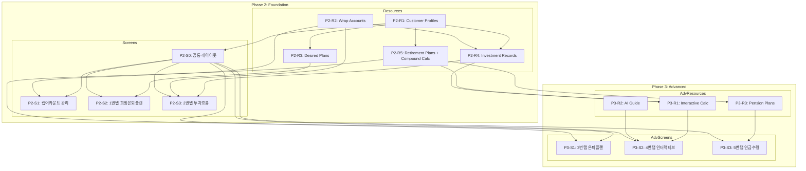

# Wrap Retirement (랩 은퇴설계) TASKS.md

> Domain-Guarded 태스크 구조
> 기존 Hub (Phase 0~1 완료) 위에 추가되는 모듈

---

## Interface Contract Validation

```
✅ Interface Contract Validation PASSED

Coverage Matrix:

Resource                        │ Fields    │ Screens Using
────────────────────────────────┼───────────┼──────────────────────────────────
customer_retirement_profiles    │ 9/9  ✅   │ 1번탭, 2번탭, 3번탭, 4번탭, 5번탭
desired_plans                   │ 8/8  ✅   │ 1번탭, 3번탭
retirement_plans                │ 15/15 ✅  │ 3번탭, 4번탭, 5번탭
investment_records              │ 16/16 ✅  │ 2번탭, 4번탭
wrap_accounts                   │ 9/9  ✅   │ 2번탭, 랩어카운트관리
interactive_calculations        │ 8/8  ✅   │ 4번탭
pension_plans                   │ 7/7  ✅   │ 5번탭
retirement_ai_guide             │ 5/5  ✅   │ 4번탭
```

---

## 의존성 구조



---

## Phase 2: Foundation (기반 구축)

### P2-R1: Customer Retirement Profiles Resource

#### [x] P2-R1-T1: DB 모델 + 마이그레이션 ✅
- **담당**: backend-specialist
- **리소스**: customer_retirement_profiles
- **작업**:
  - Alembic 마이그레이션 생성 (customer_retirement_profiles 테이블)
  - SQLAlchemy 모델 정의 (app/models/customer_retirement_profile.py)
  - Hub 기존 고객 테이블과 FK 연결
- **필드**: id, customer_id(FK unique), target_retirement_fund, desired_pension_amount, age_at_design, current_age, desired_retirement_age, created_at, updated_at
- **TDD**: RED → GREEN → REFACTOR

#### [x] P2-R1-T2: API 엔드포인트 ✅
- **담당**: backend-specialist
- **엔드포인트**:
  - GET /api/v1/retirement/profiles (목록)
  - GET /api/v1/retirement/profiles/:customer_id (조회)
  - POST /api/v1/retirement/profiles (생성)
  - PUT /api/v1/retirement/profiles/:customer_id (수정)
- **파일**: `tests/test_retirement_profiles.py` → `app/routers/retirement_profiles.py`, `app/schemas/retirement.py`
- **의존**: P2-R1-T1
- **TDD**: RED → GREEN → REFACTOR

---

### P2-R2: Wrap Accounts Resource

#### [x] P2-R2-T1: DB 모델 + 마이그레이션 ✅
- **담당**: backend-specialist
- **리소스**: wrap_accounts
- **필드**: id, product_name, securities_company, investment_target, target_return_rate, description, is_active, created_at, updated_at
- **TDD**: RED → GREEN → REFACTOR

#### [x] P2-R2-T2: API 엔드포인트 ✅
- **담당**: backend-specialist
- **엔드포인트**:
  - GET /api/v1/retirement/wrap-accounts (목록, is_active 필터)
  - POST /api/v1/retirement/wrap-accounts (등록)
  - PUT /api/v1/retirement/wrap-accounts/:id (수정)
  - DELETE /api/v1/retirement/wrap-accounts/:id (삭제)
- **파일**: `tests/test_wrap_accounts.py` → `app/routers/wrap_accounts.py`
- **의존**: P2-R2-T1
- **TDD**: RED → GREEN → REFACTOR

---

### P2-R3: Desired Plans Resource (1번탭 Backend)

#### [x] P2-R3-T1: DB 모델 + 마이그레이션
- **담당**: backend-specialist
- **리소스**: desired_plans
- **필드**: id, profile_id(FK), monthly_desired_amount, retirement_period_years, target_total_fund, required_lump_sum, required_annual_savings, calculation_params(JSONB), created_at, updated_at
- **의존**: P2-R1-T1
- **TDD**: RED → GREEN → REFACTOR

#### [x] P2-R3-T2: API + 복리 역산 계산
- **담당**: backend-specialist
- **엔드포인트**:
  - GET /api/v1/retirement/desired-plans/:customer_id
  - PUT /api/v1/retirement/desired-plans/:customer_id
- **계산 로직**: 매월 희망 수령액 + 은퇴 기간 → 목표 은퇴자금 역산 → 필요 일시납/적립금액 계산
- **파일**: `tests/test_desired_plans.py`, `tests/test_compound_calc.py` → `app/routers/desired_plans.py`, `app/services/compound_calc.py`
- **의존**: P2-R3-T1
- **TDD**: RED → GREEN → REFACTOR (엑셀 수식 대조 필수)

---

### P2-R4: Investment Records Resource (2번탭 Backend)

#### [x] P2-R4-T1: DB 모델 + 마이그레이션
- **담당**: backend-specialist
- **리소스**: investment_records
- **필드**: id, profile_id(FK), wrap_account_id(FK), record_type(enum), product_name, investment_amount, evaluation_amount, return_rate, status(enum), start_date, end_date, predecessor_id(self FK), successor_id(self FK), memo, created_at, updated_at
- **의존**: P2-R1-T1, P2-R2-T1
- **TDD**: RED → GREEN → REFACTOR

#### [x] P2-R4-T2: 투자기록 CRUD API
- **담당**: backend-specialist
- **엔드포인트**:
  - GET /api/v1/retirement/investment-records (필터: customer_id, year, status)
  - POST /api/v1/retirement/investment-records
  - PUT /api/v1/retirement/investment-records/:id
  - DELETE /api/v1/retirement/investment-records/:id
- **자동 계산**: exit 시 수익률 자동 계산, 연결상품 predecessor/successor 관계 설정
- **파일**: `tests/test_investment_records.py` → `app/routers/investment_records.py`
- **의존**: P2-R4-T1
- **TDD**: RED → GREEN → REFACTOR

#### [x] P2-R4-T3: 연간 투자흐름표 API
- **담당**: backend-specialist
- **엔드포인트**:
  - GET /api/v1/retirement/investment-records/annual-flow/:customer_id/:year
- **계산 로직**: 해당 연도 투자기록 집계 → 일시납/연적립/총납입/연간총수익/연간평가액/연수익률/인출액/누적인출액/총평가금액 계산
- **파일**: `tests/test_annual_flow.py` → `app/services/annual_flow_calc.py`
- **의존**: P2-R4-T2
- **TDD**: RED → GREEN → REFACTOR

---

### P2-R5: Retirement Plans Resource + Compound Calc (3번탭 Backend)

#### [x] P2-R5-T1: DB 모델 + 마이그레이션
- **담당**: backend-specialist
- **리소스**: retirement_plans
- **필드**: id, profile_id(FK), current_age, lump_sum_amount, annual_savings, saving_period_years, inflation_rate, annual_return_rate, target_retirement_fund, target_pension_amount, desired_retirement_age, possible_retirement_age, inheritance_consideration, yearly_projections(JSONB), created_at, updated_at
- **의존**: P2-R1-T1
- **TDD**: RED → GREEN → REFACTOR

#### [x] P2-R5-T2: API + 시뮬레이션 서비스
- **담당**: backend-specialist
- **엔드포인트**:
  - GET /api/v1/retirement/plans/:customer_id
  - POST /api/v1/retirement/plans
  - PUT /api/v1/retirement/plans/:id
  - POST /api/v1/retirement/simulation/calculate
- **계산 서비스**: `app/services/retirement_simulation.py` - 기본정보 → 연도별 예상 평가금액 배열 생성 (복리 계산)
- **파일**: `tests/test_retirement_plans.py`, `tests/test_retirement_simulation.py`
- **의존**: P2-R5-T1, P2-R3-T2 (compound_calc 재사용)
- **TDD**: RED → GREEN → REFACTOR (100년치 시뮬레이션 정확성 검증)

---

### P2-S0: Wrap Retirement 공통 레이아웃

#### [x] P2-S0-T1: 고객 선택 바 + 탭 네비게이션
- **담당**: frontend-specialist
- **화면**: /retirement (공통 컨테이너)
- **컴포넌트**:
  - CustomerSelector: 고객 검색/선택 드롭다운, 선택 시 `고객명(고유번호) | 목표은퇴자금 | 희망은퇴나이` 상단 고정
  - RetirementTabNavigation: 5개 탭 전환
- **상태 관리**: Zustand store - 선택된 고객 ID, 탭 전환 시 고객 유지
- **파일**: `src/app/(main)/retirement/page.tsx`, `src/app/(main)/retirement/components/CustomerSelector.tsx`, `src/app/(main)/retirement/components/TabNavigation.tsx`, `src/app/(main)/retirement/hooks/useRetirementStore.ts`
- **의존**: P2-R1-T2 (고객 프로필 API)
- **TDD**: RED → GREEN → REFACTOR

---

### P2-S1: 랩어카운트 관리 화면

#### [x] P2-S1-T1: 상품 목록 CRUD UI
- **담당**: frontend-specialist
- **화면**: /data-management/wrap-accounts
- **컴포넌트**: WrapAccountTable, AddAccountModal, EditAccountModal
- **데이터 요구**: wrap_accounts
- **파일**: `src/app/(main)/data-management/wrap-accounts/page.tsx`
- **의존**: P2-R2-T2
- **TDD**: RED → GREEN → REFACTOR

#### [ ] P2-S1-V: 연결점 검증
- **담당**: test-specialist
- **검증 항목**:
  - [ ] Field Coverage: wrap_accounts 전체 필드 존재
  - [ ] Endpoint: GET/POST/PUT/DELETE /api/v1/retirement/wrap-accounts 존재
  - [ ] 활성/비활성 토글 동작
  - [ ] 2번탭 투자기록 추가 시 드롭다운 연동
- **의존**: P2-S1-T1

---

### P2-S2: 1번탭 - 희망 은퇴플랜 화면

#### [x] P2-S2-T1: 입력 폼 + 계산 결과표 + 그래프
- **담당**: frontend-specialist
- **화면**: /retirement?tab=desired-plan
- **컴포넌트**: DesiredAmountInput, RetirementPeriodInput, CalculationTable, CompoundGrowthChart
- **데이터 요구**: customer_retirement_profiles, desired_plans
- **그래프**: Recharts 사용, 복리 성장 곡선 (X: 나이, Y: 금액)
- **파일**: `src/app/(main)/retirement/components/tab1/DesiredPlanTab.tsx`
- **의존**: P2-S0-T1, P2-R3-T2
- **TDD**: RED → GREEN → REFACTOR

#### [ ] P2-S2-V: 연결점 검증
- **담당**: test-specialist
- **검증 항목**:
  - [ ] Field Coverage: desired_plans 전체 필드
  - [ ] 저장 시 3번탭 기본정보 사전 세팅 확인
  - [ ] 복리 성장 그래프 렌더링
- **의존**: P2-S2-T1

---

### P2-S3: 2번탭 - 투자흐름 화면

#### [x] P2-S3-T1: 연간 투자흐름표 + 투자기록 테이블
- **담당**: frontend-specialist
- **화면**: /retirement?tab=investment-flow
- **컴포넌트**: AnnualFlowTable, InvestmentRecordTable, RecordFilter, AddRecordModal
- **데이터 요구**: investment_records, wrap_accounts
- **핵심 기능**: 연결상품 클릭 시 스크롤+하이라이트, 상태 토글 (ing→exit 시 팝업), 필터
- **파일**: `src/app/(main)/retirement/components/tab2/InvestmentFlowTab.tsx`
- **의존**: P2-S0-T1, P2-R4-T3, P2-S1-T1 (랩어카운트 관리 연동)
- **TDD**: RED → GREEN → REFACTOR

#### [ ] P2-S3-T2: 타임라인 뷰 (Phase 2 확장)
- **담당**: frontend-specialist
- **컴포넌트**: TimelineView (토글 시 표시)
- **기능**: 시간축 기반 투자 흐름 시각화, 상품 간 연결 화살표
- **의존**: P2-S3-T1

#### [ ] P2-S3-V: 연결점 검증
- **담당**: test-specialist
- **검증 항목**:
  - [ ] Field Coverage: investment_records 전체 필드
  - [ ] 연결상품 추적 (predecessor/successor)
  - [ ] 연간 투자흐름표 자동 계산
  - [ ] 투자기록 추가 모달 → 랩어카운트 드롭다운
- **의존**: P2-S3-T1

---

## Phase 3: Advanced Features (고급 기능)

### P3-R1: Interactive Calculations Resource (4번탭 Backend)

#### [x] P3-R1-T1: DB 모델 + 마이그레이션
- **담당**: backend-specialist
- **리소스**: interactive_calculations
- **필드**: id, profile_id(FK), plan_year, actual_data(JSONB), projected_data(JSONB), deviation_rate, ai_guide_result, created_at, updated_at
- **의존**: P2-R5-T1
- **TDD**: RED → GREEN → REFACTOR

#### [x] P3-R1-T2: 인터랙티브 계산 API
- **담당**: backend-specialist
- **엔드포인트**:
  - POST /api/v1/retirement/simulation/interactive (3번탭 계획 + 2번탭 실제 → 비교 계산)
  - GET /api/v1/retirement/interactive/:customer_id
- **계산 로직**: 3번탭 yearly_projections + 2번탭 annual_flow → 연도별 이격률 계산, 수정 예측 그래프 데이터 생성
- **파일**: `tests/test_interactive_calc.py` → `app/services/interactive_calc.py`
- **의존**: P3-R1-T1, P2-R4-T3, P2-R5-T2
- **TDD**: RED → GREEN → REFACTOR

---

### P3-R2: AI Retirement Guide Resource (4번탭 AI Backend)

#### [x] P3-R2-T1: AI 가이드 서비스
- **담당**: backend-specialist
- **엔드포인트**:
  - POST /api/v1/retirement/ai-guide
- **입력**: 이격률, 현재 투자 데이터, 계획 데이터
- **출력**: 복리계산 기반 수치 조정 방안 (적립액/목표수익률/투자기간) + 시장/전망/고객의지 근거 설명
- **AI 연동**: Hub 기존 Claude/Gemini API 설정 활용
- **파일**: `tests/test_ai_retirement_guide.py` → `app/services/ai_retirement_guide.py`
- **의존**: P3-R1-T2
- **TDD**: RED → GREEN → REFACTOR

---

### P3-R3: Pension Plans Resource (5번탭 Backend)

#### [x] P3-R3-T1: DB 모델 + 마이그레이션
- **담당**: backend-specialist
- **리소스**: pension_plans
- **필드**: id, profile_id(FK), pension_type(enum: lifetime/fixed/inheritance), accumulation_summary(JSONB), distribution_plan(JSONB), combined_graph_data(JSONB), created_at, updated_at
- **의존**: P2-R5-T1
- **TDD**: RED → GREEN → REFACTOR

#### [x] P3-R3-T2: 연금 계산 API
- **담당**: backend-specialist
- **엔드포인트**:
  - POST /api/v1/retirement/pension/calculate (종신형/확정형/상속형 계산)
  - GET /api/v1/retirement/pension/:customer_id
  - PUT /api/v1/retirement/pension/:id
- **계산 로직**: 종신형(은퇴자금/기대여명×연금계수), 확정형(은퇴자금/확정기간), 상속형(은퇴자금×이자율)
- **파일**: `tests/test_pension_plans.py` → `app/services/pension_calc.py`
- **의존**: P3-R3-T1, P2-R5-T2
- **TDD**: RED → GREEN → REFACTOR

---

### P3-S1: 3번탭 - 은퇴플랜 화면

#### [x] P3-S1-T1: 기본정보 폼 + 시뮬레이션 테이블 + 그래프
- **담당**: frontend-specialist
- **화면**: /retirement?tab=retirement-plan
- **컴포넌트**: BasicInfoForm (10개 필드), YearlyProjectionTable, ProjectionChart
- **데이터 요구**: retirement_plans, desired_plans
- **핵심**: 1번탭 저장값 사전 세팅, 계산 클릭 시 연도별 테이블 + Navy Blue 성장 그래프
- **파일**: `src/app/(main)/retirement/components/tab3/RetirementPlanTab.tsx`
- **의존**: P2-S0-T1, P2-R5-T2
- **TDD**: RED → GREEN → REFACTOR

#### [ ] P3-S1-V: 연결점 검증
- **담당**: test-specialist
- **검증 항목**:
  - [ ] 1번탭 데이터 → 기본정보 사전 세팅
  - [ ] 시뮬레이션 계산 정확성 (100세까지)
  - [ ] 저장 후 4번탭/5번탭 기준 데이터 반영
- **의존**: P3-S1-T1

---

### P3-S2: 4번탭 - 인터랙티브 계산기 화면

#### [x] P3-S2-T1: 비교 그래프 + 이격률 + AI 가이드
- **담당**: frontend-specialist
- **화면**: /retirement?tab=interactive-calc
- **컴포넌트**: ComparisonChart (계획/실제/수정예측 겹침), DeviationDisplay, AIGuideButton, AIGuideResult, YearlyComparisonTable
- **데이터 요구**: retirement_plans, investment_records, interactive_calculations, retirement_ai_guide
- **그래프**: Navy 실선(계획) + Teal 실선(실제, 직전연도까지) + Teal 점선(수정예측) + Amber 음영(괴리)
- **파일**: `src/app/(main)/retirement/components/tab4/InteractiveCalcTab.tsx`
- **의존**: P2-S0-T1, P3-R1-T2, P3-R2-T1
- **TDD**: RED → GREEN → REFACTOR

#### [ ] P3-S2-V: 연결점 검증
- **담당**: test-specialist
- **검증 항목**:
  - [ ] 3번탭 계획 + 2번탭 실제 데이터 겹침 그래프
  - [ ] 이격률 계산 및 색상 분기 (상회/부합/하회)
  - [ ] AI 가이드 요청 → 결과 표시
  - [ ] 데이터 없는 경우 안내 메시지
- **의존**: P3-S2-T1

---

### P3-S3: 5번탭 - 연금수령 계획 화면

#### [x] P3-S3-T1: 모으기 요약 + 지급방법 비교 + 통합 그래프
- **담당**: frontend-specialist
- **화면**: /retirement?tab=pension-plan
- **컴포넌트**: AccumulationSummary, PensionTypeSelector, PensionComparisonTable, LifecycleChart
- **데이터 요구**: pension_plans, retirement_plans, interactive_calculations
- **그래프**: 모으기(Navy) + 쓰기(Gold) 연속 그래프, 연금지급방법 선택에 따라 동적 변경
- **파일**: `src/app/(main)/retirement/components/tab5/PensionPlanTab.tsx`
- **의존**: P2-S0-T1, P3-R3-T2
- **TDD**: RED → GREEN → REFACTOR

#### [ ] P3-S3-V: 연결점 검증
- **담당**: test-specialist
- **검증 항목**:
  - [ ] 모으는 기간 요약 데이터 표시
  - [ ] 종신형/확정형/상속형 전환 시 그래프 동적 변경
  - [ ] 모으기+쓰기 통합 연속 그래프 렌더링
- **의존**: P3-S3-T1

---

## 요약

| Phase | Resource 태스크 | Screen 태스크 | Verification | 합계 |
|-------|---------------|-------------|-------------|------|
| P2 | 10개 (R1~R5) | 5개 (S0~S3) | 3개 (S1-V~S3-V) | 18개 |
| P3 | 5개 (R1~R3) | 3개 (S1~S3) | 3개 (S1-V~S3-V) | 11개 |
| **총계** | **15개** | **8개** | **6개** | **29개** |

### 병렬 실행 가능 그룹

**Phase 2 Resources (병렬 가능):**
- P2-R1 (Customer Profiles) — 독립
- P2-R2 (Wrap Accounts) — 독립

**Phase 2 Resources (P2-R1 완료 후 병렬):**
- P2-R3 (Desired Plans) — R1 의존
- P2-R4 (Investment Records) — R1, R2 의존
- P2-R5 (Retirement Plans) — R1 의존

**Phase 2 Screens (관련 Resource 완료 후):**
- P2-S0 (공통 레이아웃) — R1 의존
- P2-S1 (랩어카운트 관리) — R2 의존
- P2-S2 (1번탭) — S0, R3 의존
- P2-S3 (2번탭) — S0, R4, S1 의존

**Phase 3 Resources (P2 완료 후 병렬):**
- P3-R1 (Interactive Calc) — R5, R4 의존
- P3-R3 (Pension Plans) — R5 의존

**Phase 3 Screens (관련 Resource 완료 후):**
- P3-S1 (3번탭) — R5 의존
- P3-S2 (4번탭) — R1, R2 의존
- P3-S3 (5번탭) — R3 의존
