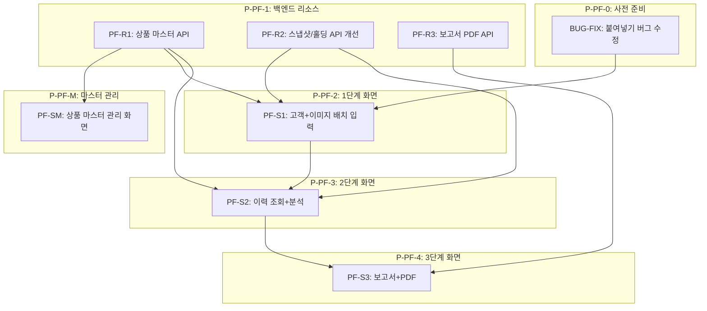

# IRP/연금저축 포트폴리오 재설계 — TASKS (Domain-Guarded v2.0)

> 생성일: 2026-03-16
> 기준 기획: docs/add_portfolio/기획.md
> 참조 엑셀: docs/add_portfolio/NH수익률 관리 프로그램.xlsx (Dashboard, Data_Templet 시트)
> 기존 코드: frontend/src/app/(main)/portfolio/irp/, frontend/src/components/portfolio/

---

## 엑셀 → 웹 구조 매핑

```
Excel Dashboard                 →   웹 3단계 구조
─────────────────────────────────────────────────
Data_Templet 상품별 위험도 DATA  →  [0단계] 상품 마스터 관리 화면 (신규)
1단계: 고객/이미지 입력           →  S-IRP-1 (개선: 붙여넣기 버그 수정, 배치)
2단계: 데이터 조회/분석           →  S-IRP-2 (개선: 기간별 그래프, 분산 차트)
3단계: 보고서                   →  S-IRP-3 (개선: 개요+분석+변경안내+AI코멘트+PDF)
  ■ 개요 (자금현황 테이블)
  ■ 연금저축/IRP
    ● 포트폴리오 분석 표
    ● 지역분산 차트
    ● 위험도 분산 차트
    ● 수익률 그래프
    ● 포트폴리오 변경 (수정비중 입력 → 변경후 자동계산)
```

---

## 의존성 그래프



---

## P-PF-0: 사전 준비

### [x] BUG-FIX: 이미지 붙여넣기(Ctrl+V) 수정

- **담당**: frontend-specialist
- **파일**: `frontend/src/components/portfolio/ClientRow.tsx`
- **문제**: `onClick` → 파일 다이얼로그 열림 → div 포커스 이탈 → `onPaste` 미발동
- **수정 방법**:
  1. `window` 레벨 `paste` 이벤트 리스너 추가 (포커스 무관하게 동작)
  2. "클릭" 영역과 "파일 선택" 버튼 분리 (파일 선택은 별도 버튼)
- **구현**:
  ```typescript
  useEffect(() => {
    const handleWindowPaste = (e: ClipboardEvent) => {
      // 활성 ClientRow에만 적용
      const items = e.clipboardData?.items;
      if (!items) return;
      for (let i = 0; i < items.length; i++) {
        if (items[i].type.startsWith('image/')) {
          const file = items[i].getAsFile();
          if (file) { processImageFile(file); break; }
        }
      }
    };
    window.addEventListener('paste', handleWindowPaste);
    return () => window.removeEventListener('paste', handleWindowPaste);
  }, []);
  ```
- **완료 기준**: 다른 곳 클릭 후 Ctrl+V → 이미지 붙여넣기 동작

---

## P-PF-1: 백엔드 리소스

### PF-R1: 상품 마스터 API (신규)

> 엑셀의 "상품별 위험도 DATA" 시트를 DB로 이관
> 상품명 → 위험도/지역 매핑 마스터 테이블

#### [x] PF-R1-T1: DB 스키마 + API 구현

- **담당**: backend-specialist + database-specialist
- **새 테이블**: `product_master`

```sql
CREATE TABLE product_master (
    id          VARCHAR(36) PRIMARY KEY,
    product_name VARCHAR(300) NOT NULL UNIQUE,  -- 상품명 (매핑 키)
    product_code VARCHAR(50),                    -- 종목코드
    risk_level   VARCHAR(50),                    -- 위험도 (절대안정형/성장형/절대성장형/안정형)
    region       VARCHAR(50),                    -- 지역 (국내/미국/글로벌/베트남/인도/중국/기타)
    product_type VARCHAR(100),                   -- 상품유형 (ETF/펀드/MMF 등)
    created_at   TIMESTAMP DEFAULT NOW(),
    updated_at   TIMESTAMP DEFAULT NOW()
);
```

- **엔드포인트**:
  - `GET /api/v1/product-master` — 전체 목록 (검색: ?q=상품명)
  - `POST /api/v1/product-master` — 신규 등록
  - `PUT /api/v1/product-master/:id` — 위험도/지역 수정
  - `DELETE /api/v1/product-master/:id` — 삭제
  - `GET /api/v1/product-master/lookup?name=상품명` — 이름으로 위험도/지역 조회 (홀딩 매핑용)

- **파일**:
  - `backend/alembic/versions/xxxx_add_product_master.py`
  - `backend/app/models/product_master.py`
  - `backend/app/schemas/product_master.py`
  - `backend/app/api/v1/product_master.py`
  - `backend/app/services/product_master_service.py`

- **TDD**: `backend/tests/api/test_product_master.py` → RED → GREEN → REFACTOR
- **병렬**: PF-R2-T1과 병렬 가능

---

### PF-R2: 스냅샷/홀딩 API 개선

#### [x] PF-R2-T1: 홀딩 수동 수정 API 추가

> 현재: AI 추출 후 홀딩 수정 불가
> 신규: 위험도/지역 수동 입력/수정 지원

- **담당**: backend-specialist
- **추가 엔드포인트**:
  - `PUT /api/v1/snapshots/:snapshot_id/holdings/:holding_id` — 홀딩 개별 수정 (risk_level, region, 수량 등)
  - `POST /api/v1/snapshots/:snapshot_id/holdings/apply-master` — 상품 마스터 기준으로 일괄 위험도/지역 적용

- **파일**:
  - `backend/app/api/v1/snapshots.py` (엔드포인트 추가)
  - `backend/app/services/snapshot_service.py` (서비스 로직 추가)

- **TDD**: `backend/tests/api/test_snapshot_holdings.py`
- **병렬**: PF-R1-T1과 병렬 가능

#### [x] PF-R2-T2: 스냅샷 이력 API 개선 (그래프용)

> 현재: 단순 날짜별 수익률 반환
> 신규: 3개월/6개월/1년 구간 필터 + 지역별/위험도별 비중 시계열

- **담당**: backend-specialist
- **개선 엔드포인트**:
  - `GET /api/v1/snapshots/history?account_id=&period=3m|6m|1y` — 기간별 스냅샷 이력
  - 응답에 각 스냅샷의 지역별/위험도별 비중 포함

- **파일**: `backend/app/api/v1/snapshots.py`, `backend/app/services/snapshot_service.py`
- **의존**: PF-R2-T1

---

### PF-R3: 보고서 PDF API

#### [x] PF-R3-T1: 보고서 PDF 생성 API

> 엑셀 Dashboard 구조 → HTML 템플릿 → PDF

- **담당**: backend-specialist
- **보고서 구조**:
  ```
  [개요]       자금현황 테이블 (연금저축/IRP/거치/Total)
  [분석]       포트폴리오 분석표 + 지역분산 + 위험도분산 + 수익률 그래프
               + AI 코멘트 (Gemini)
  [변경안내]   포트폴리오 변경 표 (현재비중/수정비중/변경후 평가금액)
               + AI 코멘트 (Gemini)
  ```
- **엔드포인트**:
  - `POST /api/v1/reports/portfolio` — 보고서 데이터 수집 + AI 코멘트 생성
  - `GET /api/v1/reports/portfolio/:id/pdf` — PDF 다운로드

- **PDF 라이브러리**: `playwright` 기반 HTML→PDF (차트 렌더링 포함) 또는 `WeasyPrint`
- **파일**:
  - `backend/app/api/v1/reports.py`
  - `backend/app/services/report_service.py`
  - `backend/app/services/pdf_service.py`
  - `backend/app/templates/portfolio_report.html`

- **TDD**: `backend/tests/api/test_reports.py`
- **의존**: PF-R2-T2

---

## P-PF-M: 상품 마스터 관리 화면 (신규)

### [x] PF-SM-T1: 상품 마스터 관리 UI

> 엑셀 "상품별 위험도 DATA" 시트를 웹으로 대체

- **담당**: frontend-specialist
- **화면**: `/portfolio/product-master` 또는 `/settings/product-master`
- **컴포넌트**:
  - `ProductMasterTable` — 상품 목록 테이블 (검색, 정렬)
  - `ProductMasterEditRow` — 인라인 편집 (위험도/지역 드롭다운)
  - `ProductMasterAddModal` — 신규 상품 등록 모달

- **위험도 선택지**: 절대안정형 / 안정형 / 성장형 / 절대성장형
- **지역 선택지**: 국내 / 미국 / 글로벌 / 베트남 / 인도 / 중국 / 기타

- **파일**:
  - `frontend/src/app/(main)/portfolio/product-master/page.tsx`
  - `frontend/src/components/portfolio/ProductMasterTable.tsx`
  - `frontend/src/components/portfolio/ProductMasterEditRow.tsx`

- **의존**: PF-R1-T1

---

## P-PF-2: 1단계 화면 — 고객+이미지 배치 입력

### [x] PF-S1-T1: 1단계 UI 개선

- **담당**: frontend-specialist
- **화면**: `/portfolio/irp` (기존) — 탭 1
- **변경 사항**:

  #### 고객 선택/입력
  - DB 고객 검색창 (기존 `ClientRow` 개선)
  - 신규 고객: 이름 + 계좌유형(IRP/연금저축/연금저축_거치) + 계좌번호
  - 여러 행 추가/삭제 (배치)

  #### 이미지 첨부 (버그 수정 후)
  - 붙여넣기 영역 + 파일 선택 버튼 분리
  - 이미지 미리보기 + 제거

  #### 처리 후
  - AI 추출 결과 인라인 표시
  - 상품 마스터 자동 매핑 (`/lookup` API 호출)
  - 매핑 안 된 상품 → 노란 하이라이트 + 수동 선택 드롭다운

- **파일**: `frontend/src/app/(main)/portfolio/irp/page.tsx`, `frontend/src/components/portfolio/ClientRow.tsx`
- **의존**: BUG-FIX, PF-R1-T1, PF-R2-T1

---

## P-PF-3: 2단계 화면 — 이력 조회+분석

### [x] PF-S2-T1: 2단계 UI 개선

- **담당**: frontend-specialist
- **화면**: `/portfolio/irp` — 탭 2
- **변경 사항**:

  #### 고객 이력 조회
  - 기존 저장된 고객 선택
  - 날짜별 스냅샷 목록 (최신순)
  - 보고서로 만들 스냅샷 선택 (체크박스)

  #### 포트폴리오 분석 표
  | NO | 상품명 | 위험도 | 지역 | 매입금액 | 평가금액 | 평가손익 | 수익률 |
  - 위험도/지역: 인라인 수정 가능 (저장 → `PUT /holdings/:id`)

  #### 차트 (Recharts)
  - **기간별 수익률**: 3개월/6개월/1년 탭 선택, 라인차트
  - **지역분산**: 도넛차트 (지역별 평가금액 비중)
  - **위험도 분산**: 도넛차트 (위험도별 평가금액 비중)

- **파일**: `frontend/src/app/(main)/portfolio/irp/page.tsx`, `frontend/src/components/portfolio/SnapshotDataTable.tsx`
- **의존**: PF-R2-T1, PF-R2-T2

---

## P-PF-4: 3단계 화면 — 보고서+PDF

### [x] PF-S3-T1: 3단계 UI 개선

- **담당**: frontend-specialist
- **화면**: `/portfolio/irp` — 탭 3

#### 보고서 섹션 구조 (엑셀 Dashboard 기준)

```
[개요]
  자금현황 테이블
  구분 | 조회일 | 계좌번호 | 월납입액 | 예수금 | 납입원금 | 평가금액 | 수익금액 | 총수익률

[■ 연금저축] / [■ IRP] (각각 렌더링)
  ● 포트폴리오 분석
    NO / 상품명 / 위험도 / 매입금액 / 평가금액 / 평가손익 / 수익률
  ● 지역분산 차트
  ● 위험도 분산 차트
  ● 수익률 그래프 (기간별)
  ● AI 코멘트 (편집 가능 textarea)

  ● 포트폴리오 변경 안내
    NO / 상품명 / 기준가 / 평가금액 / 수익률 / 현재비중 / [수정비중 입력] / 변경후 평가금액 / (+/-)
    → 수정비중 합계 = 1 검증
    → 변경후 평가금액 = 총평가금액 × 수정비중 (자동 계산)
    → (+/-) = 변경후 - 현재평가금액 (자동 계산)
  ● AI 변경 코멘트 (편집 가능 textarea)
```

- **AI 코멘트 생성**: Gemini API 호출 (보고서 데이터 → 분석 텍스트)
- **PDF 다운로드**: 보고서 미리보기 → PDF 저장 (개별 고객)
- **배치 PDF**: 여러 고객 선택 → ZIP 다운로드

- **파일**: `frontend/src/app/(main)/portfolio/irp/page.tsx`, `frontend/src/components/portfolio/ReportView.tsx`
- **의존**: PF-R3-T1

---

---

## P-PF-5: 고객 확인 포털 (신규)

### PF-R4: 고객 포털 API

#### [x] PF-R4-T1: 고객 정보 확장 + 포털 인증 API

- **담당**: backend-specialist + database-specialist
- **DB 변경 및 신규 테이블**:

```sql
-- 고객 정보 확장
ALTER TABLE clients ADD COLUMN birth_date DATE;
ALTER TABLE clients ADD COLUMN phone VARCHAR(20);
ALTER TABLE clients ADD COLUMN email VARCHAR(200);
ALTER TABLE clients ADD COLUMN portal_token VARCHAR(36) UNIQUE DEFAULT gen_random_uuid();

-- 리밸런싱 제안 (7일 유효)
CREATE TABLE portfolio_suggestions (
    id           VARCHAR(36) PRIMARY KEY,
    account_id   VARCHAR(36) NOT NULL,
    snapshot_id  VARCHAR(36) NOT NULL,        -- 기준 스냅샷
    suggested_weights JSONB NOT NULL,          -- {holding_id: weight, ...}
    ai_comment   TEXT,                         -- AI 변경 이유 코멘트
    expires_at   TIMESTAMP NOT NULL,           -- 생성일 + 7일
    created_at   TIMESTAMP DEFAULT NOW()
);

-- 통화 예약
CREATE TABLE call_reservations (
    id              VARCHAR(36) PRIMARY KEY,
    suggestion_id   VARCHAR(36),               -- 어떤 제안에서 예약했는지
    client_name     VARCHAR(100),
    phone           VARCHAR(20),
    preferred_date  DATE NOT NULL,
    preferred_time  VARCHAR(20) NOT NULL,       -- "10:00", "14:00", "16:00" 등
    status          VARCHAR(20) DEFAULT 'pending', -- pending/confirmed/completed
    created_at      TIMESTAMP DEFAULT NOW()
);
```

- **엔드포인트 (조회 링크)**:
  - `GET /api/v1/client-portal/[token]` — 고객 존재 확인 (이름 마스킹 반환)
  - `POST /api/v1/client-portal/[token]/verify` — 인증 → JWT 발급 (24h)
  - `GET /api/v1/client-portal/[token]/snapshots` — 계좌별 날짜 목록
  - `GET /api/v1/client-portal/[token]/report?account_id=&date=` — 날짜별 보고서

- **엔드포인트 (제안 링크)**:
  - `GET /api/v1/client-portal/[token]/suggestion/[suggest_id]` — 제안 내용 + 만료 여부
  - `POST /api/v1/client-portal/suggestion/[suggest_id]/call-reserve` — 통화 예약 등록

- **엔드포인트 (직원 - 제안 생성)**:
  - `POST /api/v1/portfolios/suggestions` — 수정비중 저장 + 제안 ID 생성 (7일 만료)
  - `GET /api/v1/portfolios/suggestions/:id` — 제안 조회

- **보안**: 3회 인증 실패 → 30분 잠금, JWT는 고객 포털 전용 scope

- **파일**:
  - `backend/app/api/v1/client_portal.py`
  - `backend/app/services/client_portal_service.py`
  - `backend/alembic/versions/xxxx_add_client_portal_tables.py`

- **TDD**: `backend/tests/api/test_client_portal.py`
- **의존**: PF-R2-T2

#### [x] PF-R4-T2: 링크 발송 + 통화예약 알림 API

- **담당**: backend-specialist
- **엔드포인트**:
  - `POST /api/v1/clients/:id/send-portal-link` — 조회 링크 이메일 발송 + 링크 반환
  - `POST /api/v1/portfolios/suggestions/:id/send` — 제안 링크 이메일 발송 + 링크 반환
  - `GET /api/v1/call-reservations` — 직원용: 통화 예약 목록 조회
  - `PUT /api/v1/call-reservations/:id` — 예약 상태 변경 (confirmed/completed)
- **이메일**: FastAPI-Mail + SMTP
- **통화 예약 시**: 직원에게 이메일 알림 자동 발송
- **파일**: `backend/app/services/email_service.py`, `backend/app/api/v1/call_reservations.py`
- **의존**: PF-R4-T1

---

### PF-S4: 고객 확인 포털 화면

#### [x] PF-S4-T1: 고객 포털 UI (모바일 최적화)

- **담당**: frontend-specialist
- **라우트**: `frontend/src/app/client/[token]/page.tsx` (공개 라우트)
- **화면 흐름**:

  ```
  [1] 인증 화면
      - 고객명(마스킹 표시), 생년월일, 핸드폰번호 입력
      - 3회 실패 시 잠금 안내

  [2] 계좌 선택 탭
      - IRP / 연금저축 / 연금저축_거치 탭

  [3] 날짜 선택
      - 스냅샷 날짜만 버튼으로 표시

  [4] 조회 보고서 뷰 (모바일 최적화)
      - 계좌 개요 카드 (자금현황)
      - 포트폴리오 분석 표
      - 지역분산 / 위험도분산 도넛차트
      - 기간별 수익률 라인차트
      - AI 코멘트 (최신 날짜에만)

  [5] 제안 영역 (?suggest=[id] 파라미터 있을 때만)
      ┌─────────────────────────────────┐
      │ ✨ 담당자 추천 포트폴리오 변경안  │
      │ 상품명 | 현재비중 → 추천비중      │
      │ AI 변경 이유 코멘트              │
      ├─────────────────────────────────┤
      │ 📞 담당자와 상담하기             │
      │ 통화 날짜: [오늘 ▾] 시간: [10시▾]│
      │         [통화 예약하기]          │
      └─────────────────────────────────┘
      → 7일 만료 시: "제안 기간이 만료되었습니다"
      → 예약 완료 시: 확인 메시지 + 직원 이메일 알림
  ```

- **통화 예약 UI**:
  - 날짜 선택: 기본값 오늘, 달력 팝업으로 변경 가능
  - 시간 선택: 드롭다운 (오전 10시 / 오후 2시 / 오후 4시 등)
  - 예약 버튼 → 확인 애니메이션 → "예약이 완료되었습니다"

- **파일**:
  - `frontend/src/app/client/[token]/page.tsx`
  - `frontend/src/components/client-portal/PortfolioReportView.tsx`
  - `frontend/src/components/client-portal/SuggestionPanel.tsx`
  - `frontend/src/components/client-portal/CallReservationForm.tsx`

- **의존**: PF-R4-T1

#### [x] PF-S2-T2: 직원 2단계 — 포트폴리오 수정비중 인라인 편집 + 제안 발송

- **담당**: frontend-specialist
- **위치**: 2단계 분석 화면 (포트폴리오 표 하단)
- **기능**:
  ```
  포트폴리오 표에서 "수정비중" 컬럼 인라인 편집
    - input 필드: 직접 % 입력
    - 합계 실시간 표시: 99.5% → 빨간색 경고
    - 합계 = 100% → 초록색 확인

  변경후 평가금액, (+/-) 자동 계산

  [리밸런싱 제안 발송] 버튼 (합계=100%일 때만 활성화)
    → AI 코멘트 생성 (Gemini: 변경 이유 자동 작성)
    → 제안 ID 생성 (7일 만료)
    → 링크 복사 버튼 + 이메일 발송 버튼
  ```

- **파일**: `frontend/src/app/(main)/portfolio/irp/page.tsx`, `frontend/src/components/portfolio/SuggestionEditor.tsx`
- **의존**: PF-R4-T1, PF-S2-T1

#### [x] PF-S3-T2: 직원 3단계 — 조회 링크 발송 버튼

- **담당**: frontend-specialist
- **위치**: 3단계 보고서 화면
- **기능**:
  - "조회 링크 복사" → 클립보드 복사 + 토스트
  - "이메일 발송" → 고객 이메일로 조회 링크 발송
  - 이메일 미등록 시 입력 유도 모달

- **의존**: PF-R4-T2, PF-S3-T1

---

## 태스크 요약 (전체)

| ID | 설명 | 담당 | 의존 | 상태 |
|----|------|------|------|------|
| BUG-FIX | 붙여넣기(Ctrl+V) 버그 수정 | frontend | - | [x] |
| PF-R1-T1 | 상품 마스터 API (DB+CRUD) | backend+db | - | [x] |
| PF-R2-T1 | 홀딩 수동 수정 API | backend | - | [x] |
| PF-R2-T2 | 스냅샷 이력 API 개선 | backend | PF-R2-T1 | [x] |
| PF-R3-T1 | 보고서 PDF API + AI 코멘트 | backend | PF-R2-T2 | [x] |
| PF-R4-T1 | 고객 포털 인증 + 제안/예약 API | backend+db | PF-R2-T2 | [x] |
| PF-R4-T2 | 링크 발송 + 통화예약 알림 API | backend | PF-R4-T1 | [x] |
| PF-SM-T1 | 상품 마스터 관리 화면 | frontend | PF-R1-T1 | [x] |
| PF-S1-T1 | 1단계 고객+이미지 UI 개선 | frontend | BUG-FIX, PF-R1-T1, PF-R2-T1 | [x] |
| PF-S2-T1 | 2단계 이력 조회+분析 UI | frontend | PF-R2-T1, PF-R2-T2 | [x] |
| PF-S2-T2 | 2단계 수정비중 인라인 편집 + 제안 발송 | frontend | PF-R4-T1, PF-S2-T1 | [x] |
| PF-S3-T1 | 3단계 보고서+PDF UI | frontend | PF-R3-T1 | [x] |
| PF-S3-T2 | 3단계 조회 링크 발송 버튼 | frontend | PF-R4-T2, PF-S3-T1 | [x] |
| PF-S4-T1 | 고객 포털 화면 (모바일 + 제안 + 통화예약) | frontend | PF-R4-T1 | [x] |

### 병렬 실행 그룹

| 그룹 | 태스크 |
|------|--------|
| 1차 병렬 | BUG-FIX + PF-R1-T1 + PF-R2-T1 |
| 2차 순차 | PF-R2-T2 |
| 3차 병렬 | PF-R3-T1 + PF-R4-T1 |
| 4차 순차 | PF-R4-T2 |
| 5차 병렬 | PF-SM-T1 + PF-S1-T1 + PF-S2-T1 + PF-S4-T1 |
| 6차 병렬 | PF-S2-T2 + PF-S3-T1 |
| 7차 순차 | PF-S3-T2 |

### 예상 개발 순서

```
[병렬] BUG-FIX + PF-R1-T1 + PF-R2-T1
                   ↓
               PF-R2-T2
                   ↓
     [병렬] PF-R3-T1 + PF-R4-T1
                   ↓
               PF-R4-T2
                   ↓
[병렬] PF-SM-T1 + PF-S1-T1 + PF-S2-T1 + PF-S4-T1
                   ↓
      [병렬] PF-S2-T2 + PF-S3-T1
                   ↓
               PF-S3-T2
```

---

## 참고: 기존 구현 현황

> **이미 구현된 것** (건드리지 않거나 소폭 수정):
> - DB: `portfolio_holdings.risk_level`, `portfolio_holdings.region` 컬럼 ✓
> - Backend: Gemini Vision 추출 (risk_level, region 포함) ✓
> - Frontend: SnapshotDataTable — 위험도/지역 표시 ✓
> - Frontend: ReportView — 지역/위험도 분산 파이차트 ✓
>
> **새로 추가되는 것**:
> - `product_master` 테이블 + 관리 화면 (상품명↔위험도/지역 마스터)
> - 홀딩 수동 수정 API
> - 포트폴리오 변경 안내 섹션 (수정비중 입력 → 변경후 자동계산)
> - AI 코멘트 (분석 + 변경안내) 생성
> - PDF 다운로드 (배치 포함)
> - Ctrl+V 붙여넣기 버그 수정
