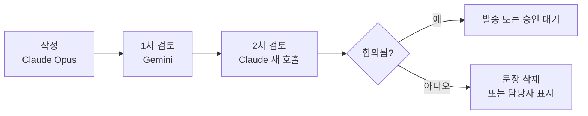
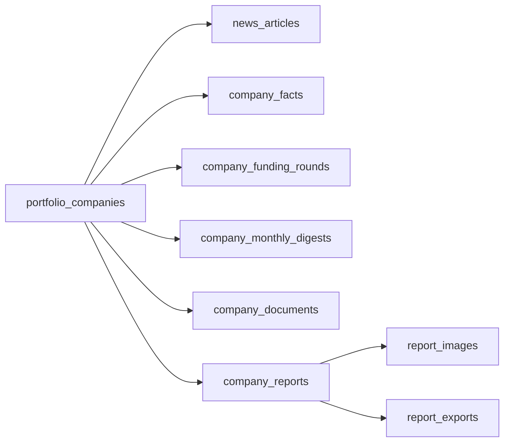

# 투자기업 뉴스 브리핑 기능 개발 기획서

> 원본: [Claude Docs 기획서](https://claude.ai/code/artifact/65aa8f71-71c8-4256-8169-7c8f784fb07a) · 내보낸 날짜 2026-09-28 · 수정은 원본에서 하고 필요할 때 다시 내보낸다.

Sep 23, 2026 · @Dr.GM

## 1. 개요

Working Hub(hub\_manager)의 **콘텐츠 제작 > 기업 리포트** 메뉴를 새로 만든다(기존 '테마 ETF 추천&관리' 메뉴는 삭제). 결과물은 세 가지다. 직원용 **데일리 브리핑**과 **월간 브리핑**은 영업인의 판단을 돕고, 고객용 **반기 기업 종합보고서**는 투자한 고객이 안심하고 기다릴 수 있게 한다. 세 결과물 모두 누적된 기업 데이터에서 나오고, Claude 작성 → Gemini 1차 검토 → Claude 2차 검토의 교차 검토를 거친다.

| 구분 | 데일리 브리핑 | 월간 브리핑 | 반기 기업 종합보고서 |
| --- | --- | --- | --- |
| 독자 | 직원 명단에서 고른 2\~5명 | 데일리와 같은 직원 | 투자 고객(출력해 직접 전달) |
| 목적 | 오늘 알아야 할 소식 | 지난 달 흐름과 영업 포인트 | 고객의 안심, 영업인의 설명 근거 |
| 주기 | 평일 08:30 | 매월 1일(데일리와 함께) | 1월 말(직전 하반기)·7월 말(상반기) 기준 작성 |
| 단위 | 전체 포트폴리오 | 전체 포트폴리오 | 기업별 1건 |
| 자료 | 당일 뉴스·공시·날씨(서울)·전일 한미 증시 | 한 달치 누적 기사·기업 사실 원장 | 모든 누적 데이터 + 자료함(투자사 보고서 포함) + DART + 웹 검색 |
| 작성·검토 | 기사 요약 Haiku, 본문 Opus → Gemini → Claude | Opus → Gemini → Claude | Opus → Gemini → Claude + 관리자 승인 |
| 전달 | 알림톡 + 웹(로그인) | 알림톡 + 웹(로그인) | 출력용 PDF·DOCX. 발송 기능 없음. 추후 고객자산관리 종합 보고서에 편입 |
| 승인 | 첫 1주만, 이후 자동 | 자동(검토 실패 시 보류) | 매번 관리자 계정 승인 |

**사용자 시나리오**

1. 담당자가 검색어를 넣으면 시스템이 후보 기업 정보를 보여주고, 담당자가 \[반영\] 또는 \[다시 찾기\]를 고른다.
2. 평일 08:30에 직원 2\~5명에게 데일리 브리핑 알림톡이 간다. 매월 1일에는 월간 브리핑도 함께 간다.
3. 영업인은 월간 브리핑의 기업별 '고객에게 이렇게 설명하세요'를 보고 고객 상담을 준비한다.
4. 1월 말·7월 말에 기업별 반기 보고서 초안이 자동으로 만들어진다. 관리자가 검토·승인하면 PDF로 출력해 고객에게 직접 전달한다.

## 2. 현행 시스템 분석

필요한 부품의 절반 이상은 이미 있다. 네이버 뉴스·DART 클라이언트, SOLAPI 알림톡, Claude 호출, 약간 배치 패턴, jsPDF 보고서 패턴을 재사용한다.

**스택**: Next.js 16 + React 19 + Tailwind 4 + Zustand(Vercel `working-hub.vercel.app`) / FastAPI + SQLAlchemy 2.0 async + Alembic + PostgreSQL(Railway Docker) / AI는 Gemini 기본, Claude Haiku 4.5 일부 사용.

| 기존 모듈 | 현재 역할 | 이번 활용 |
| --- | --- | --- |
| `services/collectors/naver_news_client.py` | 네이버 뉴스 검색(태그 제거, originallink 우선) | 재사용. 페이지네이션·날짜 파싱 추가 |
| `services/collectors/dart_client.py` | corp\_code 매핑(상장사만), 재무·공시 | 비상장사 매핑, 기업개황 조회 추가 |
| `services/solapi_service.py` | SMS·LMS·알림톡, 승인 템플릿 2개 하드코딩 | 신규 템플릿 추가, 대량 발송 함수 추가 |
| `services/report_service.py` `_call_claude_haiku()` | httpx로 Anthropic API 직접 호출 | 공용 `llm_client`로 분리·확장 |
| `services/ai_service.py` | Gemini 호출(google-genai) | 2차 교차검토에 재사용 |
| `services/collectors/key_access.py` | `user_api_keys` 복호화 | `naver_search`·`claude`·`gemini`·`dart` 키 조회 |
| `services/email_service.py` | SMTP·Resend 이메일 발송 | 고객 보고서 발송(PDF 첨부 추가) |
| `scripts/run_daily_batch.py` + `settings_store` | Railway Cron 독립 배치 | 같은 패턴으로 `run_news_briefing.py` |
| `models/user.py` | 직원 계정(`phone` 있음) | 브리핑 수신자 명단 |
| `models/client.py` | 고객 명단 | 보고서 수신자 명단 |
| 프론트 `TopNav.tsx`, `retirement/utils/*Pdf.ts` | 메뉴, jsPDF + html2canvas | 메뉴 추가, PDF 패턴 참고 |

**제약과 정리할 점**

- 앱 내부 스케줄러가 없다. 기존처럼 Railway Cron + 독립 스크립트로 간다. Railway Cron은 UTC 기준이다.
- Railway 컨테이너 디스크는 재배포 때 사라진다. 자료함 원본은 Railway Volume이나 외부 스토리지에 둔다.
- `anthropic` SDK가 없다. 웹 검색 도구를 쓰려면 SDK 추가를 권장한다(httpx 직접 호출도 가능).
- 네이버 키가 `.env`와 `user_api_keys` 두 곳에 있다. `.env`를 우선하고 DB 키로 폴백한다.
- `send_alimtalk()`의 `print` 디버그 출력을 제거하고, `disableSms: True` 고정값을 파라미터로 바꾼다.
- 기존 `message_logs`는 `client_id`가 필수라 직원 발송에 못 쓴다. 별도 로그 테이블을 둔다.

## 3. 기능 요구사항

기능은 9개 묶음(F1\~F9)과 공통 규칙 1개다. 비상장사가 많아 동명 기업을 걸러내는 것이 핵심이므로, 키워드를 **필수어·보조어·제외어**로 관리한다.

**공통. AI 교차 검토**: 직원·고객에게 나가는 모든 문장은 Claude가 쓰고, Gemini가 1차, Claude가 2차로 검토한다. 상세는 5장.

**F1. 투자기업 등록 (검색어 → 후보 확인 → 반영)**

1. 검색어 입력: 기업명, 제품명, 대표자명 등
2. 후보 탐색: DART 회사 목록, 네이버 뉴스, 웹 검색으로 후보 카드(정식명·영문명·대표자·설립일·소재지·업종·홈페이지·근거 기사)를 보여준다
3. 사용자 결정: \[반영\] / \[다시 찾기\] / \[직접 등록\]
4. 키워드 제안과 최근 7일 기사 미리보기
5. 내부 정보(선택): 투자일, 투자 형태, 투자 금액, 담당자, 메모

- 엑셀 일괄 등록(검색어 열만 있어도 됨), 활성/비활성 토글

**F2. 뉴스 수집**: 네이버 뉴스 API(필수어별 최신 100건, 직전 수집 이후만), DART 공시, URL 수동 추가, \[지금 수집\]. 등록 직후에는 과거 데이터 구축(기본 6개월, 최대 12개월)이 자동으로 돌고 검증까지 마친다(F12, 7-5).

**F3. 정제·판정**: URL 중복 제거, 비슷한 보도자료 묶기, 관련도 점수(규칙 + 40\~70점 구간 AI 재판정), '관련 없음' 피드백.

**F4. 기업 데이터 축적**

- 기사 아카이브: 기사와 요약을 지우지 않고 쌓는다. 달력에서 날짜를 누르면 그날 기사가 나온다
- 기업 사실 원장: 기사·공시·자료에서 나온 사실(투자유치, 수주·계약, 인증, 인사, 재무 등)을 출처와 함께 구조화해 쌓는다. 월간 브리핑과 반기 보고서는 이 원장을 뼈대로 쓴다
- 투자유치 기록: 라운드별 일자·금액·투자사·기업가치를 별도로 관리한다
- 월간 기업 요약: 매월 기업별 한 달 요약을 남겨, 반기 보고서가 6개월치 원문 대신 이것을 읽는다
- 보존 정책은 7장

**F5. 요약**: 기사별 3문장 요약 + 태그(긍정·중립·주의) + 이슈 유형, 기업 한 줄 요약, 기간 요약(온디맨드). 입력은 제목과 네이버 요약문만 쓰고 본문은 크롤링하지 않는다.

**F6. 데일리 브리핑(직원용)**

- 형식: ① 기본정보 → ② 종합브리핑 → ③ 기업별 브리핑 & 링크
- 평일 08:30 알림톡, 수신자는 직원 명단에서 2\~5명
- 첫 7일 승인 후 발송, 이후 자동. 웹은 로그인 후 열람

**F7. 월간 브리핑(직원용)**

- 지난 한 달의 누적 뉴스와 기업 사실 원장을 정리한다. 목적은 영업인의 통찰과 판단이다
- 매월 1일 자동 발송. 그날 데일리 브리핑과 함께 두 건을 보낸다
- Claude Opus 작성 → Gemini 1차 → Claude 2차. 형식은 5장

**F8. 자료함**: pdf, md, docx, hwp, hwpx, ppt, pptx를 올리면 본문·이미지를 추출하고 AI가 문서를 검토해 메모한다. 나온 사실은 기업 사실 원장에 후보로 올라간다.

**F9. 반기 기업 종합보고서(고객용)**

- 매년 1월 말(직전 하반기)·7월 말(상반기)을 기준으로 활성 기업별 초안을 자동 생성한다. 수시 생성도 가능하다
- 10개 항목 + 부록(링크 포함), 이미지 2\~10개, 고객 눈높이 문장
- 교차 검토 + 관리자 승인 후 출력용 PDF·DOCX로 내려받는다. 고객 전달은 수작업이라 발송 기능은 두지 않는다. 상세는 6장

**F10. 기업DB 폴더**: 기업별 폴더(01\_기업정보·02\_뉴스·03\_자료·04\_보고서·05\_이미지)에 자동 생성 파일과 업로드 파일을 정리한다. 파일명은 기업명으로 시작하고, 기업명·파일명·본문 검색과 폴더·기간·형식·상태 필터를 지원한다. 상세는 7-2.

**F11. 통합 검색**: 키워드 하나로 기업·기사·기업 원장·브리핑·반기 보고서·자료를 한 번에 찾는다. 결과는 종류별로 묶이고 기업·기간·태그 필터를 지원하며, 새 데이터는 저장 즉시 검색에 반영된다. 상세는 7-4.

**F12. 과거 데이터 구축과 검증**: 기업과 기간(기본 6개월, 최대 12개월)을 고르면 네이버·구글 뉴스·DART·웹·공공 API에서 그 기간의 데이터를 모두 모은다. 끝나면 기간 커버리지, 출처 간 대조, 핵심 사건 점검 등 6가지로 검증하고 결과서를 남긴다. 상세는 7-5.

## 4. 화면 설계

화면은 **등록 → 축적·활용 → 직원 브리핑 → 고객 보고서 → 파일 보관 → 설정** 순서로 6개다. 데이터가 만들어지는 순서이고, 기업 리포트 안의 상단 탭도 이 순서를 따른다. 디자인은 기존 페이지와 같다(10장).

| 순서 | 화면 | 라우트 | 역할 |
| --- | --- | --- | --- |
| ① | 투자기업 관리 | `/content/company-report/companies` | 기업 등록·목록 |
| ② | 기업 상세 | `/content/company-report/companies/[id]` | 기사 아카이브, 기업 원장, 기업 폴더, 반기 보고서 |
| ③ | 브리핑 | `/content/company-report/briefing?date=` / `?month=` | 데일리·월간 브리핑(탭). 알림톡 버튼이 여는 화면 |
| ④ | 보고서 관리 | `/content/company-report/reports` | 반기별 전 기업 보고서 진행 현황, 승인, 출력 |
| ⑤ | 기업DB | `/content/company-report/db` | 기업별 폴더와 파일 검색·필터·다운로드 |
| ⑥ | 발송 설정 | `/content/company-report/settings` | 수신자, 승인 모드, 스케줄, 모델, 데이터 출처 연결 상태, 이력 |
| 공통 | 통합 검색 | `/content/company-report/search?q=` | 모든 탭 상단의 검색창에서 열리는 결과 화면 |

### ① 투자기업 관리

- 목록: 오늘·7일 기사 수, 주의 배지, 마지막 수집 시각, 이번 반기 보고서 상태, 검색·정렬
- &#91;기업 추가\]: 검색어 → 후보 카드 → \[반영\] / \[다시 찾기\] / \[직접 등록\] → 키워드 칩·미리보기 → 내부 정보 → \[저장\]
- &#91;엑셀 일괄 등록\]: 행별 후보 표시, 행별 \[반영\]

### ② 기업 상세 (탭 4개)

- **기사 아카이브**: 달력에 기사 있는 날은 점, 주의 기사가 있는 날은 다른 색. 날짜를 누르면 그날 기사(제목·매체·요약·태그·원문 링크)가 나온다. 기간 선택, \[기간 요약\], 필터, '관련 없음'
- **기업 원장**: 누적된 사실의 유형별 타임라인, 투자유치 표, 임직원 수 추이(국민연금), 특허 목록, 월간 요약. AI가 올린 후보 사실은 담당자가 \[확정\] 또는 \[제외\]한다
- **기업 폴더**: 기업DB를 이 기업으로 걸러 보여준다. 끌어놓기 업로드(7개 형식), 추출 상태, 본문·이미지 미리보기, AI 메모, '보고서에 사용' 체크, 이번 반기 자료 요청 체크리스트
- **반기 보고서**: 반기 목록(2026 하반기 등)과 버전. 왼쪽에 본문과 이미지, 오른쪽에 문장별 출처·검토 결과. 이미지는 후보 중에서 담당자가 넣고 뺀다. 직접 고치고 \[검토 완료\]
- **수집 현황**(기업 원장 탭 위쪽): 월별 기사 수 막대, 출처별 건수, 마지막 검증 판정(충분·보완 필요·부족). \[과거 데이터 가져오기\](기간 선택)와 진행률, 관련도 샘플 검수 화면(20건 맞음·틀림), 검증 결과서 보기

### ③ 브리핑 (모바일 우선, 로그인 필수)

- &#91;데일리\] 탭과 \[월간\] 탭. 형식은 5장
- 날짜·월을 옮겨 지난 브리핑을 볼 수 있다
- 카톡 안 브라우저에서 로그인한 뒤 돌아오도록 `?next=` 리다이렉트를 넣는다

### ④ 보고서 관리

- 반기 선택(예: 2026 하반기) → 기업별 진행 현황: 자동 생성 → 검토 중 → 승인 → 발송 완료, 합의 안 된 문장 수
- &#91;출력\]: 승인된 보고서만 인쇄용 PDF(A4)·DOCX로 내려받는다. 여러 기업을 골라 한 번에 받을 수 있다(zip). 고객 전달은 담당자가 직접 한다. 승인은 관리자 계정만 할 수 있다
- 출력 기록: 보고서·버전·내려받은 사람·시각

### ⑤ 기업DB

- 왼쪽: 기업 폴더 트리(가나다순, 활성/비활성 구분)와 '\_포트폴리오 공통' 폴더. 상단에 기업명 검색
- 오른쪽: 파일 목록(이름·폴더·기간·형식·크기·날짜·상태), 검색창(파일명·기업명·이전 사명·본문), 필터(기업·폴더·기간·형식·자동/업로드·상태)
- 파일 누르면 미리보기·다운로드·원본 화면 이동. 폴더 통째로 내려받기
- 업로드는 기업·폴더를 고르면 파일명 규칙에 맞게 자동으로 이름이 바뀐다

### ⑥ 발송 설정

- 브리핑 수신자: 직원 명단(users)에서 2\~5명 체크(휴대폰 번호 없는 직원은 선택 불가 표시). 데일리·월간 공통
- 승인 모드: 데일리는 시작일부터 7일간 승인 후 자동 전환. 전환일과 남은 일수 표시
- 스케줄, 날씨 지역, 공휴일, 작성·검토 모델, \[테스트 발송\], 발송 이력, SOLAPI 잔액

### 공통 — 통합 검색

- 기업 리포트의 모든 탭 위에 검색창을 고정한다. 입력하는 동안 기업명 자동완성과 최근 검색어를 보여준다
- Enter를 누르면 결과 화면: 종류별 탭(전체·기업·기사·원장·브리핑·보고서·자료), 왼쪽 필터, 검색어 강조 카드, 정렬. 상세는 7-4
- 기업 상세에서 검색하면 그 기업으로 필터가 걸린 상태로 열린다

## 5. 브리핑 설계와 교차 검토

데일리는 '오늘 무슨 일이 있었나', 월간은 '그래서 무엇을 의미하고 고객에게 뭐라고 말할까'에 답한다. 두 브리핑과 반기 보고서는 같은 교차 검토 절차를 거친다.

### 데일리 브리핑 형식

1. **기본정보**: 날짜·요일, 날씨(기상청 단기예보: 최저·최고 기온, 하늘 상태, 강수확률, 기준 서울), 전일 증시(미국 S&P500·나스닥·다우존스, 한국 코스피·코스닥의 시가·종가·변동폭·등락률), 대상 기업 수·기사 수·주의 건수
2. **종합브리핑**: 오늘 꼭 봐야 할 내용 3\~5문장, 주의 이슈 먼저
3. **기업별 브리핑 & 링크**: 기업 카드마다 한 줄 요약, 주요 기사 3건(요약 + 원문 링크), \[기업 상세 보기\]

**전일 증시 표** (기본정보에 들어가는 형태)

| 시장 | 지수 | 시가 | 종가 | 변동 | % | 데이터 |
| --- | --- | --- | --- | --- | --- | --- |
| 미국 | S&P500 · 나스닥 · 다우존스 | 전일 시가 | 전일 종가 | 전전일 종가 대비 | 등락률 | yfinance(`^GSPC`, `^IXIC`, `^DJI`). 이미 설치됨 |
| 한국 | 코스피 · 코스닥 | 전일 시가 | 전일 종가 | 전전일 종가 대비 | 등락률 | KIS 지수 일봉(0001·1001). 기존 `get_index_closes`가 종가만 반환하므로 시가를 함께 반환하도록 보강 |

- 미국 장은 한국 시간 새벽에 끝나므로 07:00 수집 때 전일 데이터가 확정돼 있다
- 휴장일이면 가장 최근 거래일 데이터를 날짜와 함께 보여준다(예: '미국 11/27 휴장 → 11/26 기준')
- yfinance는 비공식 데이터라 실패할 수 있다. 실패하면 KIS 해외지수 조회로 대신하고(지원 여부 개발 시 확인), 그마저 안 되면 해당 줄에 '조회 실패'를 표시하고 브리핑은 그대로 보낸다
- 알림톡에는 길이 때문에 종가와 등락률만 넣고, 시가·변동폭은 웹 브리핑에서 본다

### 월간 브리핑 형식

1. **이달의 요약**: 포트폴리오 전체에서 지난 달 가장 중요한 일 3\~5문장
2. **포트폴리오 동향**: 기업별 기사 수와 긍정·주의 비율, 전월 대비 변화(웹에서는 차트)
3. **기업별 월간 정리**: 이달의 주요 사실(날짜·출처), 의미('분석' 표시), **고객에게 이렇게 설명하세요**(1\~2문장), 예상되는 고객 질문과 답
4. **주의가 필요한 기업**: 무슨 일인지, 어떤 영향이 있는지, 회사에 확인할 것
5. **다음 달 체크포인트**: 기사·공시에 나온 예정 일정(출시, 계약, 투자 라운드 등)

자료는 한 달치 기사 요약, 기업 사실 원장, 전월 월간 기업 요약이다. 월간 브리핑을 만들 때 기업별 월간 요약(6장 반기 보고서의 재료)도 함께 저장한다.

### 교차 검토 절차 (데일리·월간·반기 공통)



| 단계 | 모델 | 하는 일 |
| --- | --- | --- |
| 작성 | Claude Opus 5 | 문장마다 출처 ID를 단 JSON 초안 |
| 1차 검토 | Gemini 3.1 Pro | 문장별로 출처(기사 제목·요약문, 원장, 자료)와 대조한다. 사실 오류, 과장, 출처 없는 추측, 논리 비약, 빠진 중요 사실을 지적하고 유지·수정·삭제 의견을 낸다 |
| 2차 검토 | Claude Opus 5(작성과 분리된 새 호출) | 1차 지적마다 수용·기각과 근거를 남기고 최종본을 만든다. 최종본을 출처와 한 번 더 대조한다 |

- 합의 안 된 문장: 브리핑은 삭제하고, 반기 보고서는 담당자 화면에 표시한다
- 모든 검토 의견과 판정은 검토 로그로 남긴다
- 데일리: 08:20까지 2차 검토가 끝나지 않으면, 검토가 끝난 기사 요약 목록만 담은 단순 브리핑을 보내고 담당자에게 알린다
- 월간: 검토가 실패하거나 삭제된 문장이 30%를 넘으면 발송을 보류하고 담당자에게 알린다

## 6. 반기 기업 종합보고서 (고객용)

반기 보고서는 투자한 고객이 안심하고 기다릴 수 있게 하고, 영업인이 자신 있게 설명할 근거를 주는 문서다. 매년 1월 말(직전 하반기)과 7월 말(상반기)을 기준으로 활성 기업별 한 건씩 만든다. 출력용 문서이고 고객 전달은 담당자가 직접 한다. 나중에 고객자산관리 종합 보고서에 들어갈 수 있도록 항목별 내용을 구조화해 저장한다. 누적된 모든 기업 데이터를 바탕으로 10개 항목과 부록을 쓰고, 이미지는 2\~10개 넣는다.

### 사용하는 데이터

- 기업 사실 원장과 투자유치 기록(등록 이후 전 기간)
- 해당 반기의 월간 기업 요약 6개(원문 기사 수백 건 대신 이것을 읽는다)
- 자료함 문서, DART(기업개황·공시·재무), 웹 검색 보강
- 직전 반기 보고서: '지난 보고서 이후 달라진 점'을 뽑는 데 쓴다
- 이 기업에 투자한 회사(VC·조합 등)가 낸 보고서도 자료함 자료로 쓴다. 단, 고객 개인이 당사를 통해 투자한 금액·지분 같은 내용은 보고서에 넣지 않는다

### 양식 (10개 항목 + 부록)

보고서 앞에는 표지(기업명, 대상 반기, 기준일, Dr.GM 로고)와 **한 장 요약**(핵심 3줄 + 지난 보고서 이후 달라진 점)을 둔다.

| # | 항목 | 담을 내용(상세 항목) | 주요 출처 |
| --- | --- | --- | --- |
| 1 | 기업정보 | 표로 제시: 정식 기업명(국문·영문), 설립일, 대표자, 본사 소재지, 업종, 임직원 수, 자본금, 지분구조(주요 주주·지분율), 상장 여부, 기업 인증(벤처·이노비즈 등), 주요 특허 수, 홈페이지. 확인 안 된 칸은 '공개 자료 없음' | DART 기업개황·감사보고서, 자료함(IR자료·주주명부), 기사 |
| 2 | 대표자정보 | 대표자와 주요 경영진(CTO·CFO 등)별 이름·직책, 학력·경력, 창업 이력, 수상·대외 활동, 공개 발언 요지. 공개 자료만 쓰고 사생활은 다루지 않는다 | 기사, 웹 검색, 회사 홈페이지 |
| 3 | 주요특징 및 사업영역 | 한 줄 정의, 사업영역, 경쟁우위(기술·특허·네트워크), 시장의 평가, 주요 경쟁사 | 기사, 웹 검색, IR자료 |
| 4 | 제품라인업 | 제품·서비스별 이름, 300자 내 설명, 대상 고객, 단계(개발·출시·매출 발생), 매출 기여도(자료가 있을 때) | 홈페이지, IR자료, 기사 |
| 5 | **투자유치 현황** | ① 라운드별 표: 일자, 라운드(시드·시리즈 A 등), 금액, 투자사, 투자사 유형(VC·CVC·정책금융·개인투자조합·엔젤), 기업가치(공개 시), 출처 링크 ② 누적 투자금과 라운드별 변화 ③ 분석: 기존 투자사의 후속 투자 여부, 전략적 투자자의 의미, 정책금융 참여의 의미, 라운드 간 간격. 비공개 금액은 '비공개'로 쓰고 추정하지 않는다 | 투자유치 기록, 기사, 자료함(투자계약·주주명부), DART 감사보고서 |
| 6 | 최근 1년 주요성과 | 표: 날짜, 성과, 수치, 출처. 이번 반기 성과를 먼저, 직전 반기는 요약. 계약·수주, 인증·허가, 수상, 파트너십 | 기업 원장, DART 공시 |
| 7 | 성장전략 | '회사가 밝힌 전략'(출처 있는 사실)과 '분석'(사실에서 나온 해석, 라벨 표시)으로 나눈다 | 기사, 대표자 인터뷰, IR자료 |
| 8 | 최신동향 | 이번 반기 6개월 월별 타임라인 한 줄씩. 6번과 겹치지 않게 활동 중심 | 월간 기업 요약 |
| 9 | 최근 결산정보 요약 | 직전 사업연도 약식 표(매출액, 영업이익, 당기순이익, 자산·부채·자본 총계, 전년 대비 증감률, 부채비율)와 3\~5문장 해석. 숫자는 원문 그대로, 계산한 비율은 계산식을 남긴다 | DART 재무제표·감사보고서, 자료함 재무제표 |
| 10 | 결론 | 3\~5문장: 이번 반기의 진전, 핵심 강점, 주요 리스크와 회사의 대응, 다음 반기에 지켜볼 점. 매수·매도 권유나 수익·상장 보장으로 읽힐 표현은 쓰지 않는다 | 1\~9번 내용 |
| 부록 | Appendix | 아래 ‘부록 구성’ | 본문의 모든 출처 |

### 부록(Appendix) 구성

부록은 보고서 맨 끝에 둔다. 모든 링크는 PDF에서 눌러 바로 열 수 있게 하고, 긴 주소는 제목에 링크를 건다.

1. **출처 목록**: 본문 \[1\], \[2\] 번호와 연결. 번호·제목·매체·날짜·링크
2. **이번 반기 주요 기사**: 날짜·제목·매체·링크(관련도 높은 순 최대 30건)
3. **DART 공시 목록**: 공시명·일자·DART 원문 링크(있는 경우)
4. **투자유치 출처**: 라운드별 근거 기사·자료 링크
5. **참고 자료 목록**: 자료함 문서명과 공개 여부(비공개 자료는 이름만 적고 링크 없음)
6. **용어 풀이**: 본문에 나온 전문용어
7. **검증 요약**: 문장 수, 출처 수, 교차 검토 결과, 기준일
8. **면책 문구**

### 이미지 (최소 2개, 최대 10개)

**기본 2개(항상 들어감)**: 시스템이 데이터로 직접 그리는 차트다. 저작권 문제가 없고 항상 만들 수 있다.

- ① 투자유치 타임라인(라운드별 금액과 누적 투자금) → 5번 항목
- ② 재무 추이(매출·영업이익 3개년) → 9번 항목. 재무 자료가 없으면 '이번 반기 주요 사건 타임라인'으로 대신한다 → 8번 항목

**추가 이미지(최대 8개 더)**: 제품·서비스 사진, 사업 구조도, 공장·연구소, 인증서·수상, IR 자료 속 도표, 조직도.

| 이미지가 늘어나는 상황 | 예시 | 이미지 수 |
| --- | --- | --- |
| 기본 | 특별한 사건 없이 순항 중 | 2\~3개 |
| 제품이 여러 개 | 제품 라인업 3개 이상, 제품별 1장 | 4\~6개 |
| 반기 중 큰 사건이 많음 | 신제품 출시, 대형 수주, 인증 획득이 각각 있음 | 5\~8개 |
| 기업을 처음 소개하는 보고서 | 신규 투자 후 첫 반기 보고서 | 6\~10개 |
| 기술이 어려워 그림이 꼭 필요함 | 바이오·반도체 등 구조 설명이 필요한 경우 | 6\~10개 |

**이미지 출처 원칙**

- 쓸 수 있는 순서: 직접 만든 차트 > 회사가 제공한 자료(자료함, IR 자료, 보도자료 키트) > 회사 홈페이지·공식 보도자료 이미지(회사가 허락한 범위)
- 언론사 기사 사진은 저작권 때문에 넣지 않고 부록 링크로 대신한다
- 모든 이미지에 측션과 출처를 단다
- 선정: 자료함에서 이미지를 추출하고 Claude가 항목별 관련성을 판단해 측션 초안을 쓴다. 담당자가 화면에서 최종 선택한다
- 배치: 관련 항목 안에 넣고, 본문 폭에 맞춘다. 한 페이지에 2개를 넘기지 않는다

### 고객 눈높이 원칙

- 사실로 안심시킨다: 진전은 '크게 성장' 같은 형용사가 아니라 날짜·숫자·사건으로 보여준다
- 기다림의 이유를 보여준다: 비상장 투자는 회수까지 시간이 걸린다. 한 장 요약에 회사가 지금 어느 단계에 있는지(개발 → 출시 → 매출 → 흑자 등)를 표시한다
- 리스크를 숨기지 않는다: 주의 이슈는 '무슨 일 → 회사의 대응 → 지켜볼 점' 순서로 차분하게 쓴다. 숨기면 나중에 신뢰를 잃는다
- 투자 권유·수익 보장으로 읽힐 표현('곧 상장', '수익 확실')은 금지한다
- **영업 대화 노트(내부용)**: 보고서와 함께 1장짜리 노트를 만든다. 핵심 메시지 3개, 예상 질문과 답, 조심할 표현이 들어간다. 고객에게는 보내지 않는다

### 문장 규칙

- 두괄식: 항목의 첫 문장이 그 항목의 결론이다
- 고등학생 수준: 한 문장에 한 내용, 60자 안팎. 전문용어는 처음 나올 때 괄호로 푼다(예: 영업이익(본업으로 번 돈))
- 모든 사실 문장에 출처 번호 \[1\]을 단다. 출처 없는 사실은 쓰지 않는다
- 숫자·날짜·고유명사는 출처 표기 그대로 옮기고 기준 시점을 밝힌다
- 추측·전망은 5·7·10번에만 쓰고 '분석'임을 표시한다

### 자료 읽기 (자료함)

| 형식 | 텍스트 추출 | 이미지 추출 |
| --- | --- | --- |
| pdf | `pypdf`. 스캔본·표 중심 문서는 Claude API PDF 입력 | `pypdf` 페이지 이미지, 필요 시 페이지 렌더링 |
| docx | `python-docx`(본문 + 표) | 문서 안 미디어 파일 |
| md | 그대로 | — |
| pptx | `python-pptx`(슬라이드 + 발표자 노트) | 슬라이드 안 그림 |
| hwpx | zip 안 XML 직접 파싱 | zip 안 `BinData` |
| hwp | `pyhwp`, 실패 시 LibreOffice 변환 | 변환 후 추출 |
| ppt | LibreOffice로 pptx 변환 후 처리 | 변환 후 추출 |

### 작성·검증 절차

1. 자료 수집: 위 ‘사용하는 데이터’를 모으고 각각 출처 ID를 붙인다
2. 웹 검색 보강: Claude API의 web search·web fetch 도구로 항목별 빈칸을 채운다
3. 초안: Claude Opus 5가 JSON(항목별 문장 + 출처 ID + 이미지 후보)으로 쓴다
4. 1차 검토: Gemini 3.1 Pro가 Google 검색 그라운딩으로 문장별 사실을 독립 확인하고, 항목 간 모순과 논리 비약을 지적한다
5. 2차 검토: Claude Opus 5(새 호출)가 1차 지적을 판정하고 최종본을 만든다. 모든 사실 문장을 출처 원문과 다시 대조한다
6. 관리자 검토: 합의 안 된 문장과 이미지 후보를 확인하고 승인한다(승인은 관리자 계정만)

**팩트 오류 원칙**: 교차 검토는 오류를 크게 줄이지만 0%를 보장하지는 못한다. 웹 출처 자체가 틀릴 수도 있다. 그래서 출처 없는 사실은 쓰지 않고, 합의 안 된 문장은 삭제하거나 표시하며, 담당자 승인 없이는 발송할 수 없게 한다.

**실행·출력**: 모델 ID는 `app_settings`에 둔다(Gemini 3.1 Pro는 현재 프리뷰 `gemini-3.1-pro-preview`). 보고서 한 건은 수 분 걸려 백그라운드 작업으로 돌리고, 토큰 사용량·비용을 기록한다. 출력은 웹 미리보기, PDF(Dr.GM 브랜드, 링크 클릭 가능), DOCX다. PDF는 A4 인쇄에 맞춘 여백과 페이지 나눔을 쓴다. 고객 전달은 수작업이다.

## 7. 기업 데이터: 출처·기업DB 폴더·보존

기업 데이터는 11개 출처에서 모여, Working Hub 안 **기업DB**의 기업별 폴더에 정리된다. 모든 파일 이름은 기업명으로 시작해 검색·필터로 바로 찾을 수 있다. 핵심 데이터는 영구 보존한다.

### 7-1. 데이터 출처

비상장사가 많아 재무·투자유치 데이터가 가장 약하다. 그래서 공공 API를 더하고, 투자기업에 자료를 정기적으로 요청하는 절차를 둔다.

| 출처 | 가져오는 것 | 쓰는 곳 | 도입 | 비고 |
| --- | --- | --- | --- | --- |
| 네이버 뉴스 검색 API | 기사 제목·요약문·링크·날짜 | 데일리·월간·반기 | 기존(보강) | 하루 25,000회, 검색어당 최근 1,000건 |
| OpenDART | 회사 목록, 기업개황, 공시, 재무제표 | 등록, 보고서 1·6·9번 | 기존(보강) | 외부감사 대상이 아닌 소규모 비상장사는 재무 없음 |
| 특일 정보(한국천문연구원, 공공데이터포털) | 공휴일 | 데일리 발송일, 월간 발송일 판정 | **필수** | 무료 |
| 기상청 단기예보(공공데이터포털) | 날씨 | 데일리 기본정보 | 필수 | 무료 |
| 국민연금 가입 사업장 정보(공공데이터포털) | 가입자 수(임직원 수)와 추이 | 보고서 1·6번, 월간 | 강력 권장 | 비상장사 성장 신호. 사업자번호·사업장명으로 매칭 |
| KIPRIS Plus(특허청) | 특허·상표 출원·등록 | 보고서 1·3번 | 강력 권장 | 출원인명으로 조회 |
| 국세청 사업자 상태조회(공공데이터포털) | 계속·휴업·폐업 | 월 1회 이상 신호 점검 | 권장 | 사업자번호 필요 |
| 구글 알리미 RSS | 네이버에 없는 업계지·보도자료·해외 기사 | 데일리 보조 수집 | 권장 | 무료. 기업별 알리미를 RSS로 만들어 URL 등록 |
| KIS API(기존 연결) | 상장사 주가 | 상장사 보고서 | 선택 | 코스피·코스닥 지수(시가·종가)를 데일리에 사용. 상장사 주가는 상장사가 있을 때만 |
| Claude 웹 검색 / Gemini Google 검색 | 빈칸 보강, 교차 검토 사실 확인 | 전 결과물 | 필수 |  |
| 투자기업 제출 자료(자료함) | 재무제표, 주주명부, IR 자료, 투자계약, 투자사(VC·조합) 보고서. 담당자가 직접 업로드 | 보고서 1·5·9번 | **필수** | 비상장 재무의 사실상 유일한 출처 |
| 유료 기업정보·투자 DB(NICE·한국기업데이터·더브이씨·혁신의숲 등) | 비상장 재무, 투자 라운드 | 보고서 5·9번 | 검토 후 결정 | API 제공 여부·비용·약관 미확인 |
| yfinance(기존 설치) | S&P500·나스닥·다우존스 시가·종가 | 데일리 기본정보 | 필수 | 비공식 데이터. 실패 시 KIS 해외지수로 대체 |

**투자기업 자료 요청 절차**: 반기 보고서 작성 한 달 전(6월 말·12월 말)에 담당자에게 알림을 보낸다. 기업별 요청 목록(직전 연도 재무제표, 주주명부, 최근 IR 자료, 주요 성과 자료)을 만들고, 받은 여부를 기업DB에서 체크한다. 투자 계약상 보고 의무가 있다면 그 일정에 맞춘다.

### 7-2. 기업DB 폴더 시스템

기업 리포트에 **기업DB** 탭을 둔다. 기업별 폴더에 기업정보, 뉴스, 자료, 보고서, 이미지가 자동으로 쌓이고, 직접 올린 파일도 같은 규칙으로 정리된다.

```text
기업DB/
├─ _포트폴리오 공통/
│   ├─ 데일리브리핑/2026/10/  2026-10-01_데일리브리핑.pdf
│   └─ 월간브리핑/2026/      2026-10_월간브리핑.pdf
└─ 에이비씨바이오/                (기업명 가나다순)
    ├─ 01_기업정보/   에이비씨바이오_기업카드_2026-10.pdf, _투자유치기록.xlsx, _사실원장.xlsx
    ├─ 02_뉴스/       에이비씨바이오_뉴스_2026-10.md, _월간요약_2026-10.md
    ├─ 03_자료/       에이비씨바이오_자료_20261015_IR자료.pdf
    ├─ 04_보고서/     에이비씨바이오_반기보고서_2026H2_v2.pdf, .docx, _영업노트_2026H2.pdf
    └─ 05_이미지/     에이비씨바이오_차트_투자유치_2026H2.png
```

위 기업명은 예시다.

**파일 이름 규칙**: `{기업명}_{문서종류}_{기간 또는 날짜}_{버전}.{확장자}`

- 직접 올린 파일도 이 규칙으로 이름을 바꾼다. 원래 파일명은 끝에 붙이고 별도로 저장한다
- 파일명에 쓸 수 없는 문자(`/ \ : * ? " < > |`)는 지운다. 보고서는 수정할 때마다 버전이 올라가고 이전 버전도 남는다

**자동으로 만들어지는 파일**

| 폴더 | 파일 | 만들어지는 때 |
| --- | --- | --- |
| 01\_기업정보 | 기업카드(기본정보 요약 PDF), 투자유치 기록·사실 원장(엑셀) | 매월 1일, 확정 사실이 바뀔 때 |
| 02\_뉴스 | 월별 뉴스 모음(날짜·제목·요약·링크), 월간 기업 요약 | 매일 갱신 / 매월 1일 |
| 03\_자료 | 업로드 원본 | 업로드할 때 |
| 04\_보고서 | 반기 보고서 PDF·DOCX(버전별), 영업 대화 노트 | 생성·수정·승인할 때 |
| 05\_이미지 | 차트, 자료에서 추출한 이미지 | 보고서 생성·자료 업로드 때 |
| \_포트폴리오 공통 | 데일리·월간 브리핑 PDF | 발송할 때 |

**검색과 필터**

- 검색창 하나로 파일명, 기업명, 영문명, 이전 사명, 본문 추출 텍스트를 함께 찾는다. 한글 부분 일치를 위해 PostgreSQL `pg_trgm` 인덱스를 쓴다
- 필터: 기업(복수 선택), 폴더(기업정보·뉴스·자료·보고서·이미지), 기간, 파일 형식, 생성 방식(자동·업로드), 상태(초안·승인·발송), 활성·비활성 기업
- 화면: 왼쪽 기업 폴더 트리(가나다순, 상단 검색), 오른쪽 파일 목록(이름·종류·기간·크기·날짜). 파일을 누르면 미리보기, 내려받기, 원본 화면(보고서·기사)으로 이동
- &#91;폴더 통째로 내려받기\]: 기업 폴더를 같은 구조의 zip으로 받는다
- 기업 상세의 자료함 탭은 '기업 폴더' 탭으로 바뀌고, 기업DB 화면을 그 기업으로 걸러 보여준다

**저장 방식**: 폴더·파일명은 화면에 보이는 이름이고, 실제 저장 경로는 `company-db/{company_id}/{폴더}/{file_id}`다. 그래서 사명이 바뀌어도 파일을 옮기지 않고, 보이는 이름만 새 사명으로 바뀐다(이전 사명으로도 검색됨). 동명 기업은 폴더 이름 뒤에 사업자번호 끝 4자리를 붙여 구분한다.

### 7-3. 저장 계층과 보존

데이터는 원천(기사·공시·자료) → 가공(요약·사실 원장·투자유치) → 압축(월간 기업 요약) → 산출물(브리핑·보고서) 순서로 쌓인다. 반기 보고서는 6개월치 원문 대신 월간 요약 6개와 사실 원장을 읽고, 필요할 때만 원문으로 내려간다.

| 데이터 | 저장 위치 | 보존 기간 |
| --- | --- | --- |
| 기사(제목·매체·날짜·링크·요약문)와 AI 요약 | PostgreSQL + 02\_뉴스 | 영구. 본문은 저장하지 않음 |
| '관련 없음' 오탐 기사 | PostgreSQL | 90일 후 삭제(제외어 학습 기록만 남김) |
| DART·공공 API 수치(재무, 임직원 수, 특허) | PostgreSQL | 영구(시점별 스냅샷) |
| 사실 원장·투자유치 기록 | PostgreSQL + 01\_기업정보 | 영구, 수정 이력 보존 |
| 월간 기업 요약 | PostgreSQL + 02\_뉴스 | 영구 |
| 자료 원본·추출 이미지 | 파일 저장소(03·05) | 영구. 비활성 기업은 저비용 보관으로 이동 |
| 데일리·월간 브리핑 | PostgreSQL + \_포트폴리오 공통 | 영구 |
| 반기 보고서(모든 버전, PDF·DOCX, 이미지) | DB + 04\_보고서 | 영구(고객 제공 기록) |
| AI 검토 로그 원문 | PostgreSQL | 2년 후 원문 삭제, 판정 요약만 영구 |
| 발송 로그 | PostgreSQL | 5년 |

- 투자가 끝난 기업은 비활성으로 바꾸면 수집만 멈추고 폴더·데이터는 남는다. 삭제는 관리자가 직접 요청할 때만 한다
- 용량(50개 기업): 기사·요약은 연 100\~200MB, 파일은 기업당 연 50MB로 잡으면 연 2.5GB다
- 백업: DB는 매일 자동 백업 + 주 1회 외부 보관, 파일 저장소는 버전 관리
- 보안: 기업DB는 로그인한 직원만 열람·다운로드하고, 내려받은 기록을 남긴다

### 7-4. 통합 검색

키워드 하나로 기업 리포트의 모든 데이터를 찾는다. 결과는 데이터 종류별로 묶여 나오고, 누르면 원래 화면으로 간다. 새로 쌓이거나 수정된 데이터는 저장되는 즉시 검색에 반영된다.

**검색 대상**

| 종류 | 검색하는 내용 | 누르면 가는 곳 |
| --- | --- | --- |
| 기업 | 기업명, 영문명, 이전 사명, 대표자, 업종, 키워드 | 기업 상세 |
| 기사 | 제목, 네이버 요약문, AI 요약, 매체 | 기사 아카이브(해당 날짜) |
| 기업 원장 | 사실 제목·내용, 투자유치(라운드·투자사·금액) | 기업 원장 탭 |
| 브리핑 | 데일리·월간 본문, 월간 기업 요약 | 브리핑 화면(해당 날짜·월) |
| 반기 보고서 | 10개 항목 본문, 부록, 영업 대화 노트(최신 버전 기준, 이전 버전은 필터로) | 보고서의 해당 항목 |
| 자료·파일 | 파일명, 본문 추출 텍스트, AI 메모, 이미지 측션 | 기업DB 미리보기 |

**검색 방식 (2단계)**

1. 키워드 검색(2단계 개발 때): PostgreSQL `pg_trgm`으로 한글 부분 일치('바이오'로 '에이비씨바이오' 찾기)를 처리한다. 띄어쓰기를 무시하고, 기업 별칭은 기업명으로 바꿔 찾는다. 여러 단어는 AND로 찾고, 따옴표는 정확히 일치하는 구절을 찾는다
2. 의미 검색(5단계 고도화 때): '올해 후속 투자를 받은 바이오 기업'처럼 문장으로 물어도 찾게 한다. 본문을 단락 단위로 임베딩(Gemini 임베딩 API)해 `pgvector`에 저장하고, 키워드 점수와 의미 점수를 합쳐 순위를 매긴다. 정확한 값이 필요한 데이터(금액·날짜·라운드)는 구조화 필터로 찾는다

**결과 화면**

- 위쪽: 검색어, 종류별 건수 탭(전체·기업·기사·원장·브리핑·보고서·자료)
- 왼쪽 필터: 기업(복수), 기간, 태그(긍정·중립·주의), 보고서 상태, 파일 형식, 활성·비활성 기업
- 결과 카드: 종류 배지, 기업명, 제목, 날짜, 검색어가 강조된 본문 한두 줄, \[원본 보기\]
- 정렬: 관련도순(기본), 최신순. 같은 기업 결과는 묶어 보기 선택 가능
- 검색 결과를 엑셀로 내려받기, 자주 쓰는 검색 저장
- (선택) \[AI로 정리\]: 검색 결과 상위 항목만 근거로 Claude가 3\~5문장 요약을 만든다. 문장마다 결과 번호를 달고, 결과에 없는 내용은 쓰지 않는다

**검색 색인 갱신**: 모든 데이터는 저장·수정하는 서비스 함수에서 검색 색인(`search_index`)도 함께 갱신한다. 삭제·숨김 처리된 데이터는 색인에서도 빠진다. 누락에 대비해 매일 새벽 색인 점검 배치를 돌리고, 관리자용 \[색인 다시 만들기\] 버튼을 둔다.

### 7-5. 과거 데이터 구축(백필)과 검증

기업을 처음 등록하면 쌓인 뉴스가 없다. 그래서 지정한 기간(기본 6개월, 최대 12개월)의 뉴스·공시·웹 자료를 여러 출처에서 훑어오는 **과거 데이터 구축** 기능을 둔다. 끝난 뒤에는 빠진 게 없는지 자동으로 검증하고, 검증을 통과해야 반기 보고서에 쓸 수 있다.

**왜 출처가 여러 개여야 하나**: 네이버 뉴스 API는 기간을 지정할 수 없고, 검색어당 최근 1,000건까지만 준다. 기사가 많은 기업은 6개월 전까지 닿지 못할 수 있다. 반대로 구글 뉴스 RSS는 날짜 구간(`after:`·`before:`)을 지정할 수 있지만 한 번에 100건까지다. 두 출처의 약점을 서로 메우고, 같은 기사가 양쪽에서 얼마나 겹치는지로 누락을 추정한다.

**수집 방법**

| 출처 | 방법 | 역할 |
| --- | --- | --- |
| 네이버 뉴스 API | 필수어 단독 + 필수어×보조어 조합(예: 기업명+대표자, 기업명+제품명, 기업명+투자)으로 여러 번 검색해 1,000건 한도를 넘는다. 가장 오래된 기사가 시작일보다 앞서면 멈춘다 | 국내 기사의 주 출처 |
| 구글 뉴스 RSS | 기간을 주 단위로 나눠 검색(6개월 ≈ 26구간). 한 구간이 100건에 닿으면 일 단위로 다시 쪼갠다 | 기간 보장, 업계지·보도자료·해외 기사 |
| OpenDART | `list.json`에 시작·종료일을 지정해 전체 공시 | DART 등록사는 빠짐없이 |
| Claude 웹 검색 | 월별로 '기업명 + 연월' 검색, 회사 홈페이지 뉴스룸·보도자료 페이지 읽기 | 위 두 뉴스 출처가 놓친 것 |
| 공공 API | 국민연금·KIPRIS·사업자 상태의 과거 시점 데이터 | 원장·보고서의 수치 |
| 자료함 | 투자기업에 요청한 자료 | 비상장 재무·투자 라운드 |

모은 기사는 데일리와 같은 정제·요약·사실 추출을 거친다. 그다음 과거 달의 월간 기업 요약을 거꾸로 만들어 반기 보고서가 바로 쓸 수 있게 한다. 모든 기사에는 출처(`naver`/`google_rss`/`web`/`homepage`)와 수집 경로(`daily`/`backfill`)를 남긴다. 기업당 10\~30분이 걸려 백그라운드로 돌고, 화면에 진행률을 보여준다.

**실행 시점**

- 기업 등록 직후 자동 실행(기본 6개월)
- 수동 실행: 기업과 기간을 고르고 \[과거 데이터 가져오기\]. 여러 기업을 한 번에 고를 수 있다
- 키워드를 바꿀 때: 바뀐 키워드로 같은 기간을 다시 훑는다(이미 있는 기사는 건너뜀)
- 반기 보고서 생성 직전: 보고서 기간에 검증이 안 된 구간이 있으면 먼저 보완 수집을 돌린다

**검증(제대로 작동했는지 확인)**

| 검사 | 방법 | 통과 기준 |
| --- | --- | --- |
| ① 기간 커버리지 | 월별·주별 기사 수를 그리고, 기사가 0건인 달과 네이버 1,000건 한도에 걸린 검색어를 표시한다 | 한도에 걸린 구간은 모두 구글 RSS로 보완됨. 빈 달은 담당자가 '실제로 기사 없음' 확인 |
| ② 출처 간 대조 | 네이버와 구글이 각각 찾은 기사의 겹침 비율로 전체 기사 수를 추정하고 수집률을 계산한다(참고 지표) | 추정 수집률 90% 이상 |
| ③ 핵심 사건 점검 | Claude와 Gemini가 각각 따로 웹에서 그 기간의 핵심 사건(투자유치·계약·출시·인증·수상·인사·소송)을 찾아 목록을 만든다. 목록의 사건이 수집된 기사에 있는지 대조한다 | 누락 0건(누락은 자동 추가 후 재확인) |
| ④ DART 대조 | DART 공시 목록 건수와 수집 건수를 비교 | 100% 일치 |
| ⑤ 관련도 샘플 검수 | 수집 기사 20건을 무작위로 뽑아 담당자가 맞음·틀림을 누른다(약 3분) | 정확도 90% 이상. 미달이면 제외어를 고치고 다시 걸러낸다 |
| ⑥ 사실 추출 점검 | 원장 후보·투자 라운드가 ③의 핵심 사건과 맞게 들어갔는지 확인 | 핵심 사건이 모두 원장 후보에 있음 |

**검증 결과서**: 끝나면 기간, 출처별 수집 건수, 월별 분포, 추정 수집률, 핵심 사건 확인 결과(n/m), 샘플 정확도, 판정을 담은 결과서를 만든다. 결과서는 기업DB `01_기업정보/{기업명}_수집검증_{기간}.pdf`로 저장된다. 판정은 세 가지다.

- **충분**: ①\~⑥ 모두 통과. 반기 보고서에 바로 쓴다
- **보완 필요**: 일부 미통과. 시스템이 보완 수집을 한 번 더 돌리고, 그래도 남으면 담당자에게 무엇이 부족한지 알린다
- **부족**: 기사 자체가 거의 없는 기업. 보고서는 자료함 중심으로 쓰고, 투자기업 자료 요청을 우선 진행하라고 안내한다

반기 보고서는 보고서 기간이 '충분' 또는 담당자가 확인한 '보완 필요' 상태일 때만 만들 수 있다. 보고서 부록의 검증 요약에도 수집 범위·수집률을 표시한다. 이후에도 월간 배치 때 지난 달에 ①·②·③을 가볍게 돌려, 데일리 수집에 구멍이 없는지 계속 점검한다.

**참고**: 빅카인즈(한국언론진흥재단)는 기간 지정 검색이 가능한 뉴스 아카이브다. 다만 공개 자료에서 확인한 Open API 발급 사례는 대학 등 기관 단위뿐이다. 빅카인즈 안내에 따르면 분석 데이터는 공공기관·대학과 협약을 맺어 제공하고, 웹에서 내려받는 기사 본문은 앞 200자까지만 준다. 민간 회사의 업무·상업 이용은 재단 뉴스저작권팀(02-2001-7794/7798) 문의와 별도 계약이 필요해 보인다. 그래서 이번 설계에서는 연동하지 않고 네이버 + 구글 RSS + 웹으로 운영한다.

출처: [Google 뉴스 RSS 검색 파라미터(NewsCatcher)](https://www.newscatcherapi.com/blog-posts/google-news-rss-search-parameters-the-missing-documentaiton), [빅카인즈 Open API 사용 신청 안내(국립공주대)](https://swknu.kongju.ac.kr/community/noticedetail.do?seq=134)

## 8. 데이터 모델

신규 테이블은 20개다(아래 16개 + 기업DB·공공데이터용 2개 + 검색 색인 1개 + 과거 데이터 구축 1개). 기존 규칙(String(36) UUID PK, `created_at`/`updated_at`, JSONB)을 따르고, 모델·마이그레이션은 브리핑용(`models/news_briefing.py`)과 기업·보고서용(`models/company_report.py`) 2개로 나눈다.



그림에는 회사에 붙는 주요 테이블만 그렸다. 브리핑·수신자·검토 로그는 아래 표에 있다.

| 테이블 | 주요 필드 | 비고 |
| --- | --- | --- |
| `portfolio_companies` | id, name, name\_en, is\_listed, stock\_code, corp\_code, ceo\_name, industry, address, homepage, established\_at, profile\_source, search\_query, invested\_at, invest\_type, invest\_amount, owner\_user\_id, memo, is\_active, last\_collected\_at | 내부 투자 정보 포함 |
| `company_keywords` | id, company\_id, keyword, kind(`required`/`boost`/`exclude`), source | (company\_id, keyword, kind) unique |
| `news_articles` | id, company\_id, source\_type, url, url\_hash, title, description, press, published\_at, relevance\_score, is\_hidden, hidden\_at, dup\_group\_id, is\_representative, summary, tag, issue\_type | (company\_id, url\_hash) unique, (company\_id, published\_at) 인덱스 |
| `company_facts` | id, company\_id, fact\_type(`funding`/`contract`/`certification`/`product`/`people`/`financial`/`legal`/`other`), fact\_date, title, detail(JSONB), source\_refs(JSONB), status(`candidate`/`confirmed`/`rejected`), confirmed\_by, supersedes\_id | 기업 사실 원장. 수정은 새 행 + supersedes로 이력 보존 |
| `company_funding_rounds` | id, company\_id, round\_date, round\_name, amount, currency, amount\_disclosed, investors(JSONB: 이름·유형·리드 여부), valuation, is\_follow\_on, source\_refs(JSONB), status | 보고서 5번 항목과 기본 차트 ①의 원천 |
| `company_monthly_digests` | id, company\_id, month, summary, key\_fact\_ids(JSONB), article\_count, caution\_count, model | (company\_id, month) unique |
| `company_period_summaries` | id, company\_id, date\_from, date\_to, content(JSONB), model, created\_by | 온디맨드 기간 요약 캐시 |
| `company_documents` | id, company\_id, filename, file\_type, storage\_key, size, page\_count, extract\_status, extracted\_text, extracted\_images(JSONB), doc\_type, ai\_memo, use\_in\_report, is\_public, uploaded\_by | 원본은 저장소 |
| `company_reports` | id, company\_id, report\_type(`half_year`/`adhoc`), period\_year, period\_half(1/2), version, status(`generating`/`reviewing`/`review`/`approved`/`sent`/`failed`), progress\_step, as\_of\_date, content(JSONB: 10개 항목 + 부록), sources(JSONB), sales\_note(JSONB), main\_model, review\_model, token\_usage(JSONB), created\_by, approved\_by, approved\_at | 수정하면 새 버전 |
| `report_images` | id, report\_id, section\_no, kind(`chart`/`document`/`homepage`/`press_kit`), storage\_key, caption, source\_label, source\_url, rights\_note, order, selected | 보고서당 selected 2\~10개 |
| `news_briefings` | id, briefing\_date(unique), status, weather(JSONB), overall\_summary, company\_summaries(JSONB), article\_ids(JSONB), article\_count, caution\_count, approved\_by, sent\_at | 데일리 |
| `monthly_briefings` | id, month(unique), status(`draft`/`reviewing`/`ready`/`held`/`sent`), content(JSONB: 5개 섹션), stats(JSONB), sent\_at | 월간 |
| `briefing_recipients` | id, user\_id, is\_active | 직원 2\~5명, 데일리·월간 공통 |
| `briefing_send_logs` | id, briefing\_type(`daily`/`monthly`), briefing\_id, recipient\_id, phone, channel, status, solapi\_group\_id, error, sent\_at |  |
| `ai_review_logs` | id, target\_type(`daily`/`monthly`/`report`), target\_id, stage(`draft`/`review1`/`review2`), model, input\_hash, output(JSONB), verdict\_summary(JSONB), tokens, created\_at | 7장 보존 정책 적용 |
| report\_exports | id, report\_id, version, format(pdf/docx/zip), exported\_by, exported\_at | 출력 기록. 반기 보고서는 발송하지 않으므로 수신자·발송 테이블은 두지 않는다 |

**기업DB·공공데이터 테이블**

| 테이블 | 주요 필드 | 비고 |
| --- | --- | --- |
| `company_files` | id, company\_id(포트폴리오 공통은 null), folder(`info`/`news`/`docs`/`reports`/`images`/`portfolio`), display\_name, original\_name, storage\_key, file\_type, size, period\_label, origin(`auto`/`upload`), related\_type, related\_id, version, status, search\_text, created\_by | 기업DB의 모든 파일 목록. `display_name`·`search_text`에 `pg_trgm` 인덱스. `company_documents`·`report_images`는 file\_id로 연결 |
| `company_public_data` | id, company\_id, source(`nps`/`kipris`/`nts`/`kis`), as\_of, data(JSONB) | 국민연금 가입자 수, 특허, 사업자 상태, 주가의 시점별 스냅샷 |

`portfolio_companies`에는 `biz_reg_no`(사업자번호), `aliases`(이전 사명·약칭), `google_alert_rss`를 추가하고, 반기 자료 요청 상태는 `document_requests`(company\_id, period, items JSONB, status) 대신 `company_files` 체크리스트 JSONB로 관리한다. 설정값에는 공공데이터포털 인증키·KIPRIS 키를 `user_api_keys` provider로 추가한다(`data_go_kr`, `kipris`).

**검색 색인 테이블(7-4)**: `search_index`(id, entity\_type(`company`/`article`/`fact`/`funding`/`digest`/`daily`/`monthly`/`report_section`/`sales_note`/`file`), entity\_id, company\_id, title, body, doc\_date, tags(JSONB), url\_path, is\_latest, embedding(vector, 5단계), updated\_at). (entity\_type, entity\_id) unique, title·body에 `pg_trgm` GIN 인덱스. 이 테이블이 있으면 `company_files.search_text`는 검색에 쓰지 않는다.

**과거 데이터 구축 테이블(7-5)**: `backfill_jobs`(id, company\_id, period\_from, period\_to, trigger(`register`/`manual`/`keyword_change`/`pre_report`), status, progress, source\_stats(JSONB), coverage(JSONB: 월별·주별 건수, 한도 도달 목록), key\_events(JSONB: Claude·Gemini 목록과 대조 결과), sample\_review(JSONB), estimated\_recall, verdict(`sufficient`/`needs_more`/`insufficient`), report\_file\_id, created\_by). `news_articles`에는 `source`와 `collected_via` 컬럼을 추가한다. 신규 테이블은 모두 21개다.

**설정값(기존 `app_settings`)**: `news_briefing_enabled`, `news_briefing_review_until`, `news_briefing_send_time`, `news_briefing_skip_weekend`, `briefing_weather_region`, `monthly_briefing_enabled`, `half_year_report_target_day`, `report_main_model`, `report_review_model`.

## 9. 처리 파이프라인과 스케줄

배치는 세 종류다. 데일리(평일), 월간(매월 1일), 반기(1월·7월)다. 모두 `scripts/run_news_briefing.py`의 서브커맨드로 만들고 Railway Cron(UTC 기준)으로 돌린다.

### 데일리

1. 수집(07:00): 필수어별 네이버 API, DART 당일 공시, 기상청 예보
2. 정제: URL 중복 제거, 제목 유사도(토큰 Jaccard 0.6 이상) 묶기, 제외어, 40\~70점 AI 재판정
3. 기사 요약(Haiku): 기업별 최대 20건씩 묶어 `summary`·`tag`·`issue_type`
4. 사실 후보 추출: 투자유치·수주·인증 등은 `company_facts`(candidate), 투자 라운드는 `company_funding_rounds`(candidate)로 올린다
5. 브리핑 작성·교차 검토: Opus 작성 → Gemini 1차 → Claude 2차(5장). 08:20까지 끝나지 않으면 단순 브리핑으로 대체
6. 발송(08:30): 승인 기간이면 승인된 것만. 그날이 월간 발송일이면 월간 브리핑도 함께 보낸다. 실패 건은 LMS 대체, 같은 날 중복 발송 차단

### 월간

1. 전월 마감(매일 03:00에 돌고, 오늘이 1일일 때만 실행)
2. 기업별 월간 요약 생성 → `company_monthly_digests`
3. 월간 브리핑 작성·교차 검토 → `monthly_briefings`(ready)
4. 08:30 데일리 발송 때 함께 발송. 검토 실패·삭제 문장 30% 초과 시 held로 보류하고 담당자에게 알린다
5. 1일이 주말·공휴일이면 다음 영업일 데일리와 함께 보낸다(기본값, 13장 남은 질문)

### 반기

1. 7월 31일(상반기)·1월 31일(직전 하반기) 02:00에 활성 기업 전체의 보고서 초안을 순서대로 만든다(기업당 수 분)
2. 마지막 월(6월·12월)의 월간 요약이 먼저 끝난 뒤 실행되도록 월간 배치 완료를 확인한다
3. 초안이 끝나면 담당자에게 알림. 보고서 관리 화면에서 관리자가 검토·이미지 선택·승인한 뒤 출력
4. 발송일은 두지 않는다. 미승인 보고서가 남아 있으면 매주 월요일 관리자에게 알린다

### 스케줄

| 작업 | KST | Railway Cron(UTC) | 명령 |
| --- | --- | --- | --- |
| 데일리 수집·증시·작성·검토 | 평일 07:00 | `0 22 * * 0-4` | `run_news_briefing.py daily-build` |
| 발송(데일리 + 월간) | 평일 08:30 | `30 23 * * 0-4` | `run_news_briefing.py send` |
| 낮 추가 수집(선택) | 평일 13:00·18:00 | `0 4,9 * * 1-5` | `run_news_briefing.py collect` |
| 월간 마감 | 매일 03:00(1일만 실행) | `0 18 * * *` | `run_news_briefing.py monthly` |
| 반기 보고서 초안 | 1/31·7/31 02:00 | `0 17 30 1,7 *` | `run_news_briefing.py half-year` |
| 검색 색인 점검 | 매일 04:00 | `0 19 * * *` | `run_news_briefing.py reindex-check` |

**용량·비용 추정(50개 기업)**: 네이버 호출은 하루 150\~450회(한도 25,000회)다. AI 호출은 데일리 하루 Haiku 100회 이내 + 교차 검토 3회, 월간 약 60회, 반기 기업당 수십 회다. 모든 호출의 토큰을 기록해 발송 설정 화면에 월별 비용을 보여준다. 알림톡은 수신자 5명 기준 월 약 110건이다.

## 10. 메뉴·디자인·API·모듈 설계

이 기능은 **콘텐츠 제작 > 기업 리포트** 메뉴로 들어간다. 기존 '테마 ETF 추천&관리' 메뉴(준비 중 화면)는 삭제한다. 화면 디자인은 다른 페이지와 같은 다크 테마 규칙을 그대로 쓴다.

### 메뉴 변경

| 파일 | 변경 |
| --- | --- |
| `frontend/src/components/common/TopNav.tsx` | '콘텐츠 제작' 그룹의 '테마 ETF 추천&관리' 항목을 빼고 `{ title: '기업 리포트', desc: '투자기업 브리핑·반기 보고서', href: '/content/company-report', icon: ic.doc }`를 넣는다 |
| `frontend/src/app/(main)/home/page.tsx` 55행 | 홈 바로가기 카드 '테마 ETF 추천&관리'를 '기업 리포트'로 교체 |
| `frontend/src/app/(main)/dashboard/page.tsx` 88행 | '테마 ETF 리포트' 버튼을 '기업 리포트'(`/content/company-report`)로 교체 |
| `frontend/src/app/(main)/content/etf-radar/` | 폴더 삭제(플레이스홀더 1개 파일). `docs/etf_report_manage` 기획 문서는 남겨둔다 |

### 화면 라우트

기업 리포트 안에서는 상단 탭(기존 `common/Tab`)으로 4장의 6개 화면을 오간다. `/content/company-report`는 브리핑 탭으로 연다.

| 화면 | 라우트 |
| --- | --- |
| ① 투자기업 관리 | `/content/company-report/companies` |
| ② 기업 상세 | `/content/company-report/companies/[id]` |
| ③ 브리핑 | `/content/company-report/briefing?date=` · `?month=` |
| ④ 보고서 관리 | `/content/company-report/reports` |
| ⑤ 기업DB | `/content/company-report/db?company=&folder=&q=` |
| ⑥ 발송 설정 | `/content/company-report/settings` |

### 디자인 규칙 (기존 페이지와 동일)

- 레이아웃: `(main)/layout.tsx`의 `.wh` 다크 테마와 1600px 컨테이너(`--wh-maxw`, 좌우 40px)를 그대로 따른다. 페이지에 별도 배경색을 주지 않는다
- 색·테두리: `globals.css`의 변수만 쓴다. 카드 `--bg-card`/`--bg-card-2`, 테두리 `--border`/`--border-strong`, 글자 `--text-primary`/`--text-secondary`/`--text-muted`, 강조 `--blue-400`·`--blue-500`, 태그 긍정·주의·위험은 `--success`·`--warning`·`--danger`와 각 `-bg`
- 컴포넌트: 기존 `components/common`의 Button, Card, Table, Tab, Modal, Tooltip, FileUpload와 `wh-btn`·`wh-btn-primary`·`wh-btn-ghost`·`wh-btn-sm`·`wh-badge` 클래스를 쓴다. 새 공통 스타일은 만들지 않는다
- 차트: 이미 쓰는 recharts로 그리고, 보고서 PDF에 들어가는 차트는 백엔드에서 같은 색으로 PNG를 만든다
- 참고 화면: '고객 정보 관리'(목록·모달 패턴), '주식·ETF 추천'(카드·패널 패턴)의 구성을 따른다
- 고객용 PDF만 예외로 Dr.GM 브랜드(밝은 인쇄용 디자인, 기존 `brand` 설정)를 쓴다

### 백엔드 파일 배치

| 구분 | 파일 | 내용 |
| --- | --- | --- |
| 신규 | `models/news_briefing.py`, `models/company_report.py` + 스키마 | 8장의 17개 테이블 |
| 신규 | `services/llm_client.py` | Claude(웹 검색·web fetch, PDF·이미지 입력)·Gemini(Google 검색 그라운딩) 공용 호출, JSON 출력, 재시도, 토큰 기록 |
| 신규 | `services/company_report/cross_review.py` | 작성 → Gemini 1차 → Claude 2차 공통 엔진, 검토 로그 |
| 신규 | `services/company_report/company_finder.py`, `collector.py`, `dedup.py`, `summarizer.py`, `facts.py` | 후보 기업 찾기, 수집, 정제, 요약, 사실·투자유치 추출 |
| 신규 | `services/company_report/daily.py`, `monthly.py` | 데일리·월간 브리핑 생성·발송 |
| 신규 | `services/company_report/documents.py`, `images.py` | 자료함 텍스트·이미지 추출, 차트 PNG 생성 |
| 신규 | `services/company_report/half_year.py`, `exporters.py` | 반기 보고서 작성, PDF(링크·이미지 포함)·DOCX |
| 신규 | `services/storage.py`, `services/weather_client.py` | 파일 저장소, 기상청 |
| 신규 | `api/v1/company_report.py`, `scripts/run_news_briefing.py` | 라우터, 배치 서브커맨드 |
| 수정 | `main.py`, `models/__init__.py`, `solapi_service.py`, `naver_news_client.py`, `dart_client.py`, `email_service.py`, `requirements.txt`, `Dockerfile` | 등록, 템플릿 B·C와 대량 발송, 수집·지수 보강, 라이브러리(pypdf, python-docx, python-pptx, pyhwp, anthropic, matplotlib) |

### 엔드포인트 (`/api/v1/company-report`)

| 메서드 | 경로 | 용도 |
| --- | --- | --- |
| POST | `/companies/search-candidates` | 검색어 → 후보 기업 카드 |
| GET / POST / PUT / DELETE | `/companies`, `/companies/{id}` | 목록·등록·수정·비활성화 |
| POST | `/companies/import`, `/companies/keyword-suggest`, `/companies/preview-search`, `/companies/{id}/collect` | 일괄 등록, 키워드 제안, 미리보기, 즉시 수집 |
| GET | `/companies/{id}/article-dates?month=`, `/companies/{id}/articles?date=&from=&to=` | 달력, 날짜·기간별 기사 |
| GET / PATCH | `/companies/{id}/facts`, `/facts/{id}` | 사실 원장 조회, 확정·제외·수정 |
| GET / POST / PATCH | `/companies/{id}/funding-rounds`, `/funding-rounds/{id}` | 투자유치 기록 |
| GET | `/companies/{id}/monthly-digests` | 월간 기업 요약 |
| POST / GET / PATCH / DELETE | `/companies/{id}/documents`, `/documents/{id}` | 자료함 |
| POST | `/companies/{id}/reports` | 수시 보고서 생성(백그라운드) |
| GET | `/reports?year=&half=&status=`, `/reports/{id}` | 반기 현황, 본문·출처·검토 결과 |
| PUT / POST | `/reports/{id}`, `/reports/{id}/approve` | 수정(새 버전), 승인 |
| GET / PATCH | `/reports/{id}/images`, `/report-images/{id}` | 이미지 후보, 선택·순서·측션 |
| GET | `/reports/{id}/export?format=pdf\|docx`, `/reports/{id}/sales-note` | 내려받기, 영업 대화 노트 |
| POST | `/reports/{id}/send` | 만들지 않음(반기 보고서는 출력용) |
| GET / POST | `/report-recipient-groups` | 수신자 그룹 |
| GET / POST | `/briefings/daily?date=`, `/briefings/daily/{id}/approve`, `/send`, `/test-send` | 데일리 |
| GET / POST | `/briefings/monthly?month=`, `/briefings/monthly/{id}/send` | 월간 |
| GET / PUT | `/recipients`, `/settings` | 수신자 2\~5명, 설정 |
| GET | `/send-logs`, `/ai-usage?month=` | 발송 이력, AI 사용량 |

반기 보고서는 출력용이므로 위 표의 `/reports/{id}/send`와 `/report-recipient-groups`는 만들지 않는다. 대신 다음을 둔다.

- `POST /reports/export-batch`: 여러 기업 보고서 일괄 출력(zip), 출력 기록 저장
- `GET /companies/{id}/report-content?year=&half=`: 승인된 보고서의 항목별 구조화 데이터. 나중에 고객자산관리 종합 보고서가 이 API로 내용을 가져간다
- `GET /market/daily-indices?date=`: 전일 한미 증시 지표. 신규 모듈 `services/collectors/market_indices.py`(KIS 지수 시가·종가 + yfinance 미국 지수)
- 승인 API(`/reports/{id}/approve`, 데일리 승인)는 `is_superuser`(관리자 계정)만 호출할 수 있다

**기업DB·데이터 출처 추가분**

| 구분 | 파일 / 경로 | 내용 |
| --- | --- | --- |
| 신규 모듈 | `services/company_report/company_db.py` | 파일명 규칙, 폴더 배치, 자동 파일 생성(기업카드·월별 뉴스 모음·엑셀), zip 내보내기, 검색 |
| 신규 모듈 | `services/collectors/data_go_kr.py` | 특일 정보, 국민연금 사업장, 사업자 상태조회, 기상청 |
| 신규 모듈 | `services/collectors/kipris_client.py`, `google_alert_rss.py` | 특허 조회, 알리미 RSS 수집 |
| API | `GET /db/tree`, `GET /db/files?company=&folder=&from=&to=&type=&origin=&status=&q=` | 폴더 트리, 파일 검색·필터 |
| API | `POST /db/files`, `GET /db/files/{id}/download`, `GET /db/companies/{id}/zip` | 업로드(자동 이름 변경), 다운로드, 폴더 zip |
| API | `GET /companies/{id}/public-data`, `GET/PUT /companies/{id}/document-requests` | 공공데이터 스냅샷, 자료 요청 체크리스트 |
| 프론트 | `components/company-report/FolderTree`, `FileTable`, `FileFilterBar`, `FilePreview` | 기존 `common/Table`·`Modal` 기반 |

**통합 검색 추가분**

| 구분 | 파일 / 경로 | 내용 |
| --- | --- | --- |
| 신규 모듈 | `services/company_report/search.py` | 색인 갱신 함수(`index_entity`, `remove_entity`), 검색 쿼리, 별칭 치환, 하이라이트, 5단계 의미 검색 |
| API | `GET /search?q=&types=&company=&from=&to=&tag=&sort=&page=` | 통합 검색(종류별 건수 포함) |
| API | `GET /search/suggest?q=`, `POST /search/summarize`, `GET /search/export` | 자동완성, AI 정리(선택), 엑셀 내보내기 |
| API | `POST /search/reindex` | 관리자용 색인 재구축 |
| 배치 | `run_news_briefing.py reindex-check` | 매일 04:00 누락 점검 |
| 프론트 | `components/company-report/SearchBar`, `SearchResults`, `SearchFilters` | 기존 `common/Input`·`Tab`·`Card` 기반 |

**과거 데이터 구축 추가분**

| 구분 | 파일 / 경로 | 내용 |
| --- | --- | --- |
| 신규 모듈 | `services/company_report/backfill.py` | 출처별 수집(네이버 조합 검색, 구글 RSS 기간 분할, DART 기간, 웹), 정제·요약·사실 추출, 과거 월간 요약 생성 |
| 신규 모듈 | `services/company_report/coverage_check.py` | 검증 ①\~⑥, 수집률 추정, 판정, 검증 결과서 PDF |
| 신규 모듈 | `services/collectors/google_news_rss.py` | 날짜 구간 검색(100건 도달 시 구간 분할) |
| API | `POST /companies/backfill`(기업 여러 개, 기간), `GET /backfill-jobs?company=`, `GET /backfill-jobs/{id}` | 실행, 진행·결과 조회 |
| API | `GET /backfill-jobs/{id}/sample`, `POST /backfill-jobs/{id}/sample-review`, `POST /backfill-jobs/{id}/confirm-gaps` | 샘플 검수, 빈 달 확인 |
| 배치 | `run_news_briefing.py monthly`에 지난 달 커버리지 점검 추가 | 데일리 수집 구멍 탐지 |

## 11. 카카오 알림톡 연동

기존 SOLAPI 알림톡 경로(`SOLAPI_PF_ID`, 승인 템플릿 2개 운영 중)를 그대로 쓴다. 새로 심사받을 템플릿은 데일리용 B와 월간용 C, 2개다. 보내는 쪽은 회사 카카오 채널 하나이고, 받는 사람은 직원 명단에서 고른 2\~5명이다. 친구톡은 종료되고 광고성 '브랜드 메시지'로 바뀌었으므로 업무 알림은 알림톡으로 보낸다.

**템플릿 B — 데일리(확정)**

```markdown
Dr.GM 투자기업 데일리 브리핑

■ 기본정보
#{날짜} | 서울 #{날씨}
#{전일증시}
대상 #{기업수}개 기업 · 기사 #{기사수}건 · 주의 #{주의수}건

■ 종합브리핑
#{종합브리핑}

■ 기업별 브리핑
#{기업별요약}

전체 기사와 원문 링크는 아래 버튼에서 확인해 주세요.

[버튼: 브리핑 보기] https://working-hub.vercel.app/content/company-report/briefing?date=#{날짜코드}
```

`#{전일증시}`는 두 줄, 약 120자다(예: `미 S&P500 5,812.4(+0.4%) 나스닥 18,920.1(+0.7%) 다우 42,310.0(-0.1%)` / `한 코스피 2,650.3(+0.9%) 코스닥 780.2(-0.3%)`, 숫자는 예시). 시가·변동폭까지 보는 전체 표는 웹 브리핑에 둔다.

**템플릿 C — 월간(신규)**

```markdown
Dr.GM 투자기업 월간 브리핑

■ #{월} 요약
#{월간요약}

■ 주목할 기업
#{주목기업}

■ 주의가 필요한 기업
#{주의기업}

■ 다음 달 체크포인트
#{체크포인트}

기업별 정리와 고객 설명 포인트는 아래 버튼에서 확인해 주세요.

[버튼: 월간 브리핑 보기] https://working-hub.vercel.app/content/company-report/briefing?month=#{월코드}
```

알림톡 본문은 1,000자 이내다. 데일리는 `#{종합브리핑}` 250자, `#{기업별요약}` 400자(상위 5개 기업)로 자른다. 월간은 요약 250자, 주목 기업 250자, 주의 기업 150자, 체크포인트 150자로 자른다. 가변 영역이 커서 반려될 수 있다. 반려되면 건수와 링크만 담은 간단한 안으로 다시 신청한다.

**심사 통과 요령**

- 수신자가 직원이고 업무 정보 안내임을 문구에 드러낸다. 광고·홍보 문구는 넣지 않는다
- 버튼 링크는 고정 도메인(`working-hub.vercel.app`) 뒤에 변수를 붙인다
- 심사는 SOLAPI 콘솔에서 신청하고 보통 영업일 1\~3일이 걸린다. 개발 시작과 동시에 B·C를 함께 신청한다

**발송 로직**

- 수신자 전원을 `/messages/v4/send-many`로 한 번에 보낸다(신규 `send_bulk_alimtalk`). 월간 발송일에는 같은 호출에 데일리 → 월간 순서로 두 건을 넣는다
- `disableSms=False`와 `text`(제목 + 링크)를 넣어, 카톡을 못 받으면 LMS로 대체된다
- SOLAPI `groupId`를 기록하고 30분 뒤 도달 결과를 갱신한다
- 브리핑별로 `status=sent`를 남겨 중복 발송을 막는다. 수동 재발송은 화면에서 확인 후 허용한다
- 발송량은 수신자 5명 기준 월 약 110건(데일리 약 105건 + 월간 5건)이다

## 12. 개발 단계와 작업 목록

총 5단계, 약 8.5주다. 11월 말까지 끝내면 12월 1일 첫 월간 브리핑, 2027년 1월 첫 반기 보고서(2026 하반기)에 맞출 수 있다. 첫 반기 보고서는 쌓인 데이터가 적으므로, 과거 데이터 구축(7-5)으로 2026년 7\~12월을 채우고 검증을 통과시키며 11월 중 투자기업 자료를 먼저 받아 기업DB를 채워야 한다(네이버 API는 검색어당 최근 1,000건까지).

| 단계 | 내용 | 기간 | 끝나면 되는 것 |
| --- | --- | --- | --- |
| 1 | 데일리 MVP + 메뉴 정리 | 약 1.5주 | 매일 아침 교차 검토된 데일리 알림톡 |
| 2 | 기업 상세·원장·기업DB·공공데이터·설정 | 약 2주 | 달력 아카이브, 사실 원장, 기업별 폴더·검색, 임직원·특허 데이터 |
| 3 | 월간 브리핑 | 약 1주 | 매월 1일 데일리와 함께 월간 발송 |
| 4 | 반기 기업 종합보고서 | 약 2.5주 | 자료 요청, 이미지, 부록, 출력용 PDF·DOCX |
| 5 | 고도화 | 약 1.5주 | 알리미 RSS, 오탐 감소, 일괄 등록, 즉시 알림 |

**1단계 — 데일리 MVP + 메뉴 정리 (약 1.5주)**

- [ ] 알림톡 템플릿 B·C 심사 신청, 공공데이터포털·KIPRIS 활용 신청(승인에 시간이 걸림)
- [ ] 메뉴: '테마 ETF 추천&관리' 삭제(TopNav·홈·대시보드·etf-radar 폴더), '콘텐츠 제작 > 기업 리포트' 추가
- [ ] 브리핑·기업 기본 모델 + 마이그레이션
- [ ] `llm_client`와 `cross_review` 엔진(Opus → Gemini → Claude, 검토 로그)
- [ ] 검색어 → 후보 카드 → \[반영\]/\[다시 찾기\] → 키워드 → 저장, 등록 시 기본 백필(네이버·DART 6개월)
- [ ] 수집 → 정제 → 요약 → 데일리 작성·교차 검토 → 발송, 단순 브리핑 대체 경로
- [ ] 특일 정보·기상청 연동(발송일 판정, 날씨)
- [ ] 투자기업 목록·브리핑 화면(기존 디자인 규칙 적용)
- [ ] Railway Cron 등록, 승인 모드 7일 시범 운영
- [ ] 전일 증시 지표: `market_indices` 모듈(KIS 지수 시가·종가 보강, yfinance 미국 지수), 휴장일 처리, 데일리 기본정보·템플릿 B 반영

**2단계 — 기업 상세·원장·기업DB·공공데이터·설정 (약 2주)**

- [ ] 달력형 기사 아카이브, 기간 요약, 필터, '관련 없음'
- [ ] 사실 후보·투자 라운드 자동 추출, 기업 원장 탭(확정·제외·수정)
- [ ] 기업DB: 파일 저장소, `company_files`, 파일명 규칙, 폴더 트리·검색·필터·zip, 기업카드·월별 뉴스 모음 자동 생성
- [ ] 공공데이터: 국민연금 사업장, KIPRIS, 사업자 상태조회(월 1회 스냅샷)
- [ ] 발송 설정 화면(수신자 2\~5명, 승인 기간, 날씨 지역, 모델, 출처 연결 상태, AI 사용량)
- [ ] DART 공시 병합
- [ ] 통합 검색 1단계: `search_index`, 저장 시 색인 갱신, 키워드 검색·필터·결과 화면, 기존 데이터 일괄 색인
- [ ] 과거 데이터 구축 완성: 구글 뉴스 RSS 기간 분할, 웹 보강, 과거 월간 요약, 검증 ①\~⑥와 결과서, 수집 현황 화면

**3단계 — 월간 브리핑 (약 1주)**

- [ ] 기업별 월간 요약 생성
- [ ] 월간 브리핑 5개 섹션 작성·교차 검토, 보류 규칙
- [ ] 월간 탭 화면(차트 포함), 데일리와 함께 발송(템플릿 C)
- [ ] 지난 달 데이터로 시험 발송

**4단계 — 반기 기업 종합보고서 (약 2.5주)**

- [ ] 투자기업 자료 요청 절차: 5월 말·11월 말 알림, 기업별 요청 체크리스트
- [ ] 자료함(7개 형식 텍스트·이미지 추출, AI 메모)
- [ ] 보고서 작성: 10개 항목 + 부록, 웹 검색 보강, 교차 검토, 영업 대화 노트
- [ ] 이미지: 기본 차트 2종, 후보 선정·측션, 선택 화면(2\~10개)
- [ ] PDF(링크·이미지)·DOCX, 기업DB 04\_보고서 자동 저장, 보고서 관리 화면, 일괄 출력·출력 기록, 종합 보고서 연동용 \`report-content\` API
- [ ] 반기 자동 생성 배치와 알림
- [ ] 품질 시험: 기업 3곳(비상장 2, 상장 1) 보고서를 담당자가 전 문장 대조

**5단계 — 고도화 (약 1.5주)**

- [ ] 구글 알리미 RSS 보조 수집
- [ ] '관련 없음' 피드백 기반 제외어 추천, AI 관련도 재판정
- [ ] 엑셀 일괄 등록, URL 수동 추가
- [ ] DART 기업개황 주기 갱신, '주의' 기사 즉시 알림, 휴·폐업 이상 신호 알림
- [ ] 보존 정책 자동화(오탐 90일 삭제, 검토 로그 2년 정리, 비활성 기업 파일 이동)
- [ ] 유료 기업정보·투자 DB 검토 결과에 따라 연동
- [ ] 통합 검색 2단계: 의미 검색(임베딩 + pgvector), \[AI로 정리\], 검색 저장·엑셀 내보내기

**테스트**: 기존 `backend/tests/api/` 패턴을 따른다. 중복 제거, 데일리 멱등성, 승인 기간 자동 전환, 월간 발송일 판정(주말·공휴일), 교차 검토 불합의 처리, 7개 형식 파서, 미승인 보고서 출력 차단, 관리자 외 승인 차단, 휴장일 증시 표시, 이미지 2\~10개 제한을 테스트한다. LLM·SOLAPI·이메일은 목킹한다.

## 13. 결정 사항과 남은 질문

결정 사항 31개를 모두 본문에 반영했다. 남은 것은 개발 중 확인할 기술 항목 2개뿐이고, 대표님이 답하실 질문은 없다.

| # | 주제 | 결정 | 반영 위치 |
| --- | --- | --- | --- |
| 1 | 투자기업 유형 | 비상장사가 더 많다 | 3장 F1, 6장 |
| 2 | 기업 등록 | 검색어 → 후보 정보 확인 → \[반영\] 또는 \[다시 찾기\] | 3장, 4장 ① |
| 3 | 브리핑 수신자 | 직원 명단에서 2\~5명. 발신은 회사 카카오 채널 | 4장 ⑥, 11장 |
| 4 | 데일리 승인 | 첫 1주 승인 후 자동 발송 | 3장 F6, 9장 |
| 5 | 데일리 템플릿 | B(요약 포함) | 11장 |
| 6 | 브리핑 접근 | 웹사이트 로그인 후 열람 | 4장 ③ |
| 7 | 데일리 형식 | 기본정보 → 종합브리핑 → 기업별 브리핑 & 링크 | 5장 |
| 8 | 월간 브리핑 | 매월 1일 자동 발송, 데일리와 함께 두 건 | 3장 F7, 5장, 9장 |
| 9 | 교차 검토 | Claude Opus 작성 → Gemini 1차 → Claude 2차, 데일리·월간·반기 공통 | 5장 |
| 10 | 고객용 보고서 | 반기 기업 종합보고서, 누적 데이터 전체 기반, 고객 눈높이 | 6장 |
| 11 | 보고서 전달 | 출력용. 발송 기능 없이 담당자가 직접 전달. 추후 고객자산관리 종합 보고서에 편입 | 1장, 6장, 10장 |
| 12 | 투자유치 항목 | 투자처·자금 규모 분석을 5번 항목으로 추가 | 6장 |
| 13 | 부록 | 마지막에 두고 모든 출처를 클릭 가능한 링크로 | 6장 |
| 14 | 이미지 | 최소 2개(기본 차트), 상황에 따라 최대 10개 | 6장 |
| 15 | 데이터 보존 | 핵심 데이터 영구, 4단계 계층 저장 | 7-3 |
| 16 | 메뉴 | 콘텐츠 제작 > 기업 리포트, '테마 ETF 추천&관리' 삭제 | 10장 |
| 17 | 디자인 | 기존 페이지 디자인 그대로 적용 | 10장 |
| 18 | 데이터 출처 | 특일·국민연금·KIPRIS·사업자 상태·구글 알리미 RSS 추가, 자료 요청 절차 | 7-1, 12장 |
| 19 | 기업DB | 기업별 폴더, 기업명으로 시작하는 파일명, 검색·필터·zip | 7-2, 4장 ⑤ |
| 20 | 통합 검색 | 키워드 하나로 모든 데이터 검색, 저장 즉시 반영 | 7-4 |
| 21 | 과거 데이터 구축 | 기본 6개월, 여러 출처 수집 + 6가지 검증 | 7-5, 3장 F12 |
| 22 | 날씨 지역 | 서울 | 5장, 11장 |
| 23 | 데일리 증시 지표 | 전일 미국(S&P500·나스닥·다우존스)·한국(코스피·코스닥) 시가·종가·변동·% | 5장, 7-1, 11장 |
| 24 | 월간 휴일 처리 | 1일이 휴일이면 다음 영업일 데일리와 함께 | 9장 |
| 25 | 반기 작성 시점 | 1월 말·7월 말 기준 작성, 목표 발송일 없음 | 6장, 9장 |
| 26 | 승인자 | 관리자 계정(대표님) | 4장, 6장, 10장 |
| 27 | 투자 정보 범위 | 투자사 보고서는 자료로 사용, 고객 개인의 투자 금액·지분은 제외 | 6장, 7-1 |
| 28 | 유료 DB | 사용 안 함(기사·공시·자료함 기반) | 7-1 |
| 29 | 파일 저장소 | Railway Volume | 7-2 |
| 30 | 투자기업 자료 | 담당자가 직접 업로드 | 7-1 |
| 31 | 빅카인즈 | 연동하지 않음(공공기관·대학 협약 위주, 민간 이용은 별도 계약 필요) | 7-5 |

**남은 질문**

- [ ] (개발자 확인) 현재 Railway PostgreSQL에서 `CREATE EXTENSION IF NOT EXISTS vector;`가 되는지 5단계 전에 확인한다. 되면 의미 검색을 붙이고, 안 되면 키워드 검색 + AI 정리로 운영한다
- [ ] (개발자 확인) KIS에서 해외지수 조회가 되는지 확인해 yfinance 실패 대비 경로로 둔다

**참고 출처**

- [SOLAPI 친구톡 종료·브랜드 메시지 대체 공지](https://solapi.com/notices/notices-2025-12-04)
- [SOLAPI 알림톡/브랜드 메시지 QnA](https://solapi.com/guides/kakao-faq)
- [Claude web search 도구 문서](https://platform.claude.com/docs/en/agents-and-tools/tool-use/web-search-tool)
- [Claude Opus 5 발표](https://www.anthropic.com/news/claude-opus-5)
- [Gemini 3 개발자 가이드](https://ai.google.dev/gemini-api/docs/gemini-3)

코드 검토 대상은 `hub_manager`의 현재 작업 폴더다(`.claude/worktrees/` 제외).
