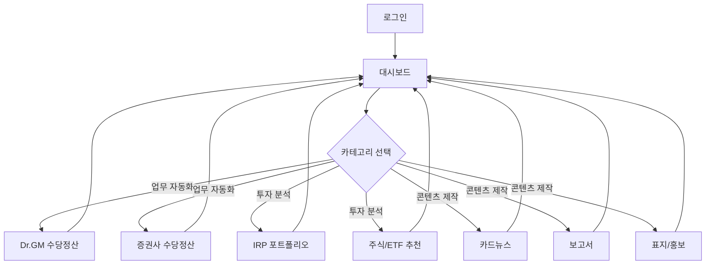
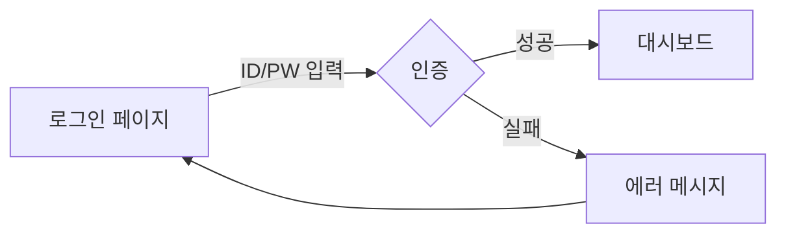
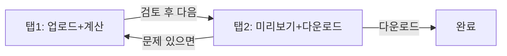
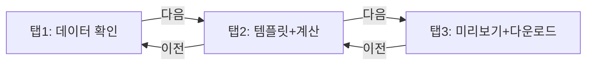
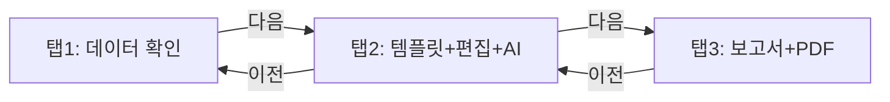
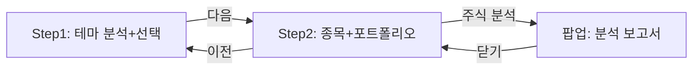
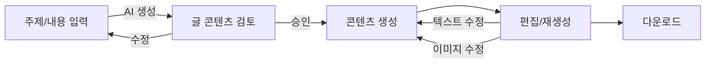

# Working Hub Manager 사용자 플로우

## 1. 메인 플로우



---

## 2. 화면별 플로우

### 2.1 로그인



- **진입**: 앱 최초 접근 시
- **행동**: 아이디/비밀번호 입력 → 로그인 버튼
- **이탈**: 대시보드로 이동

### 2.2 대시보드

- **진입**: 로그인 성공 후 / 헤더 홈 버튼
- **행동**: 카테고리 클릭 → 하위 프로그램 카드 펼침 → 카드 클릭
- **이탈**: 선택한 프로그램 페이지로 이동 (새 페이지)

### 2.3 Dr.GM 수당정산 계산기



- **탭 1**: 엑셀 업로드 (상단) + 계산 결과 테이블 (하단) → "다음" 버튼
- **탭 2**: 수당명세서 미리보기 → 다운로드 버튼 / "이전" 버튼

### 2.4 증권사 수당정산 계산기



- **탭 1**: 크롤링 결과 확인 or 엑셀 업로드 파일 읽기 결과 확인
- **탭 2**: 템플릿에 결과 적용 + 계산 수행
- **탭 3**: 보고서 미리보기 + 다운로드

### 2.5 IRP 포트폴리오 수익률 관리기



- **탭 1**: 크롤링/엑셀 업로드 → 결과 확인
- **탭 2**: 템플릿 적용 + 직접 값 입력/수정 (리밸런싱, 추천상품) + AI 분석 확인
- **탭 3**: 보고서 미리보기 + PDF 다운로드

### 2.6 주식/ETF 추천 프로그램



- **Step 1**: 증권사 API 테마 불러오기 → AI 뉴스분석 점수 → 추천 테마 표시 → 복수 테마 바구니 담기
- **Step 2**: 선택 테마 주식 목록 (Top 5 구별) + 수익률/기관/외국인 매수 정보 → 포트폴리오/회사풀 담기
- **팝업**: 개별 주식 분석 보고서 (NotebookLM식 리서치 기반 작성)

### 2.7 콘텐츠 제작 (카드뉴스/보고서/표지 공통)



- **입력**: 주제, 내용 입력
- **AI 작성**: AI가 글 콘텐츠 작성 → 사용자 검토/승인 (수정 시 재생성)
- **생성**: 브랜드 디자인(컬러/로고/서체) 자동 적용된 콘텐츠 생성
- **편집**: 텍스트 변경 재생성, 이미지 부분 수정 요청 재생성
- **출력**: 이미지/PDF 다운로드

---

## 3. 공통 네비게이션

### 헤더 바 (모든 페이지 공통)

```
[로고] [홈] [현재 프로그램명]               [프로필/로그아웃]
```

| 요소 | 행동 |
|------|------|
| 로고 | 대시보드로 이동 |
| 홈 | 대시보드로 이동 |
| 현재 프로그램명 | 현재 위치 표시 (클릭 불가) |
| 프로필 | 사용자 정보 확인 |
| 로그아웃 | 로그인 페이지로 이동 |

---

## 4. 예외 플로우

| 상황 | 처리 |
|------|------|
| 로그인 실패 | 에러 메시지 표시, 재시도 |
| 세션 만료 | 로그인 페이지로 리다이렉트 |
| 크롤링 실패 | "엑셀 업로드로 대체하시겠습니까?" 안내 |
| 엑셀 형식 오류 | 에러 메시지 + 올바른 형식 안내 |
| AI API 실패 | "잠시 후 다시 시도해주세요" + 재시도 버튼 |
| 네트워크 에러 | 에러 페이지 표시 + 새로고침 안내 |
