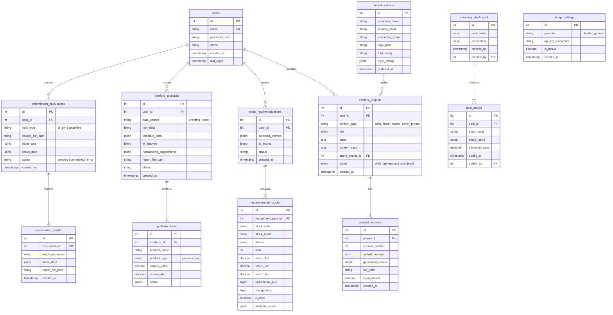

# Working Hub Manager 데이터베이스 설계

## 1. ERD

---

## 2. 테이블 정의

### users (사용자)
| 컬럼 | 타입 | 제약 | 설명 |
|------|------|------|------|
| id | SERIAL | PK | 기본키 |
| email | VARCHAR(255) | UNIQUE, NOT NULL | 로그인 이메일 |
| password_hash | VARCHAR(255) | NOT NULL | bcrypt 해시 |
| name | VARCHAR(100) | NOT NULL | 사용자 이름 |
| created_at | TIMESTAMP | DEFAULT NOW() | 생성일 |
| last_login | TIMESTAMP | | 마지막 로그인 |

### commission_calculations (수당정산)
| 컬럼 | 타입 | 제약 | 설명 |
|------|------|------|------|
| id | SERIAL | PK | 기본키 |
| user_id | INT | FK(users) | 작업자 |
| calc_type | VARCHAR(20) | NOT NULL | dr_gm / securities |
| source_file_path | VARCHAR(500) | | 업로드 파일 경로 |
| input_data | JSONB | | 입력 데이터 |
| result_data | JSONB | | 계산 결과 |
| status | VARCHAR(20) | DEFAULT 'pending' | 상태 |
| created_at | TIMESTAMP | DEFAULT NOW() | 생성일 |

### portfolio_analyses (포트폴리오 분석)
| 컬럼 | 타입 | 제약 | 설명 |
|------|------|------|------|
| id | SERIAL | PK | 기본키 |
| user_id | INT | FK(users) | 작업자 |
| data_source | VARCHAR(20) | NOT NULL | crawling / excel |
| raw_data | JSONB | | 원시 데이터 |
| template_data | JSONB | | 템플릿 적용 데이터 |
| ai_analysis | JSONB | | AI 분석 결과 |
| rebalancing_suggestions | JSONB | | 리밸런싱 제안 |
| report_file_path | VARCHAR(500) | | PDF 경로 |
| status | VARCHAR(20) | | 상태 |
| created_at | TIMESTAMP | DEFAULT NOW() | 생성일 |

### stock_recommendations (주식 추천)
| 컬럼 | 타입 | 제약 | 설명 |
|------|------|------|------|
| id | SERIAL | PK | 기본키 |
| user_id | INT | FK(users) | 작업자 |
| selected_themes | JSONB | | 선택한 테마 목록 |
| ai_scores | JSONB | | AI 분석 점수 |
| status | VARCHAR(20) | | 상태 |
| created_at | TIMESTAMP | DEFAULT NOW() | 생성일 |

### content_projects (콘텐츠 프로젝트)
| 컬럼 | 타입 | 제약 | 설명 |
|------|------|------|------|
| id | SERIAL | PK | 기본키 |
| user_id | INT | FK(users) | 작업자 |
| content_type | VARCHAR(20) | NOT NULL | card_news / report / cover_promo |
| title | VARCHAR(200) | | 프로젝트 제목 |
| topic | TEXT | | 주제 |
| content_input | TEXT | | 입력 내용 |
| brand_setting_id | INT | FK(brand_settings) | 브랜드 설정 |
| status | VARCHAR(20) | DEFAULT 'draft' | 상태 |
| created_at | TIMESTAMP | DEFAULT NOW() | 생성일 |

### brand_settings (브랜드 설정)
| 컬럼 | 타입 | 제약 | 설명 |
|------|------|------|------|
| id | SERIAL | PK | 기본키 |
| company_name | VARCHAR(100) | NOT NULL | 회사명 |
| primary_color | VARCHAR(7) | | 기본 컬러 (#RRGGBB) |
| secondary_color | VARCHAR(7) | | 보조 컬러 |
| logo_path | VARCHAR(500) | | 로고 파일 경로 |
| font_family | VARCHAR(100) | | 서체 |
| style_config | JSONB | | 추가 스타일 설정 |
| updated_at | TIMESTAMP | DEFAULT NOW() | 수정일 |

### ai_api_settings (AI API 설정)
| 컬럼 | 타입 | 제약 | 설명 |
|------|------|------|------|
| id | SERIAL | PK | 기본키 |
| provider | VARCHAR(20) | NOT NULL | claude / gemini |
| api_key_encrypted | TEXT | NOT NULL | 암호화된 API 키 |
| is_active | BOOLEAN | DEFAULT true | 활성화 여부 |
| created_at | TIMESTAMP | DEFAULT NOW() | 생성일 |

---

## 3. 인덱스

| 테이블 | 컬럼 | 이유 |
|--------|------|------|
| users | email | 로그인 조회 |
| commission_calculations | user_id, created_at | 사용자별 최근 작업 조회 |
| portfolio_analyses | user_id, created_at | 사용자별 최근 분석 조회 |
| stock_recommendations | user_id, created_at | 사용자별 최근 추천 조회 |
| content_projects | user_id, content_type | 사용자별/유형별 조회 |
| recommended_stocks | recommendation_id, is_top5 | Top 5 필터링 |

---

## 4. 제약 조건

| 종류 | 설명 |
|------|------|
| FK | 모든 user_id → users(id) ON DELETE CASCADE |
| FK | commission_results.calculation_id → commission_calculations(id) |
| FK | portfolio_items.analysis_id → portfolio_analyses(id) |
| FK | recommended_stocks.recommendation_id → stock_recommendations(id) |
| FK | content_versions.project_id → content_projects(id) |
| FK | content_projects.brand_setting_id → brand_settings(id) |
| UNIQUE | users.email |
| CHECK | commission_calculations.calc_type IN ('dr_gm', 'securities') |
| CHECK | content_projects.content_type IN ('card_news', 'report', 'cover_promo') |
