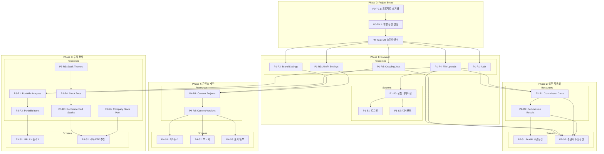

# Working Hub Manager - TASKS (Domain-Guarded v2.0)

> 생성일: 2026-03-05
> 모드: Domain-Guarded (화면 명세 기반)
> 화면 수: 9개 | 리소스 수: 15개

---

## 의존성 그래프

---

## Phase 0: Project Setup

### [x] P0-T0.1: 프로젝트 초기화
- **담당**: frontend-specialist
- **스펙**: Next.js + FastAPI 모노레포 구조 생성
- **파일**:
  - `frontend/package.json`, `frontend/tsconfig.json`, `frontend/next.config.ts`, `frontend/tailwind.config.ts`
  - `backend/pyproject.toml`, `backend/requirements.txt`
  - `backend/app/main.py`, `backend/app/config.py`
- **산출물**:
  - `/frontend` - Next.js 15+ App Router 프로젝트
  - `/backend` - FastAPI 프로젝트
  - 루트 `docker-compose.yml`

### [x] P0-T0.2: 개발 환경 설정
- **담당**: backend-specialist
- **의존**: P0-T0.1
- **스펙**: Docker, 환경변수, Lint/Format 설정
- **파일**:
  - `docker-compose.yml` (PostgreSQL, FastAPI, Next.js)
  - `.env.example`
  - `frontend/.eslintrc.json`, `frontend/.prettierrc`
  - `backend/pyproject.toml` (ruff, mypy 설정)

### [x] P0-T0.3: 데이터베이스 스키마 생성
- **담당**: database-specialist
- **의존**: P0-T0.2
- **스펙**: PostgreSQL 스키마 + Alembic 마이그레이션 초기 설정
- **파일**: `backend/tests/test_db_connection.py` → `backend/app/database.py`, `backend/app/models/*.py`, `backend/alembic/`
- **테이블**: users, commission_calculations, commission_results, crawling_jobs, portfolio_analyses, portfolio_items, stock_themes, stock_recommendations, recommended_stocks, company_stock_pool, content_projects, content_versions, brand_settings, ai_api_settings, file_uploads
- **TDD**: RED → GREEN → REFACTOR

---

## Phase 1: Common Resources & Layout

### P1-R1: Users/Auth Resource

#### [x] P1-R1-T1: Auth API 구현
- **담당**: backend-specialist
- **리소스**: users
- **엔드포인트**:
  - POST /api/auth/login (로그인)
  - POST /api/auth/logout (로그아웃)
  - GET /api/auth/me (현재 사용자)
- **필드**: id, email, name, last_login
- **파일**: `backend/tests/api/test_auth.py` → `backend/app/routers/auth.py`, `backend/app/services/auth_service.py`
- **스펙**: JWT 기반 인증 (bcrypt 해싱, 토큰 발급/갱신)
- **Worktree**: `worktree/phase-1-common`
- **TDD**: RED → GREEN → REFACTOR
- **헌법**: `constitutions/fastapi/api-design.md` 준수
- **병렬**: P1-R2-T1, P1-R3-T1, P1-R4-T1, P1-R5-T1과 병렬 가능

### P1-R2: Brand Settings Resource

#### [x] P1-R2-T1: Brand Settings API 구현
- **담당**: backend-specialist
- **리소스**: brand_settings
- **엔드포인트**:
  - GET /api/brand (브랜드 설정 조회)
  - PUT /api/brand (브랜드 설정 수정)
- **필드**: id, company_name, primary_color, secondary_color, logo_path, font_family, style_config
- **파일**: `backend/tests/api/test_brand.py` → `backend/app/routers/brand.py`
- **스펙**: 회사 브랜드 설정 CRUD (로고 업로드 포함)
- **Worktree**: `worktree/phase-1-common`
- **TDD**: RED → GREEN → REFACTOR
- **헌법**: `constitutions/fastapi/api-design.md` 준수
- **병렬**: P1-R1-T1, P1-R3-T1, P1-R4-T1, P1-R5-T1과 병렬 가능

### P1-R3: AI API Settings Resource

#### [x] P1-R3-T1: AI API Settings API 구현
- **담당**: backend-specialist
- **리소스**: ai_api_settings
- **엔드포인트**:
  - GET /api/settings/ai (AI 설정 조회)
  - PUT /api/settings/ai (AI 설정 수정)
- **필드**: id, provider, api_key_encrypted, is_active
- **파일**: `backend/tests/api/test_ai_settings.py` → `backend/app/routers/ai_settings.py`
- **스펙**: Claude/Gemini API 키 관리 (암호화 저장, 활성 프로바이더 선택)
- **Worktree**: `worktree/phase-1-common`
- **TDD**: RED → GREEN → REFACTOR
- **헌법**: `constitutions/fastapi/api-design.md` 준수
- **병렬**: P1-R1-T1, P1-R2-T1, P1-R4-T1, P1-R5-T1과 병렬 가능

### P1-R4: File Uploads Resource

#### [x] P1-R4-T1: File Uploads API 구현
- **담당**: backend-specialist
- **리소스**: file_uploads
- **엔드포인트**:
  - POST /api/upload/excel (엑셀 파일 업로드 + 파싱)
- **필드**: id, file_name, file_path, file_size, parsed_data, uploaded_at
- **파일**: `backend/tests/api/test_upload.py` → `backend/app/routers/upload.py`, `backend/app/services/excel_service.py`
- **스펙**: 엑셀 파일 업로드, openpyxl 파싱, 결과 JSONB 저장
- **Worktree**: `worktree/phase-1-common`
- **TDD**: RED → GREEN → REFACTOR
- **헌법**: `constitutions/fastapi/api-design.md` 준수
- **병렬**: P1-R1-T1, P1-R2-T1, P1-R3-T1, P1-R5-T1과 병렬 가능

### P1-R5: Crawling Jobs Resource

#### [x] P1-R5-T1: Crawling Jobs API 구현
- **담당**: backend-specialist
- **리소스**: crawling_jobs
- **엔드포인트**:
  - POST /api/crawling/start (크롤링 시작)
  - GET /api/crawling/:id/status (크롤링 상태 조회)
- **필드**: id, source_type, status, result_data, error_message, created_at
- **파일**: `backend/tests/api/test_crawling.py` → `backend/app/routers/crawling.py`, `backend/app/services/crawler_service.py`
- **스펙**: Playwright 기반 웹 크롤링 (증권사 수당, IRP 포트폴리오), 비동기 실행, 상태 폴링
- **Worktree**: `worktree/phase-1-common`
- **TDD**: RED → GREEN → REFACTOR
- **헌법**: `constitutions/fastapi/api-design.md` 준수
- **병렬**: P1-R1-T1, P1-R2-T1, P1-R3-T1, P1-R4-T1과 병렬 가능

---

### P1-S0: 공통 레이아웃

#### [x] P1-S0-T1: 공통 레이아웃 및 컴포넌트 구현
- **담당**: frontend-specialist
- **화면**: 전체 앱 레이아웃
- **컴포넌트**:
  - Header (로고, 홈 버튼, 프로필/로그아웃)
  - Tab (탭 내비게이션 공통)
  - Button, Input, Card, Table, Modal, FileUpload (UI 기본 컴포넌트)
- **데이터 요구**: users (auth/me)
- **파일**: `frontend/src/components/common/__tests__/Header.test.tsx` → `frontend/src/components/common/Header.tsx`, `frontend/src/app/layout.tsx`
- **스펙**: HeaderBar (로고/홈/로그아웃), Tab 공통 컴포넌트, 기본 UI 컴포넌트 세트
- **Worktree**: `worktree/phase-1-layout`
- **TDD**: RED → GREEN → REFACTOR
- **데모**: `/demo/phase-1/s0-layout`
- **데모 상태**: logged-in, logged-out
- **의존**: P1-R1-T1

### P1-S1: 로그인 화면

#### [x] P1-S1-T1: 로그인 UI 구현
- **담당**: frontend-specialist
- **화면**: /login
- **컴포넌트**:
  - LoginForm (이메일/비밀번호 입력)
  - LogoImage (회사 로고 표시)
- **데이터 요구**: users (auth/login)
- **파일**: `frontend/src/app/(auth)/login/__tests__/page.test.tsx` → `frontend/src/app/(auth)/login/page.tsx`
- **스펙**: 이메일/비밀번호 입력, JWT 토큰 저장, 유효성 검사 에러 표시
- **Worktree**: `worktree/phase-1-layout`
- **TDD**: RED → GREEN → REFACTOR
- **데모**: `/demo/phase-1/s1-login`
- **데모 상태**: default, validation-error, auth-error, loading
- **의존**: P1-S0-T1

#### [x] P1-S1-T2: 로그인 통합 테스트
- **담당**: test-specialist
- **화면**: /login
- **시나리오**:
  | 이름 | When | Then |
  |------|------|------|
  | 로그인 성공 | 올바른 이메일/비밀번호 입력 후 클릭 | /dashboard 이동, JWT 저장 |
  | 로그인 실패 | 잘못된 비밀번호 | 에러 메시지 표시 |
  | 빈 필드 제출 | 미입력 후 클릭 | 필수 입력 안내 |
- **파일**: `frontend/tests/e2e/login.spec.ts`
- **Worktree**: `worktree/phase-1-layout`

#### [x] P1-S1-V: 로그인 연결점 검증
- **담당**: test-specialist
- **화면**: /login
- **검증 항목**:
  - [ ] Field Coverage: users.[email] 존재
  - [ ] Endpoint: POST /api/auth/login 응답 정상
  - [ ] Navigation: LoginForm 성공 → /dashboard 라우트 존재
  - [ ] Auth: 비로그인 상태에서 접근 가능
- **파일**: `frontend/tests/integration/login.verify.ts`

### P1-S2: 대시보드 화면

#### [x] P1-S2-T1: 대시보드 UI 구현
- **담당**: frontend-specialist
- **화면**: /dashboard
- **컴포넌트**:
  - CategoryAccordion (업무 자동화, 투자 분석, 콘텐츠 제작)
  - ProgramCardGrid (카테고리별 프로그램 카드)
- **데이터 요구**: users (auth/me)
- **파일**: `frontend/src/app/(main)/dashboard/__tests__/page.test.tsx` → `frontend/src/app/(main)/dashboard/page.tsx`, `frontend/src/components/dashboard/CategoryGroup.tsx`, `frontend/src/components/dashboard/ProgramCard.tsx`
- **스펙**: 3개 카테고리 아코디언, 클릭 시 하위 프로그램 카드 펼침, 카드 클릭 시 해당 페이지 이동
- **Worktree**: `worktree/phase-1-layout`
- **TDD**: RED → GREEN → REFACTOR
- **데모**: `/demo/phase-1/s2-dashboard`
- **데모 상태**: all-collapsed, one-expanded, loading
- **의존**: P1-S0-T1

#### [x] P1-S2-T2: 대시보드 통합 테스트
- **담당**: test-specialist
- **화면**: /dashboard
- **시나리오**:
  | 이름 | When | Then |
  |------|------|------|
  | 초기 로드 | 로그인 후 접속 | 3개 카테고리 그룹 표시, 모두 접힌 상태 |
  | 카테고리 펼침 | 업무 자동화 클릭 | Dr.GM, 증권사 카드 표시 |
  | 프로그램 이동 | Dr.GM 카드 클릭 | /commission/dr-gm 이동 |
  | 로그아웃 | 로그아웃 클릭 | /login 이동, 세션 삭제 |
- **파일**: `frontend/tests/e2e/dashboard.spec.ts`
- **Worktree**: `worktree/phase-1-layout`

#### [x] P1-S2-V: 대시보드 연결점 검증
- **담당**: test-specialist
- **화면**: /dashboard
- **검증 항목**:
  - [ ] Field Coverage: users.[name, email] 존재
  - [ ] Endpoint: GET /api/auth/me 응답 정상
  - [ ] Navigation: ProgramCard → /commission/dr-gm 라우트 존재
  - [ ] Navigation: ProgramCard → /commission/securities 라우트 존재
  - [ ] Navigation: ProgramCard → /portfolio/irp 라우트 존재
  - [ ] Navigation: ProgramCard → /investment/stock-recommend 라우트 존재
  - [ ] Navigation: ProgramCard → /content/card-news 라우트 존재
  - [ ] Navigation: ProgramCard → /content/report 라우트 존재
  - [ ] Navigation: ProgramCard → /content/cover-promo 라우트 존재
  - [ ] Auth: 비로그인 시 /login 리다이렉트
  - [ ] Shared: HeaderBar 렌더링
- **파일**: `frontend/tests/integration/dashboard.verify.ts`

---

## Phase 2: 업무 자동화

### P2-R1: Commission Calculations Resource

#### [x] P2-R1-T1: Commission Calculations API 구현
- **담당**: backend-specialist
- **리소스**: commission_calculations
- **엔드포인트**:
  - POST /api/commissions (수당 계산 생성)
  - GET /api/commissions (계산 목록)
  - GET /api/commissions/:id (계산 상세)
- **필드**: id, user_id, calc_type, source_file_path, input_data, result_data, status, created_at
- **파일**: `backend/tests/api/test_commissions.py` → `backend/app/routers/commission.py`, `backend/app/services/commission_service.py`
- **스펙**: Dr.GM/증권사 수당 계산 로직, 엑셀 데이터 파싱 → 계산 → 결과 저장
- **Worktree**: `worktree/phase-2-commission`
- **TDD**: RED → GREEN → REFACTOR
- **헌법**: `constitutions/fastapi/api-design.md` 준수
- **병렬**: P2-R2-T1과 병렬 가능
- **의존**: P1-R4-T1 (File Uploads)

### P2-R2: Commission Results Resource

#### [x] P2-R2-T1: Commission Results API 구현
- **담당**: backend-specialist
- **리소스**: commission_results
- **엔드포인트**:
  - GET /api/commissions/:calc_id/results (결과 목록)
  - GET /api/commissions/:calc_id/results/:id/download (명세서 다운로드)
- **필드**: id, calculation_id, employee_name, detail_data, report_file_path
- **파일**: `backend/tests/api/test_commission_results.py` → `backend/app/routers/commission.py`, `backend/app/services/pdf_service.py`
- **스펙**: 개인별 수당 명세서 생성 (ReportLab PDF), 다운로드 API
- **Worktree**: `worktree/phase-2-commission`
- **TDD**: RED → GREEN → REFACTOR
- **헌법**: `constitutions/fastapi/api-design.md` 준수
- **병렬**: P2-R1-T1과 병렬 가능
- **의존**: P2-R1-T1

---

### P2-S1: Dr.GM 수당정산 계산기 화면

> 화면: /commission/dr-gm
> 데이터 요구: file_uploads, commission_calculations, commission_results

#### [x] P2-S1-T1: Dr.GM 수당정산 UI 구현
- **담당**: frontend-specialist
- **화면**: /commission/dr-gm
- **컴포넌트**:
  - TabNavigation (2탭: 업로드&계산 / 미리보기&다운로드)
  - ExcelUpload (드래그&드롭 파일 업로드)
  - CalculationResultTable (계산 결과 테이블)
  - PreviewPanel (명세서 미리보기 + 다운로드)
- **데이터 요구**: file_uploads, commission_calculations, commission_results
- **파일**: `frontend/src/app/(main)/commission/dr-gm/__tests__/page.test.tsx` → `frontend/src/app/(main)/commission/dr-gm/page.tsx`, `frontend/src/components/commission/ExcelUpload.tsx`, `frontend/src/components/commission/CalculationResultTable.tsx`
- **스펙**: 2탭 구조, 엑셀 업로드 → 파싱 → 계산 결과 테이블 → 명세서 미리보기 → 다운로드
- **Worktree**: `worktree/phase-2-commission`
- **TDD**: RED → GREEN → REFACTOR
- **데모**: `/demo/phase-2/s1-dr-gm`
- **데모 상태**: upload-empty, uploading, calculated, preview, downloading
- **의존**: P2-R1-T1, P2-R2-T1

#### [ ] P2-S1-T2: Dr.GM 수당정산 통합 테스트
- **담당**: test-specialist
- **화면**: /commission/dr-gm
- **시나리오**:
  | 이름 | When | Then |
  |------|------|------|
  | 엑셀 업로드 | 파일 드래그&드롭 | 파싱 후 데이터 테이블 표시 |
  | 계산 결과 | 계산 완료 | 수당 계산 결과 하단 표시 |
  | 명세서 미리보기 | 다음 버튼 | 탭 2 이동, 명세서 표시 |
  | 다운로드 | 다운로드 클릭 | 명세서 파일 다운로드 |
- **파일**: `frontend/tests/e2e/commission-dr-gm.spec.ts`
- **Worktree**: `worktree/phase-2-commission`

#### [ ] P2-S1-V: Dr.GM 수당정산 연결점 검증
- **담당**: test-specialist
- **화면**: /commission/dr-gm
- **검증 항목**:
  - [ ] Field Coverage: file_uploads.[file_name, parsed_data] 존재
  - [ ] Field Coverage: commission_calculations.[id, calc_type, input_data, result_data, status] 존재
  - [ ] Field Coverage: commission_results.[employee_name, detail_data, report_file_path] 존재
  - [ ] Endpoint: POST /api/upload/excel 응답 정상
  - [ ] Endpoint: POST /api/commissions 응답 정상
  - [ ] Endpoint: GET /api/commissions/:calc_id/results 응답 정상
  - [ ] Endpoint: GET /api/commissions/:calc_id/results/:id/download 다운로드 정상
  - [ ] Navigation: TabNavigation → /dashboard 복귀 가능
  - [ ] Auth: 로그인 필수
  - [ ] Shared: HeaderBar 렌더링
- **파일**: `frontend/tests/integration/commission-dr-gm.verify.ts`

### P2-S2: 증권사 수당정산 계산기 화면

> 화면: /commission/securities
> 데이터 요구: crawling_jobs, file_uploads, commission_calculations, commission_results

#### [x] P2-S2-T1: 증권사 수당정산 UI 구현
- **담당**: frontend-specialist
- **화면**: /commission/securities
- **컴포넌트**:
  - TabNavigation (3탭: 데이터 확인 / 템플릿&계산 / 미리보기&다운로드)
  - DataSourceSelector (크롤링 실행 or 엑셀 업로드)
  - DataResultTable (크롤링/업로드 결과 테이블)
  - TemplateCalcPanel (템플릿 적용 + 계산 결과)
  - PreviewDownloadPanel (보고서 미리보기 + 다운로드)
- **데이터 요구**: crawling_jobs, file_uploads, commission_calculations, commission_results
- **파일**: `frontend/src/app/(main)/commission/securities/__tests__/page.test.tsx` → `frontend/src/app/(main)/commission/securities/page.tsx`, `frontend/src/components/commission/DataSourceSelector.tsx`
- **스펙**: 3탭 구조, 크롤링/엑셀 업로드 → 데이터 확인 → 템플릿 적용 계산 → 보고서 다운로드
- **Worktree**: `worktree/phase-2-commission`
- **TDD**: RED → GREEN → REFACTOR
- **데모**: `/demo/phase-2/s2-securities`
- **데모 상태**: initial, crawling, crawl-error, data-loaded, calculating, preview, downloading
- **의존**: P2-R1-T1, P2-R2-T1, P1-R5-T1

#### [ ] P2-S2-T2: 증권사 수당정산 통합 테스트
- **담당**: test-specialist
- **화면**: /commission/securities
- **시나리오**:
  | 이름 | When | Then |
  |------|------|------|
  | 크롤링 수집 | 크롤링 실행 클릭 | 진행 상태 표시, 완료 시 데이터 테이블 |
  | 크롤링 실패 | 크롤링 에러 | 에러 메시지 + 엑셀 업로드 대체 안내 |
  | 템플릿 계산 | 탭 2에서 계산 | 템플릿 적용 결과 + 계산 결과 표시 |
  | 보고서 다운로드 | 탭 3에서 다운로드 | 보고서 파일 다운로드 |
- **파일**: `frontend/tests/e2e/commission-securities.spec.ts`
- **Worktree**: `worktree/phase-2-commission`

#### [ ] P2-S2-V: 증권사 수당정산 연결점 검증
- **담당**: test-specialist
- **화면**: /commission/securities
- **검증 항목**:
  - [ ] Field Coverage: crawling_jobs.[id, status, result_data, error_message] 존재
  - [ ] Field Coverage: file_uploads.[file_name, parsed_data] 존재
  - [ ] Field Coverage: commission_calculations.[id, calc_type, input_data, result_data, status] 존재
  - [ ] Field Coverage: commission_results.[employee_name, detail_data, report_file_path] 존재
  - [ ] Endpoint: POST /api/crawling/start 응답 정상
  - [ ] Endpoint: GET /api/crawling/:id/status 응답 정상
  - [ ] Endpoint: POST /api/upload/excel 응답 정상
  - [ ] Endpoint: POST /api/commissions 응답 정상
  - [ ] Navigation: TabNavigation → /dashboard 복귀 가능
  - [ ] Auth: 로그인 필수
  - [ ] Shared: HeaderBar 렌더링
- **파일**: `frontend/tests/integration/commission-securities.verify.ts`

---

## Phase 3: 투자 분석

### P3-R1: Portfolio Analyses Resource

#### [x] P3-R1-T1: Portfolio Analyses API 구현
- **담당**: backend-specialist
- **리소스**: portfolio_analyses
- **엔드포인트**:
  - POST /api/portfolios (포트폴리오 분석 생성)
  - GET /api/portfolios (분석 목록)
  - GET /api/portfolios/:id (분석 상세)
  - PUT /api/portfolios/:id (분석 수정)
- **필드**: id, user_id, data_source, raw_data, template_data, ai_analysis, rebalancing_suggestions, report_file_path, status, created_at
- **파일**: `backend/tests/api/test_portfolios.py` → `backend/app/routers/portfolio.py`, `backend/app/services/portfolio_service.py`
- **스펙**: 포트폴리오 데이터 저장, AI 분석 요청 (Claude/Gemini), 리밸런싱 제안, PDF 보고서 생성
- **Worktree**: `worktree/phase-3-investment`
- **TDD**: RED → GREEN → REFACTOR
- **헌법**: `constitutions/fastapi/api-design.md` 준수
- **병렬**: P3-R3-T1, P3-R4-T1, P3-R5-T1, P3-R6-T1과 병렬 가능
- **의존**: P1-R4-T1, P1-R5-T1

### P3-R2: Portfolio Items Resource

#### [x] P3-R2-T1: Portfolio Items API 구현
- **담당**: backend-specialist
- **리소스**: portfolio_items
- **엔드포인트**:
  - GET /api/portfolios/:analysis_id/items (항목 목록)
  - PUT /api/portfolios/:analysis_id/items/:id (항목 수정)
- **필드**: id, analysis_id, product_name, product_type, current_value, return_rate, details
- **파일**: `backend/tests/api/test_portfolio_items.py` → `backend/app/routers/portfolio.py`
- **스펙**: 포트폴리오 개별 항목 조회/수정 (연금저축/IRP 구분)
- **Worktree**: `worktree/phase-3-investment`
- **TDD**: RED → GREEN → REFACTOR
- **헌법**: `constitutions/fastapi/api-design.md` 준수
- **의존**: P3-R1-T1

### P3-R3: Stock Themes Resource

#### [x] P3-R3-T1: Stock Themes API 구현
- **담당**: backend-specialist
- **리소스**: stock_themes
- **엔드포인트**:
  - GET /api/stocks/themes (테마 목록)
  - POST /api/stocks/themes/analyze (테마 AI 분석)
- **필드**: id, theme_name, ai_score, news_summary, stock_count, updated_at
- **파일**: `backend/tests/api/test_stock_themes.py` → `backend/app/routers/stock.py`, `backend/app/services/stock_service.py`
- **스펙**: 증권사 API 테마 조회, AI 뉴스 분석 기반 점수 산정, 추천 테마 하이라이트
- **Worktree**: `worktree/phase-3-investment`
- **TDD**: RED → GREEN → REFACTOR
- **헌법**: `constitutions/fastapi/api-design.md` 준수
- **병렬**: P3-R1-T1과 병렬 가능

### P3-R4: Stock Recommendations Resource

#### [x] P3-R4-T1: Stock Recommendations API 구현
- **담당**: backend-specialist
- **리소스**: stock_recommendations
- **엔드포인트**:
  - POST /api/stocks/recommendations (추천 생성 - 선택 테마 기반)
  - GET /api/stocks/recommendations/:id (추천 상세)
- **필드**: id, user_id, selected_themes, ai_scores, status, created_at
- **파일**: `backend/tests/api/test_stock_recs.py` → `backend/app/routers/stock.py`
- **스펙**: 선택된 테마 기반 주식 추천 생성, 테마별 AI 점수 집계
- **Worktree**: `worktree/phase-3-investment`
- **TDD**: RED → GREEN → REFACTOR
- **헌법**: `constitutions/fastapi/api-design.md` 준수
- **의존**: P3-R3-T1

### P3-R5: Recommended Stocks Resource

#### [x] P3-R5-T1: Recommended Stocks API 구현
- **담당**: backend-specialist
- **리소스**: recommended_stocks
- **엔드포인트**:
  - GET /api/stocks/recommendations/:rec_id/stocks (추천 종목 목록)
- **필드**: id, recommendation_id, stock_code, stock_name, theme, rank, return_1m, return_3m, return_6m, institutional_buy, foreign_buy, is_top5, analysis_report
- **파일**: `backend/tests/api/test_recommended_stocks.py` → `backend/app/routers/stock.py`
- **스펙**: 테마별 추천 종목 목록, Top 5 구별, 기간별 수익률/기관&외국인 매수 정보
- **Worktree**: `worktree/phase-3-investment`
- **TDD**: RED → GREEN → REFACTOR
- **헌법**: `constitutions/fastapi/api-design.md` 준수
- **의존**: P3-R4-T1

### P3-R6: Company Stock Pool Resource

#### [x] P3-R6-T1: Company Stock Pool API 구현
- **담당**: backend-specialist
- **리소스**: company_stock_pool
- **엔드포인트**:
  - GET /api/stocks/pool (회사 투자풀 조회)
  - POST /api/stocks/pool (투자풀에 종목 추가)
- **필드**: id, pool_name, stocks, created_at
- **파일**: `backend/tests/api/test_stock_pool.py` → `backend/app/routers/stock.py`
- **스펙**: 회사 투자풀 관리 (종목 추가/조회)
- **Worktree**: `worktree/phase-3-investment`
- **TDD**: RED → GREEN → REFACTOR
- **헌법**: `constitutions/fastapi/api-design.md` 준수
- **병렬**: P3-R3-T1과 병렬 가능

---

### P3-S1: IRP 포트폴리오 수익률 관리기 화면

> 화면: /portfolio/irp
> 데이터 요구: crawling_jobs, file_uploads, portfolio_analyses, portfolio_items

#### [x] P3-S1-T1: IRP 포트폴리오 UI 구현
- **담당**: frontend-specialist
- **화면**: /portfolio/irp
- **컴포넌트**:
  - TabNavigation (3탭: 데이터 확인 / 템플릿&편집&AI / 보고서&PDF)
  - DataSourceSelector (크롤링 or 엑셀 업로드)
  - DataResultTable (데이터 확인 테이블)
  - TemplateEditPanel (템플릿 적용 + 값 직접 수정)
  - AIAnalysisPanel (AI 분석 결과 + 리밸런싱 제안)
  - ReportPreview (보고서 미리보기 + PDF 다운로드)
- **데이터 요구**: crawling_jobs, file_uploads, portfolio_analyses, portfolio_items
- **파일**: `frontend/src/app/(main)/portfolio/irp/__tests__/page.test.tsx` → `frontend/src/app/(main)/portfolio/irp/page.tsx`, `frontend/src/components/portfolio/TemplateEditPanel.tsx`, `frontend/src/components/portfolio/AIAnalysisPanel.tsx`
- **스펙**: 3탭 구조, 크롤링/업로드 → 템플릿 자동 적용 + 수동 편집 → AI 분석&리밸런싱 → PDF 보고서
- **Worktree**: `worktree/phase-3-investment`
- **TDD**: RED → GREEN → REFACTOR
- **데모**: `/demo/phase-3/s1-portfolio-irp`
- **데모 상태**: data-empty, crawling, data-loaded, template-editing, ai-analyzing, ai-result, report-preview, downloading
- **의존**: P3-R1-T1, P3-R2-T1

#### [ ] P3-S1-T2: IRP 포트폴리오 통합 테스트
- **담당**: test-specialist
- **화면**: /portfolio/irp
- **시나리오**:
  | 이름 | When | Then |
  |------|------|------|
  | 데이터 수집 | 크롤링 또는 엑셀 업로드 | 포트폴리오 데이터 테이블 표시 |
  | 템플릿 편집 | 탭 2에서 값 수정 | 수정 값 반영 |
  | AI 분석 | AI 분석 요청 | 분석 결과 + 리밸런싱 제안 표시 |
  | AI 제안 적용 | 제안 적용 클릭 | 템플릿에 자동 반영 |
  | PDF 다운로드 | 탭 3에서 다운로드 | PDF 파일 생성 + 다운로드 |
- **파일**: `frontend/tests/e2e/portfolio-irp.spec.ts`
- **Worktree**: `worktree/phase-3-investment`

#### [ ] P3-S1-V: IRP 포트폴리오 연결점 검증
- **담당**: test-specialist
- **화면**: /portfolio/irp
- **검증 항목**:
  - [ ] Field Coverage: crawling_jobs.[id, status, result_data, error_message] 존재
  - [ ] Field Coverage: file_uploads.[file_name, parsed_data] 존재
  - [ ] Field Coverage: portfolio_analyses.[id, data_source, raw_data, template_data, ai_analysis, rebalancing_suggestions, report_file_path, status] 존재
  - [ ] Field Coverage: portfolio_items.[id, product_name, product_type, current_value, return_rate, details] 존재
  - [ ] Endpoint: POST /api/crawling/start 응답 정상
  - [ ] Endpoint: POST /api/portfolios 응답 정상
  - [ ] Endpoint: PUT /api/portfolios/:id 응답 정상
  - [ ] Endpoint: GET /api/portfolios/:analysis_id/items 응답 정상
  - [ ] Navigation: TabNavigation → /dashboard 복귀 가능
  - [ ] Auth: 로그인 필수
  - [ ] Shared: HeaderBar 렌더링
- **파일**: `frontend/tests/integration/portfolio-irp.verify.ts`

### P3-S2: 주식/ETF 추천 프로그램 화면

> 화면: /investment/stock-recommend
> 데이터 요구: stock_themes, stock_recommendations, recommended_stocks, company_stock_pool

#### [x] P3-S2-T1: 주식/ETF 추천 UI 구현
- **담당**: frontend-specialist
- **화면**: /investment/stock-recommend
- **컴포넌트**:
  - StepIndicator (2단계 위저드: 테마 분석 / 종목 확인)
  - ThemeList (테마 목록 + AI 점수 + 추천 하이라이트)
  - ThemeBasket (선택된 테마 바구니)
  - StockList (테마별 주식 목록 + Top 5 구별)
  - StockAnalysisPopup (개별 주식 AI 분석 보고서 팝업)
- **데이터 요구**: stock_themes, stock_recommendations, recommended_stocks, company_stock_pool
- **파일**: `frontend/src/app/(main)/investment/stock-recommend/__tests__/page.test.tsx` → `frontend/src/app/(main)/investment/stock-recommend/page.tsx`, `frontend/src/components/investment/ThemeList.tsx`, `frontend/src/components/investment/StockList.tsx`, `frontend/src/components/investment/StockAnalysisPopup.tsx`
- **스펙**: 2단계 위저드, Step 1: 테마 분석 → 바구니 담기, Step 2: 종목 목록 + Top 5 + 포트폴리오/풀 담기, 팝업: AI 리서치 기반 분석 보고서
- **Worktree**: `worktree/phase-3-investment`
- **TDD**: RED → GREEN → REFACTOR
- **데모**: `/demo/phase-3/s2-stock-recommend`
- **데모 상태**: step1-initial, step1-analyzing, step1-basket, step2-stocks, stock-popup, loading
- **의존**: P3-R3-T1, P3-R4-T1, P3-R5-T1, P3-R6-T1

#### [ ] P3-S2-T2: 주식/ETF 추천 통합 테스트
- **담당**: test-specialist
- **화면**: /investment/stock-recommend
- **시나리오**:
  | 이름 | When | Then |
  |------|------|------|
  | 테마 분석 | 분석 실행 | AI 점수 + 추천 하이라이트 표시 |
  | 테마 선택 | 복수 테마 바구니 담기 | 바구니에 테마 표시 |
  | 종목 확인 | Step 2 진입 | 테마별 주식 목록 + Top 5 구별 |
  | 포트폴리오 담기 | 종목 선택 후 담기 | 포트폴리오/회사풀 추가 + 완료 알림 |
  | 분석 보고서 | 개별 주식 분석 클릭 | 팝업에 AI 리서치 기반 분석 |
- **파일**: `frontend/tests/e2e/stock-recommend.spec.ts`
- **Worktree**: `worktree/phase-3-investment`

#### [ ] P3-S2-V: 주식/ETF 추천 연결점 검증
- **담당**: test-specialist
- **화면**: /investment/stock-recommend
- **검증 항목**:
  - [ ] Field Coverage: stock_themes.[id, theme_name, ai_score, news_summary, stock_count] 존재
  - [ ] Field Coverage: stock_recommendations.[id, selected_themes, ai_scores, status] 존재
  - [ ] Field Coverage: recommended_stocks.[id, stock_code, stock_name, theme, rank, return_1m, return_3m, return_6m, institutional_buy, foreign_buy, is_top5, analysis_report] 존재
  - [ ] Field Coverage: company_stock_pool.[id, pool_name, stocks] 존재
  - [ ] Endpoint: GET /api/stocks/themes 응답 정상
  - [ ] Endpoint: POST /api/stocks/themes/analyze 응답 정상
  - [ ] Endpoint: POST /api/stocks/recommendations 응답 정상
  - [ ] Endpoint: GET /api/stocks/recommendations/:rec_id/stocks 응답 정상
  - [ ] Endpoint: POST /api/stocks/pool 응답 정상
  - [ ] Navigation: StepIndicator → /dashboard 복귀 가능
  - [ ] Navigation: StockList → /portfolio/irp 이동 가능
  - [ ] Auth: 로그인 필수
  - [ ] Shared: HeaderBar 렌더링
- **파일**: `frontend/tests/integration/stock-recommend.verify.ts`

---

## Phase 4: 콘텐츠 제작

### P4-R1: Content Projects Resource

#### [x] P4-R1-T1: Content Projects API 구현
- **담당**: backend-specialist
- **리소스**: content_projects
- **엔드포인트**:
  - POST /api/content (콘텐츠 프로젝트 생성)
  - GET /api/content (프로젝트 목록)
  - GET /api/content/:id (프로젝트 상세)
  - PUT /api/content/:id (프로젝트 수정)
- **필드**: id, user_id, content_type, title, topic, content_input, brand_setting_id, status, created_at
- **파일**: `backend/tests/api/test_content.py` → `backend/app/routers/content.py`, `backend/app/services/content_service.py`
- **스펙**: 콘텐츠 프로젝트 CRUD (card_news/report/cover_promo), AI 텍스트 생성 요청 (Claude/Gemini 선택)
- **Worktree**: `worktree/phase-4-content`
- **TDD**: RED → GREEN → REFACTOR
- **헌법**: `constitutions/fastapi/api-design.md` 준수
- **의존**: P1-R2-T1, P1-R3-T1

### P4-R2: Content Versions Resource

#### [x] P4-R2-T1: Content Versions API 구현
- **담당**: backend-specialist
- **리소스**: content_versions
- **엔드포인트**:
  - GET /api/content/:project_id/versions (버전 목록)
  - POST /api/content/:project_id/versions (새 버전 생성 - AI 생성/재생성)
  - GET /api/content/:project_id/versions/:id/download (디자인 파일 다운로드)
- **필드**: id, project_id, version_number, ai_text_content, generated_assets, file_path, is_approved, created_at
- **파일**: `backend/tests/api/test_content_versions.py` → `backend/app/routers/content.py`, `backend/app/services/ai_service.py`
- **스펙**: AI 텍스트 생성, 브랜드 적용 디자인 생성 (Pillow + AI), 버전 관리, 파일 다운로드
- **Worktree**: `worktree/phase-4-content`
- **TDD**: RED → GREEN → REFACTOR
- **헌법**: `constitutions/fastapi/api-design.md` 준수
- **의존**: P4-R1-T1

---

### P4-S1: 카드뉴스 제작 화면

> 화면: /content/card-news
> 데이터 요구: content_projects, content_versions, brand_settings, ai_api_settings

#### [x] P4-S1-T1: 카드뉴스 제작 UI 구현
- **담당**: frontend-specialist
- **화면**: /content/card-news
- **컴포넌트**:
  - InputPanel (주제/내용 입력 + AI 프로바이더 선택)
  - AITextReview (AI 텍스트 검토/수정/승인/재생성)
  - CardNewsPreview (카드뉴스 미리보기 + 텍스트/이미지 수정 + 다운로드)
- **데이터 요구**: content_projects, content_versions, brand_settings, ai_api_settings
- **파일**: `frontend/src/app/(main)/content/card-news/__tests__/page.test.tsx` → `frontend/src/app/(main)/content/card-news/page.tsx`, `frontend/src/components/content/InputPanel.tsx`, `frontend/src/components/content/AITextReview.tsx`, `frontend/src/components/content/CardNewsPreview.tsx`
- **스펙**: 입력 → AI 글 생성 → 검토/수정 → 승인 → 브랜드 적용 카드뉴스 생성 → 텍스트/이미지 수정 재생성 → 다운로드
- **Worktree**: `worktree/phase-4-content`
- **TDD**: RED → GREEN → REFACTOR
- **데모**: `/demo/phase-4/s1-card-news`
- **데모 상태**: input, generating-text, text-review, generating-design, design-preview, editing, downloading
- **의존**: P4-R1-T1, P4-R2-T1

#### [ ] P4-S1-T2: 카드뉴스 통합 테스트
- **담당**: test-specialist
- **화면**: /content/card-news
- **시나리오**:
  | 이름 | When | Then |
  |------|------|------|
  | AI 글 생성 | 주제/내용 입력 후 생성 | AI 글 콘텐츠 작성 + 검토 표시 |
  | 카드뉴스 생성 | 글 승인 | 브랜드 적용 카드뉴스 생성 + 미리보기 |
  | 텍스트 수정 | 텍스트 수정 후 재생성 | 수정된 텍스트로 카드뉴스 재생성 |
  | 다운로드 | 다운로드 클릭 | 카드뉴스 이미지 다운로드 |
- **파일**: `frontend/tests/e2e/content-card-news.spec.ts`
- **Worktree**: `worktree/phase-4-content`

#### [ ] P4-S1-V: 카드뉴스 연결점 검증
- **담당**: test-specialist
- **화면**: /content/card-news
- **검증 항목**:
  - [ ] Field Coverage: content_projects.[id, content_type, title, topic, content_input, status] 존재
  - [ ] Field Coverage: content_versions.[id, version_number, ai_text_content, generated_assets, file_path, is_approved] 존재
  - [ ] Field Coverage: brand_settings.[company_name, primary_color, secondary_color, logo_path, font_family, style_config] 존재
  - [ ] Field Coverage: ai_api_settings.[provider, is_active] 존재
  - [ ] Endpoint: POST /api/content 응답 정상
  - [ ] Endpoint: POST /api/content/:project_id/versions 응답 정상
  - [ ] Endpoint: GET /api/content/:project_id/versions/:id/download 다운로드 정상
  - [ ] Endpoint: GET /api/brand 응답 정상
  - [ ] Endpoint: GET /api/settings/ai 응답 정상
  - [ ] Navigation: InputPanel → /dashboard 복귀 가능
  - [ ] Auth: 로그인 필수
  - [ ] Shared: HeaderBar 렌더링
- **파일**: `frontend/tests/integration/content-card-news.verify.ts`

### P4-S2: 보고서 제작 화면

> 화면: /content/report
> 데이터 요구: content_projects, content_versions, brand_settings, ai_api_settings

#### [x] P4-S2-T1: 보고서 제작 UI 구현
- **담당**: frontend-specialist
- **화면**: /content/report
- **컴포넌트**:
  - InputPanel (주제/내용 입력 + AI 프로바이더 선택)
  - AITextReview (AI 텍스트 검토/수정/승인/재생성)
  - ReportPreview (보고서 미리보기 + 텍스트/이미지 수정 + 다운로드)
- **데이터 요구**: content_projects, content_versions, brand_settings, ai_api_settings
- **파일**: `frontend/src/app/(main)/content/report/__tests__/page.test.tsx` → `frontend/src/app/(main)/content/report/page.tsx`, `frontend/src/components/content/ReportPreview.tsx`
- **스펙**: 카드뉴스와 동일 플로우 (입력→AI글→검토→승인→브랜드 보고서 생성→수정→다운로드), content_type: report
- **Worktree**: `worktree/phase-4-content`
- **TDD**: RED → GREEN → REFACTOR
- **데모**: `/demo/phase-4/s2-report`
- **데모 상태**: input, generating-text, text-review, generating-design, report-preview, editing, downloading
- **의존**: P4-R1-T1, P4-R2-T1
- **병렬**: P4-S1-T1과 병렬 가능 (공통 컴포넌트 공유 주의)

#### [ ] P4-S2-T2: 보고서 제작 통합 테스트
- **담당**: test-specialist
- **화면**: /content/report
- **시나리오**:
  | 이름 | When | Then |
  |------|------|------|
  | AI 보고서 글 생성 | 주제/내용 입력 후 생성 | AI 보고서 글 작성 + 검토 표시 |
  | 보고서 생성 | 글 승인 | 브랜드 적용 보고서 생성 + 미리보기 |
  | 수정 재생성 | 텍스트/이미지 수정 후 재생성 | 수정 반영된 보고서 재생성 |
  | 다운로드 | 다운로드 클릭 | 보고서 파일 다운로드 |
- **파일**: `frontend/tests/e2e/content-report.spec.ts`
- **Worktree**: `worktree/phase-4-content`

#### [ ] P4-S2-V: 보고서 제작 연결점 검증
- **담당**: test-specialist
- **화면**: /content/report
- **검증 항목**:
  - [ ] Field Coverage: content_projects.[id, content_type, title, topic, content_input, status] 존재
  - [ ] Field Coverage: content_versions.[id, version_number, ai_text_content, generated_assets, file_path, is_approved] 존재
  - [ ] Endpoint: POST /api/content 응답 정상 (content_type: report)
  - [ ] Endpoint: POST /api/content/:project_id/versions 응답 정상
  - [ ] Endpoint: GET /api/content/:project_id/versions/:id/download 다운로드 정상
  - [ ] Navigation: InputPanel → /dashboard 복귀 가능
  - [ ] Auth: 로그인 필수
  - [ ] Shared: HeaderBar 렌더링
- **파일**: `frontend/tests/integration/content-report.verify.ts`

### P4-S3: 표지/홍보페이지 디자인 화면

> 화면: /content/cover-promo
> 데이터 요구: content_projects, content_versions, brand_settings, ai_api_settings

#### [x] P4-S3-T1: 표지/홍보페이지 UI 구현
- **담당**: frontend-specialist
- **화면**: /content/cover-promo
- **컴포넌트**:
  - InputPanel (주제/내용 입력 + AI 프로바이더 선택)
  - AITextReview (AI 텍스트 검토/수정/승인/재생성)
  - DesignPreview (표지/홍보 디자인 미리보기 + 텍스트/이미지 수정 + 다운로드)
- **데이터 요구**: content_projects, content_versions, brand_settings, ai_api_settings
- **파일**: `frontend/src/app/(main)/content/cover-promo/__tests__/page.test.tsx` → `frontend/src/app/(main)/content/cover-promo/page.tsx`, `frontend/src/components/content/DesignPreview.tsx`
- **스펙**: 카드뉴스와 동일 플로우, content_type: cover_promo, 표지/홍보 디자인 특화 미리보기
- **Worktree**: `worktree/phase-4-content`
- **TDD**: RED → GREEN → REFACTOR
- **데모**: `/demo/phase-4/s3-cover-promo`
- **데모 상태**: input, generating-text, text-review, generating-design, design-preview, editing, downloading
- **의존**: P4-R1-T1, P4-R2-T1
- **병렬**: P4-S1-T1, P4-S2-T1과 병렬 가능 (공통 컴포넌트 공유 주의)

#### [ ] P4-S3-T2: 표지/홍보페이지 통합 테스트
- **담당**: test-specialist
- **화면**: /content/cover-promo
- **시나리오**:
  | 이름 | When | Then |
  |------|------|------|
  | AI 콘텐츠 생성 | 주제/내용 입력 후 생성 | AI 콘텐츠 작성 + 검토 표시 |
  | 디자인 생성 | 콘텐츠 승인 | 브랜드 적용 표지/홍보 디자인 생성 + 미리보기 |
  | 수정 재생성 | 텍스트/이미지 수정 후 재생성 | 수정 반영된 디자인 재생성 |
  | 다운로드 | 다운로드 클릭 | 디자인 파일 다운로드 |
- **파일**: `frontend/tests/e2e/content-cover-promo.spec.ts`
- **Worktree**: `worktree/phase-4-content`

#### [ ] P4-S3-V: 표지/홍보페이지 연결점 검증
- **담당**: test-specialist
- **화면**: /content/cover-promo
- **검증 항목**:
  - [ ] Field Coverage: content_projects.[id, content_type, title, topic, content_input, status] 존재
  - [ ] Field Coverage: content_versions.[id, version_number, ai_text_content, generated_assets, file_path, is_approved] 존재
  - [ ] Endpoint: POST /api/content 응답 정상 (content_type: cover_promo)
  - [ ] Endpoint: POST /api/content/:project_id/versions 응답 정상
  - [ ] Endpoint: GET /api/content/:project_id/versions/:id/download 다운로드 정상
  - [ ] Navigation: InputPanel → /dashboard 복귀 가능
  - [ ] Auth: 로그인 필수
  - [ ] Shared: HeaderBar 렌더링
- **파일**: `frontend/tests/integration/content-cover-promo.verify.ts`

---

## 태스크 요약

| Phase | Resource 태스크 | Screen 태스크 | Verification | 합계 |
|-------|----------------|--------------|-------------|------|
| P0 | - | - | - | 3 |
| P1 | 5 (R1~R5) | 3 (S0, S1, S2) × UI+Test | 2 (S1-V, S2-V) | 14 |
| P2 | 2 (R1~R2) | 2 (S1, S2) × UI+Test | 2 (S1-V, S2-V) | 10 |
| P3 | 6 (R1~R6) | 2 (S1, S2) × UI+Test | 2 (S1-V, S2-V) | 14 |
| P4 | 2 (R1~R2) | 3 (S1, S2, S3) × UI+Test | 3 (S1-V, S2-V, S3-V) | 14 |
| **합계** | **15** | **20** | **9** | **55** |

### 병렬 실행 그룹

| Phase | 병렬 가능 그룹 |
|-------|--------------|
| P1 Resources | P1-R1, P1-R2, P1-R3, P1-R4, P1-R5 (5개 병렬) |
| P2 Resources | P2-R1, P2-R2 (2개 병렬) |
| P3 Resources | {P3-R1, P3-R3, P3-R6} 병렬 → P3-R2, P3-R4 → P3-R5 |
| P4 Resources | P4-R1 → P4-R2 (순차) |
| P4 Screens | P4-S1, P4-S2, P4-S3 (3개 병렬 가능) |
